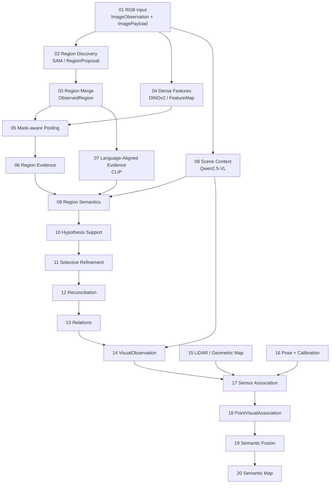

# Pipeline end-to-end do contextual-3d-mapping

Esta documentação acompanha a informação desde os pixels de um frame RGB até a evidência semântica ancorada em geometria 3D. A pergunta central em cada etapa é:

> Que informação existe agora, de onde ela veio, como foi transformada e o que será enviado para a próxima etapa?

A documentação é dividida em dois níveis: este diretório descreve o fluxo entre capacidades; detalhes internos pertencem a `modules/<module>/docs/`.

Para a visão **integral do repositório**, incluindo fontes, adapters, contracts, `mapping-runtime`, todos os módulos implementados, relações entre os payloads, proveniência, armazenamento, aplicações e capacidades planejadas, use [`system-flow.md`](./system-flow.md). O diagrama desta página é apenas a visão resumida da pipeline.

## Regra de documentação

A documentação separa explicitamente três coisas:

```text
arquitetura pretendida
        !=
código implementado
        !=
comportamento realmente observado
```

Sempre que existe evidência versionada, os exemplos usam artifacts reais. Exemplos artificiais não devem ser apresentados como outputs medidos.

## Padrão descritivo das páginas

As páginas devem explicar o estágio como uma transformação concreta, não apenas listar nomes de classes. Sempre que aplicável, uma página deve mostrar:

- quem produz a entrada;
- shape, estrutura ou contract do payload;
- como a informação é transformada;
- qual modelo ou algoritmo participa;
- um exemplo real da reference run;
- quando não houver artifact real, um exemplo explicitamente marcado como conceitual;
- quem consome a saída;
- como erros nesta etapa afetam as seguintes;
- links de **Próxima leitura** no fim da página.

Quando houver embeddings, patches, máscaras, transforms ou relações entre modelos, a documentação deve mostrar visualmente a passagem de informação. Por exemplo:

```text
SAM mask
    -> RegionView
    -> Qwen semantic hypotheses

RegionView
    -> CLIP image embedding

Qwen hypothesis text
    -> CLIP text embedding

image embedding + text embedding
    -> hypothesis support
```

O objetivo é permitir que alguém leia as docs e consiga reconstruir mentalmente o que acontece com os dados sem precisar inferir o fluxo a partir do código.

## Reference run

NOTE: os artifacts da run que ilustrava esta seção (`20260910T115810Z`) foram removidos do repositório — resultados de execução são descartáveis e regeneráveis a partir do código e da configuração versionados (ver "Legado" em `AGENTS.md`), não um contract a manter vivo. Os blocos de exemplo abaixo, e nas páginas numeradas de `01` a `20`, ficam marcados como **conceituais** até que uma nova reference run real seja gravada e linkada aqui.

Estrutura esperada de uma reference run (exemplo conceitual, sem artifact real associado):

```text
run_id: <run-id>
git_revision: <commit>
quality_profile: research_quality
frames: <n>
reference_frame: <observation_id>
resolution: <largura> x <altura>
reference_region: <region_id>
GPU budget: <budget>
observed peak: <peak>
```

Modelos usados na última run real observada antes da limpeza (para contexto histórico, não como configuração atual — ver [backends de modelos](../modules/visual-perception/docs/model-backends.md) para a configuração vigente):

| Capacidade | Modelo |
| --- | --- |
| Region discovery | SAM ViT-H (backend atual é o SAM3 tracker) |
| Dense visual features | DINOv2-base |
| Language-aligned evidence | CLIP ViT-L/14 |
| Scene/region semantics | Qwen2.5-VL-3B-Instruct, 4-bit |

Uma reference run nunca é ground truth nem garantia de desempenho — é só um exemplo observado de uma revisão específica.

## Pipeline geral

Esta visão é deliberadamente resumida. A relação completa entre cada módulo e contract está em [`system-flow.md`](./system-flow.md).



## Estado atual

| Capacidade | Estado | Evidência atual |
| --- | --- | --- |
| `visual-perception` | implementado | pipeline completo até `VisualObservation`; artifacts de run são gerados sob demanda e não versionados |
| `state-estimation` | primeiro slice implementado | contracts e integração FAST-LIO |
| `geometric-map` | primeiro slice implementado | geometria persistente e referências estáveis |
| `sensor-association` | implementado | projeção, suporte válido e oclusão |
| `semantic-fusion` | implementado no nível de ponto | fusão multi-keyframe e suporte espacial |
| `point-representation` | primeiro slice implementado | contracts públicos, transforms determinísticos e port `PointEncoder` com fake; nenhum backbone concreto ainda |
| `semantic-map` | primeiro slice implementado | consolidação de runs contextuais publicadas sobre geometria compartilhada (`consolidate_context_runs`) |
| `semantic-memory` | planejado | capacidade ainda não materializada em módulo |
| `scene-graph` | planejado | capacidade ainda não materializada em módulo |
| `context-reasoning` | planejado | capacidade ainda não materializada em módulo |
| `query-engine` | planejado | capacidade ainda não materializada em módulo |

Capacidades apenas planejadas não mantêm diretórios vazios em `modules/`. Elas passam a existir fisicamente quando houver contract, implementação, teste ou documentação concreta que justifique o módulo.

A cadeia de tipos até `VisualObservation` está implementada e testada. Para a parte 3D existem implementação e diagnósticos reais, mas nenhuma run atual mantém um artifact versionado que acompanhe uma região específica até um `GeometryReference` e depois até uma entidade persistente — isso é regenerável a qualquer momento, não algo que a documentação preserve como artifact fixo.

## Documentação especializada por módulo

A documentação local descreve o código e as decisões internas das capacidades já materializadas:

- [`visual-perception`](../modules/visual-perception/docs/README.md), arquitetura interna, backends e política semântica;
- [`state-estimation`](../modules/state-estimation/docs/README.md), contracts de movimento e integração FAST-LIO;
- [`geometric-map`](../modules/geometric-map/docs/README.md), geometria persistente e referências estáveis;
- [`sensor-association`](../modules/sensor-association/docs/README.md), projeção, visibilidade e oclusão;
- [`semantic-fusion`](../modules/semantic-fusion/docs/README.md), fusão multi-view e suporte espacial;
- [`semantic-map`](../modules/semantic-map/docs/index.md), consolidação de runs contextuais publicadas sobre geometria compartilhada;
- [`point-representation`](../modules/point-representation/README.md), contracts e transforms para embeddings 3D por ponto (ainda sem backbone concreto).

Use estas páginas para perguntas sobre como um módulo funciona internamente. Use [`system-flow.md`](./system-flow.md) para entender todas as relações entre módulos. Use os documentos numerados abaixo para seguir a transformação da informação estágio por estágio.

## Documentação por estágio

1. [Entrada RGB](./01-input-rgb.md)
2. [Region Discovery](./02-region-discovery.md)
3. [Region Merge / Consolidation](./03-region-merge.md)
4. [Dense Feature Extraction](./04-dense-features.md)
5. [Mask-aware Pooling](./05-mask-aware-pooling.md)
6. [Region Evidence](./06-region-evidence.md)
7. [Language-Aligned Evidence](./07-language-aligned-evidence.md)
8. [Scene Context](./08-scene-context.md)
9. [Region Semantics](./09-region-semantics.md)
10. [Hypothesis Support](./10-hypothesis-support.md)
11. [Selective Refinement](./11-selective-refinement.md)
12. [Reconciliation intra-frame](./12-reconciliation.md)
13. [Relations](./13-relations.md)
14. [VisualObservation](./14-visual-observation.md)
15. [Geometric Map](./15-geometric-map.md)
16. [Pose + Calibration](./16-pose-calibration.md)
17. [Sensor Association](./17-sensor-association.md)
18. [PointVisualAssociation](./18-point-visual-association.md)
19. [Semantic Fusion](./19-semantic-fusion.md)
20. [Semantic Map / Memory](./20-semantic-map.md)

## Diagramas canônicos

- [Fluxo completo do repositório e todas as relações](./system-flow.md)
- [Pipeline detalhada de `visual-perception`](../modules/visual-perception/docs/pipeline-flow.md)
- [Descoberta de regiões](../modules/visual-perception/docs/region-discovery-flow.md)
- [Relação entre modelos](../modules/visual-perception/docs/model-flow.md)
- [Fluxo semântico](../modules/visual-perception/docs/semantic-flow.md)

## Como cada página deve ser mantida

Cada estágio deve responder, quando aplicável: objetivo, entrada, contract, transformação, tecnologias, exemplo da reference run, artifacts, saída, consumidor, limitações atuais e referências científicas. Quando não houver artifact real, a página deve declarar isso explicitamente.

Detalhes que pertencem exclusivamente a um módulo devem ser movidos ou referenciados a partir de `modules/<module>/docs/`, evitando duas fontes de verdade.

A documentação anterior foi preservada em [`.old-docs/`](../.old-docs/) para consulta histórica.

## Próxima leitura

- [Fluxo completo do repositório](./system-flow.md)
- [01. Entrada RGB](./01-input-rgb.md)
- [Pipeline detalhada de `visual-perception`](../modules/visual-perception/docs/pipeline.md)
- [Documentação dos módulos](../modules/README.md)
