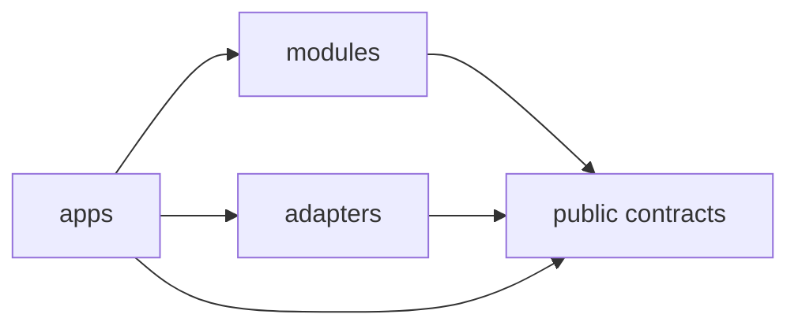

# Applications

Applications are composition roots. They assemble module capabilities into runnable workflows without absorbing the responsibilities of those modules.

## `mapping-runtime`

`apps/mapping-runtime/` executes end-to-end map construction or update workflows from live sensors, recorded sessions, or dataset adapters.

It is responsible for composition, configuration, lifecycle, dependency wiring, and execution order. It does not implement state estimation, visual perception, point representation, association, fusion, mapping, memory, graph construction, reasoning, or querying algorithms.

Conceptually:

```text
input adapter
    -> state-estimation
    -> geometric-map
    -> visual-perception / point-representation
    -> sensor-association
    -> semantic-fusion
    -> semantic-map
    -> semantic-memory / scene-graph
    -> persistence
```

## `map-explorer`

`apps/map-explorer/` is the primary human-facing application for opening and inspecting completed or incrementally updated maps.

Its public responsibilities include:

- opening a map by stable identity;
- rendering persistent 3D geometry;
- rendering semantic overlays and entities;
- submitting semantic, spatial, and contextual queries through `query-engine`;
- focusing the viewer on returned regions or entities;
- showing source observations, evidence, and provenance;
- exposing scene-graph relations without becoming the owner of graph construction.

The explorer may contain a backend/API boundary and a web frontend, but those layers consume application contracts rather than private module internals.

## `cli`

`apps/cli/` provides scriptable access to application operations for development, automation, inspection, export, and reproducible experiments.

The CLI should expose the same application-level capabilities as other clients where practical instead of introducing alternative business logic.

## Dependency direction



Applications may select and wire implementations. Modules must not depend on applications.
