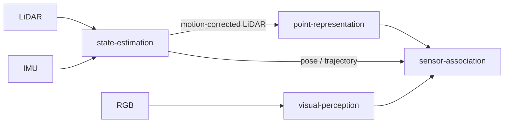

# Repository Architecture

`contextual-3d-mapping` is organized as a modular research framework. The repository-level architecture defines how independently developed capabilities are composed without coupling their implementations.

## Architectural principles

1. **Modules are independent development units.**
   Each module should be independently executable, testable, benchmarkable, and replaceable.

2. **Integration occurs through contracts.**
   A module may depend on shared schemas and interfaces from `contracts/`, but should not depend directly on another module's internal implementation.

3. **Adapters isolate external systems.**
   Dataset formats, sensor sources, middleware, storage backends, and third-party integrations should be translated at repository boundaries instead of leaking external representations into module internals.

4. **Applications compose capabilities.**
   `apps/` is responsible for assembling modules into runnable workflows. Composition belongs outside the modules themselves.

5. **Experiments and evaluation remain separable from production composition.**
   `experiments/` may compare implementations or configurations, while `evaluation/` contains reusable evaluation logic and metrics.

6. **Global documentation describes relationships, not module internals.**
   Detailed algorithms and implementation decisions belong to `modules/<module>/docs/`.

## Repository topology

```text
contextual-3d-mapping/
├── adapters/
├── apps/
├── contracts/
├── datasets/
├── docs/
├── evaluation/
├── experiments/
├── modules/
│   ├── state-estimation/
│   ├── visual-perception/
│   ├── point-representation/
│   ├── sensor-association/
│   ├── semantic-fusion/
│   ├── semantic-map/
│   ├── semantic-memory/
│   ├── scene-graph/
│   ├── context-reasoning/
│   └── query-engine/
└── tests/
```

## Geometric front-end boundary

`state-estimation` is responsible for estimating motion from LiDAR/IMU observations and exposing pose, trajectory, and motion-corrected LiDAR data through contracts. It is upstream of learned point representation and multimodal sensor association.

The module does not own persistent geometric-map construction. If persistent geometric reconstruction becomes a first-class capability, it should be introduced behind its own module boundary rather than folded into state estimation or semantic mapping.



## Dependency rule

The primary rule is:

```text
module implementation -> contracts <- module implementation
```

A module should exchange contract-compatible data with other modules rather than importing their private classes, internal services, training code, or implementation-specific data structures.

Cross-module orchestration should be performed by `apps/`, adapters, or dedicated composition code.

## Replaceability

The architecture is intentionally implementation-agnostic. A module can have multiple implementations, research variants, checkpoints, or algorithms as long as they satisfy the same external contract expected by the composing workflow.

This allows individual modules to evolve independently without forcing the rest of the system to adopt the same internal technology or research approach.
