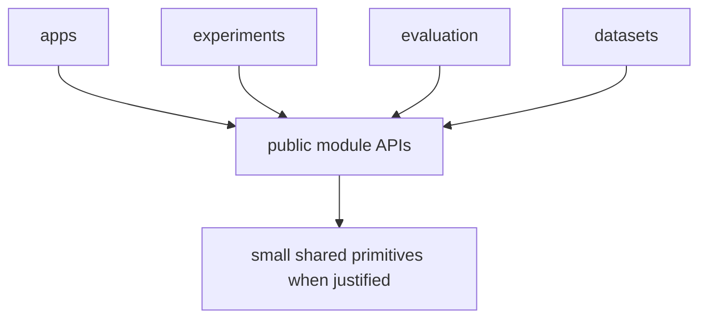
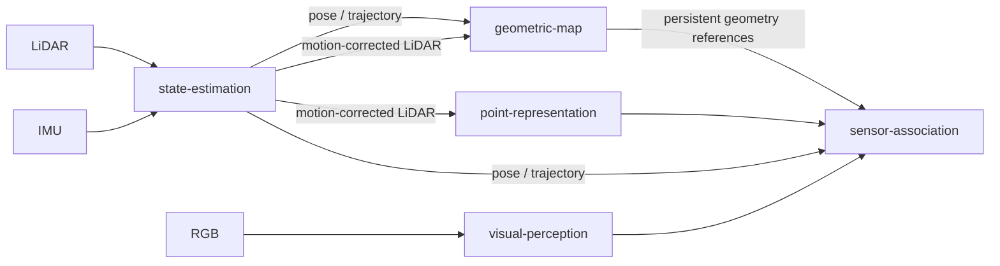

# Repository Architecture

`contextual-3d-mapping` is organized as a capability-oriented modular research framework for open-vocabulary 3D semantic and contextual mapping.

The architecture is intentionally simple. It does **not** adopt Clean Architecture as a repository-wide pattern.

The objective is to make each capability easy to locate, understand, modify, test, benchmark, and replace while following SOLID principles at meaningful code and module boundaries.

For implementation-level guidance, also read [`engineering-principles.md`](./engineering-principles.md) and the root [`AGENTS.md`](../AGENTS.md).

## Architectural priorities

When two designs are both technically valid, prefer the one that improves these properties in this order:

1. readability and local understandability;
2. explicit responsibility and ownership;
3. low coupling;
4. testability and replaceability;
5. extensibility around proven variation points;
6. abstraction only when justified.

The project should not gain architectural layers merely because they are common in application frameworks.

## Repository topology

The repository is organized around runnable applications, research capabilities, datasets, experiments, evaluation, and documentation.

```text
contextual-3d-mapping/
├── apps/
│   ├── mapping-runtime/
│   ├── map-explorer/
│   └── cli/
├── modules/
│   ├── state-estimation/
│   ├── geometric-map/
│   ├── visual-perception/
│   ├── point-representation/
│   ├── sensor-association/
│   ├── semantic-fusion/
│   ├── semantic-map/
│   ├── semantic-memory/
│   ├── scene-graph/
│   ├── context-reasoning/
│   └── query-engine/
├── datasets/
├── evaluation/
├── experiments/
├── docs/
└── tests/
```

Repository-wide shared primitives may exist when they are genuinely common and stable, but the architecture does not require a large global contracts or infrastructure layer.

The repository may still contain root-level directories created during earlier architecture iterations, such as `adapters/` and `contracts/`. They are not mandatory architectural layers and should not be expanded mechanically. New capability-specific code should remain with the capability that owns it.

## Capability ownership

Each module owns one coherent system capability.

- `state-estimation`: LiDAR/IMU observations to pose, trajectory, and motion-corrected LiDAR frames.
- `geometric-map`: persistent world geometry built from poses and geometric observations.
- `visual-perception`: RGB observations to structured visual and semantic features.
- `point-representation`: LiDAR points to learned 3D representations.
- `sensor-association`: temporal and geometric association between multimodal observations.
- `semantic-fusion`: multi-source, temporal, and multi-view semantic evidence fusion.
- `semantic-map`: persistent open-vocabulary semantic information linked to world geometry.
- `semantic-memory`: semantic and spatial retrieval over mapped information.
- `scene-graph`: entities, hierarchy, and relationships extracted from mapped state.
- `context-reasoning`: contextual inference with explicit provenance.
- `query-engine`: unified semantic, spatial, and contextual query interface.

A capability should have one obvious owner. If a feature appears to belong equally to several modules, resolve the ownership boundary before implementation instead of duplicating the responsibility.

## Module boundary

A module is an independently understandable and testable development unit.

A module may contain its own:

```text
modules/<module>/
├── README.md
├── src/
├── tests/
├── configs/
├── benchmarks/
└── docs/
```

These directories are optional and should only be created when useful.

A module does not need to reproduce a fixed internal architecture such as `domain/`, `application/`, `infrastructure/`, `ports/`, or `adapters/`.

The module should expose a small public API. Other modules may use that public API but must not import or depend on private implementation details.

## Dependency rule

The primary dependency rule is:

```text
consumer -> producer public API
```

not:

```text
consumer -> producer private implementation
```

High-level composition is performed by `apps/`, experiments, or explicit orchestration code.

Cross-module dependencies should remain explicit and preferably acyclic.



If two modules need extensive access to each other's private structures, the boundary should be reconsidered rather than hidden behind additional wrappers.

## Geometry boundary

`state-estimation` estimates motion. It owns pose estimation, trajectory state, and motion-corrected LiDAR observations.

A concrete LiDAR-inertial odometry implementation remains an implementation detail of `state-estimation` behind the module's public capability boundary.

`geometric-map` owns persistent reconstruction of world geometry. Persistent geometry therefore does not belong to `state-estimation` and should not be duplicated inside `semantic-map`.



## Semantic boundary

`semantic-map` enriches persistent geometry with semantic information. It should reference geometric entities instead of silently creating a second authoritative copy of world geometry.

`semantic-memory`, `scene-graph`, and `context-reasoning` derive retrieval structures and higher-level contextual structures from mapped information.

`query-engine` is the user-facing query capability used by applications to combine semantic, spatial, and contextual retrieval.

## Application boundary

`apps/` contains runnable compositions of capabilities.

The initial application roles are:

- `mapping-runtime`: builds and updates maps from live, recorded, or dataset observations;
- `map-explorer`: opens persisted maps, renders geometry and semantic information, and interacts with `query-engine`;
- `cli`: provides non-graphical automation, inspection, debugging, evaluation, and export workflows.

Applications may select concrete implementations and compose modules. They must not become the owner of algorithms that clearly belong to a module.

## Integration ownership

External integrations should stay close to the capability that owns them.

Examples:

```text
state-estimation/
    concrete LiDAR-inertial odometry integration

geometric-map/
    geometry backend used only by that module

visual-perception/
    model runtime used only by visual perception
```

A repository-wide integration layer should only exist when an integration is genuinely shared by unrelated capabilities.

This locality is intentional: opening one module should reveal most of the code required to understand that capability.

## Contracts and shared primitives

SOLID and dependency inversion do not require a global interface for every class.

Create a protocol or interface when there is a real boundary or variation point, such as:

- multiple implementations;
- intentional replaceability;
- isolation of an expensive or external dependency;
- a public module boundary;
- a test substitute that must satisfy the same behavior.

Capability-specific contracts belong to the capability that defines them.

For example, a point embedding contract belongs to `point-representation`, even when another module consumes it.

Only genuinely repository-wide and stable concepts should be promoted to shared code, for example spatial frames, poses, transforms, timestamps, identifiers, or simple provenance primitives.

## SOLID interpretation

SOLID is applied as a code and boundary design rule, not as a directory template.

- **Single Responsibility**: modules and components have one coherent reason to change.
- **Open/Closed**: proven variation points can gain new implementations without modifying consumers.
- **Liskov Substitution**: implementations of the same public contract preserve the contract's invariants.
- **Interface Segregation**: interfaces remain narrow and consumer-oriented.
- **Dependency Inversion**: high-level orchestration depends on stable capabilities, not volatile concrete implementations.

Do not introduce abstractions solely to claim compliance with SOLID.

## Explicit multimodal data flow

Important information required to interpret or reproduce a result should remain explicit at module boundaries where applicable:

- timestamp;
- coordinate frame;
- sensor identity;
- units;
- pose or transform provenance;
- calibration identity;
- source observation identity;
- confidence or uncertainty;
- model/checkpoint provenance when needed for reproducibility.

Modules should fail clearly when boundary invariants are violated rather than silently converting incompatible frames, timestamps, dimensions, or units.

## Persistence boundary

Persistence is a capability concern, not a reason to impose a global architecture layer.

Persistent state may include geometry, semantics, observations, evidence, provenance, indexes, and scene-level structures.

A storage implementation used by one module can remain local to that module. A storage abstraction shared by multiple capabilities should exist only if the shared requirement is real and its semantics are stable.

Applications may coordinate loading and saving, but they should not own the semantics of persisted module state.

## Research implementation rule

The architecture remains implementation-agnostic.

Algorithms, external repositories, models, datasets, and research papers may inform concrete implementations, but public capability boundaries are named after project responsibilities rather than source implementations.

For example, a concrete odometry framework may implement the `state-estimation` capability, but the repository architecture should not become coupled to that one framework.

Likewise, an issue should describe the required capability, behavior, tests, and acceptance criteria. Research references and implementation parallels belong in module documentation when useful for scientific traceability.

## Abstraction rule

Do not create abstractions in anticipation of hypothetical needs.

Before adding a layer, global package, registry, factory, base class, or protocol, identify the concrete problem it solves.

Prefer a direct local implementation when it is clearer.

A useful rule is:

```text
make the common case obvious;
make variation explicit only where variation exists.
```

## Replaceability

Modules may have multiple implementations, model variants, checkpoints, storage strategies, or algorithms as long as they satisfy the public behavior expected by their consumers.

Replaceability should be protected by tests around public contracts where practical, not by exposing implementation internals.

## Documentation boundary

Root `docs/` documents repository-level architecture, integration, policies, and decisions.

Detailed algorithmic and implementation decisions belong to `modules/<module>/docs/`.

A repository-wide architectural decision is incomplete if future contributors cannot recover its rationale. Structural changes should therefore update the relevant documentation in the same work.