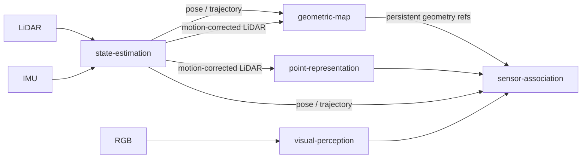

# Repository Architecture

`contextual-3d-mapping` is organized as a modular research framework. The repository-level architecture defines how independently developed capabilities are composed without coupling their implementations.

## Architectural principles

1. **Modules are independent development units.**
   Each module should be independently executable, testable, benchmarkable, and replaceable.

2. **Integration occurs through contracts.**
   A module may depend on shared schemas and interfaces from `contracts/`, but should not depend directly on another module's internal implementation.

3. **Adapters isolate external systems.**
   Dataset formats, sensor sources, middleware, storage backends, and third-party integrations are translated at repository boundaries instead of leaking external representations into module internals.

4. **Applications compose capabilities.**
   `apps/` owns runnable workflows and user-facing composition. It does not own the research capabilities implemented by modules.

5. **Experiments and evaluation remain separable from application composition.**
   `experiments/` may compare implementations or configurations, while `evaluation/` contains reusable evaluation logic and metrics.

6. **Global documentation describes relationships, not module internals.**
   Detailed algorithms and implementation decisions belong to `modules/<module>/docs/`.

## Repository topology

```text
contextual-3d-mapping/
├── adapters/
│   ├── datasets/
│   ├── ros2/
│   └── map-storage/
├── apps/
│   ├── mapping-runtime/
│   ├── map-explorer/
│   └── cli/
├── contracts/
│   ├── spatial/
│   ├── temporal/
│   ├── observations/
│   └── maps/
├── datasets/
│   ├── manifests/
│   ├── schemas/
│   └── splits/
├── docs/
├── evaluation/
├── experiments/
├── modules/
│   ├── state-estimation/
│   ├── geometric-map/
│   ├── visual-perception/
│   ├── point-representation/
│   ├── sensor-association/
│   ├── semantic-fusion/
│   ├── semantic-map/
│   ├── semantic-memory/
│   ├── scene-graph/
│   ├── context-reasoning/
│   └── query-engine/
└── tests/
```

## Geometry boundary

`state-estimation` estimates motion and exposes pose, trajectory, and motion-corrected LiDAR observations. A concrete LiDAR-inertial odometry implementation remains an internal adapter of that module.

`geometric-map` consumes contract-compatible poses and LiDAR observations to maintain persistent world geometry. Persistent geometric reconstruction therefore does not belong to `state-estimation` and is not duplicated inside `semantic-map`.



## Semantic boundary

`semantic-map` enriches persistent geometry with semantic information while referencing geometric entities rather than owning an independent duplicate of the world geometry.

`semantic-memory`, `scene-graph`, and `context-reasoning` expose retrieval and contextual structures derived from mapped information. `query-engine` provides the unified query boundary consumed by applications.

## Application boundary

The initial application composition contains three entry points:

- `mapping-runtime`: builds and updates maps from live, recorded, or dataset observations;
- `map-explorer`: opens persisted maps, renders geometry and semantic information, and interacts with `query-engine`;
- `cli`: provides non-graphical automation, inspection, debugging, and export workflows.

Applications depend on public contracts and module entry points. They must not import private module implementations.

## Persistence boundary

Persistence is represented through contracts and adapters rather than being embedded into the domain of a specific application.

Logical map state includes persistent geometry, semantic structures, observations, evidence, provenance, and indexes. Concrete storage technologies remain replaceable behind `adapters/map-storage/` or module-local infrastructure when ownership is exclusive to one module.

## Shared contracts

The root `contracts/` directory is reserved for repository-wide primitives such as spatial frames, timestamps, observations, provenance, map identity, and artifact references.

Capability-specific contracts remain owned by the capability that defines them. For example, a learned point embedding contract belongs to `point-representation`, not to the global contract package.

## Dependency rule

The primary rule is:

```text
module implementation -> contracts <- module implementation
```

Cross-module orchestration is performed by `apps/`, adapters, or dedicated composition code.

## Replaceability

The architecture is intentionally implementation-agnostic. A module can have multiple implementations, research variants, checkpoints, storage backends, or algorithms as long as they satisfy the same public contracts expected by the composing workflow.
