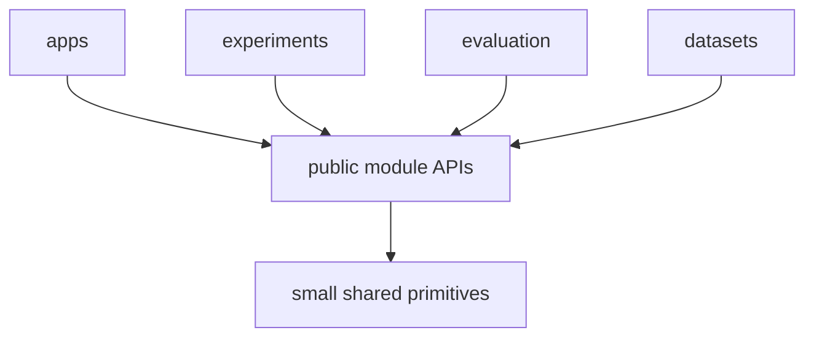
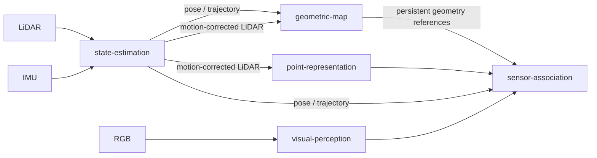

# Repository Architecture

`contextual-3d-mapping` is organized as a **capability-oriented modular research framework** for open-vocabulary 3D semantic and contextual mapping.

The architecture is designed so each capability is easy to locate, understand, modify, test, benchmark, and replace. SOLID principles guide code and dependency design at meaningful boundaries.

For implementation-level guidance, also read [`engineering-principles.md`](./engineering-principles.md) and the root [`AGENTS.md`](../AGENTS.md).

## Architectural priorities

When two designs are technically valid, prefer the one that improves these properties in this order:

1. readability and local understandability;
2. explicit responsibility and ownership;
3. low coupling;
4. testability and replaceability;
5. extensibility around proven variation points;
6. abstraction when it makes the design clearer or safer.

## Repository topology

The repository is organized around runnable applications, capability modules, datasets, experiments, evaluation, and documentation.

```text
contextual-3d-mapping/
├── apps/
│   ├── mapping-runtime/
│   ├── map-explorer/
│   └── cli/
├── modules/
│   ├── state-estimation/
│   ├── geometric-map/
│   ├── visual-perception/
│   ├── point-representation/
│   ├── sensor-association/
│   ├── semantic-fusion/
│   ├── semantic-map/
│   ├── semantic-memory/
│   ├── scene-graph/
│   ├── context-reasoning/
│   └── query-engine/
├── datasets/
├── evaluation/
├── experiments/
├── docs/
└── tests/
```

When repository-wide primitives become necessary, keep them small and stable in a shared package. Capability-specific integrations, contracts, configuration, and persistence helpers stay with the owning module.

## Capability ownership

Each module owns one coherent system capability.

- `state-estimation`: LiDAR/IMU observations to pose, trajectory, and motion-corrected LiDAR frames.
- `geometric-map`: persistent world geometry built from poses and geometric observations.
- `visual-perception`: RGB observations to structured visual and semantic features.
- `point-representation`: LiDAR points to learned 3D representations.
- `sensor-association`: temporal and geometric association between multimodal observations.
- `semantic-fusion`: multi-source, temporal, and multi-view semantic evidence fusion.
- `semantic-map`: persistent open-vocabulary semantic information linked to world geometry.
- `semantic-memory`: semantic and spatial retrieval over mapped information.
- `scene-graph`: entities, hierarchy, and relationships extracted from mapped state.
- `context-reasoning`: contextual inference with explicit provenance.
- `query-engine`: unified semantic, spatial, and contextual query interface.

A capability should have one obvious owner. Resolve that ownership before implementation when a feature appears to span several modules.

## Module boundary

A module is an independently understandable and testable development unit.

A typical module may evolve toward:

```text
modules/<module>/
├── README.md
├── src/
├── tests/
├── configs/
├── benchmarks/
└── docs/
```

Create these directories only when they serve a real responsibility.

The module exposes a small public API. Consumers use that public API while implementation details remain local to the producer module.

## Dependency rule

The primary dependency shape is:

```text
consumer -> producer public API -> producer implementation
```

High-level composition is performed by `apps/`, experiments, or explicit orchestration code.

Cross-module dependencies should remain explicit and preferably acyclic.



If two modules repeatedly need substantial access to each other's internal concepts, reconsider the ownership boundary.

## Geometry boundary

`state-estimation` owns motion estimation, pose, trajectory state, and motion-corrected LiDAR observations.

Concrete LiDAR-inertial odometry implementations satisfy the public state-estimation capability while remaining local to that module.

`geometric-map` owns persistent reconstruction of world geometry.



Persistent geometry has one authoritative owner, `geometric-map`. Semantic capabilities reference that geometry through stable public types.

## Semantic boundary

`semantic-map` enriches persistent geometry with semantic information.

`semantic-memory`, `scene-graph`, and `context-reasoning` derive retrieval structures and higher-level contextual structures from mapped information.

`query-engine` is the query boundary used by applications to combine semantic, spatial, and contextual retrieval.

## Application boundary

`apps/` contains runnable compositions of capabilities.

The initial application roles are:

- `mapping-runtime`: builds and updates maps from live, recorded, or dataset observations;
- `map-explorer`: opens persisted maps, renders geometry and semantic information, and interacts with `query-engine`;
- `cli`: provides non-graphical automation, inspection, debugging, evaluation, and export workflows.

Applications select concrete implementations, connect module inputs and outputs, manage runtime lifecycle, and expose user-facing entry points.

Research algorithms remain owned by their capability modules.

## Integration ownership

Place external integrations with the capability that owns their behavior.

Examples:

```text
modules/state-estimation/
    concrete LiDAR-inertial odometry integration

modules/geometric-map/
    geometry backend used by geometric mapping

modules/visual-perception/
    visual model runtime
```

Create repository-wide integration infrastructure when unrelated capabilities truly share the same integration semantics.

This locality keeps most of the code needed to understand one capability inside one module.

## Contracts and shared primitives

Create a protocol or interface for a real behavior boundary or variation point, such as:

- multiple implementations;
- intentional replaceability;
- research comparisons;
- isolation of an expensive or external dependency;
- a public module boundary;
- contract-level testing with substitutes.

Capability-specific contracts belong to the capability that defines them.

For example, a point embedding contract belongs to `point-representation`, even when another module consumes it.

Repository-wide shared types are reserved for stable concepts that several modules must interpret identically, for example:

```text
Timestamp
FrameId
Pose
RigidTransform
MapId
ArtifactId
Provenance
```

## SOLID interpretation

SOLID is applied as a code and boundary design rule.

- **Single Responsibility**: modules and components have one coherent reason to change.
- **Open/Closed**: proven variation points gain new implementations without requiring changes to consumers.
- **Liskov Substitution**: implementations of the same public contract preserve consumer-visible invariants.
- **Interface Segregation**: interfaces are narrow and consumer-oriented.
- **Dependency Inversion**: high-level orchestration depends on stable capabilities while concrete implementations satisfy those capabilities.

## Explicit multimodal data flow

Important information required to interpret or reproduce a result remains explicit at module boundaries where applicable:

- timestamp;
- coordinate frame;
- sensor identity;
- units;
- pose or transform provenance;
- calibration identity;
- source observation identity;
- confidence or uncertainty;
- model/checkpoint provenance when needed for reproducibility.

A typical transformation should be readable as:

```text
observation
    -> boundary validation
    -> capability transformation
    -> explicit output
    -> next capability
```

Validate boundary invariants before downstream processing.

## Persistence boundary

Persistence follows capability ownership.

Persistent state may include geometry, semantics, observations, evidence, provenance, indexes, and scene-level structures.

A storage implementation used by one capability remains local to that capability. Shared storage abstractions are introduced when several capabilities genuinely require the same stable behavior.

Applications may coordinate loading and saving while each module remains responsible for the semantics of its persisted state.

## Research implementation rule

Public architecture is named after project responsibilities.

Algorithms, external repositories, models, datasets, and papers inform concrete implementations and are documented as scientific provenance beside the relevant module.

For example:

```text
public capability: PoseEstimator
concrete implementation: FAST_LIO-backed estimator
```

Issues should describe capability behavior, inputs, outputs, tests, constraints, and acceptance criteria. Module documentation records implementation parallels and research references when scientifically useful.

## Abstraction rule

Use an abstraction when it makes a concrete boundary, replacement scenario, or variation point clearer.

A practical rule is:

```text
make the common case obvious;
make variation explicit where variation exists.
```

Local behavior with one straightforward implementation should remain direct. Shared abstractions emerge from proven common concepts.

## Replaceability

Modules may have multiple implementations, model variants, checkpoints, storage strategies, or algorithms as long as they preserve the public behavior expected by consumers.

Protect replaceability with tests around public contracts and boundary invariants.

## Documentation boundary

Root `docs/` documents repository-level architecture, integration, policies, and decisions.

Detailed algorithmic and implementation decisions belong to `modules/<module>/docs/`.

A structural change should update the relevant documentation in the same work so future contributors can recover both the chosen design and its rationale.