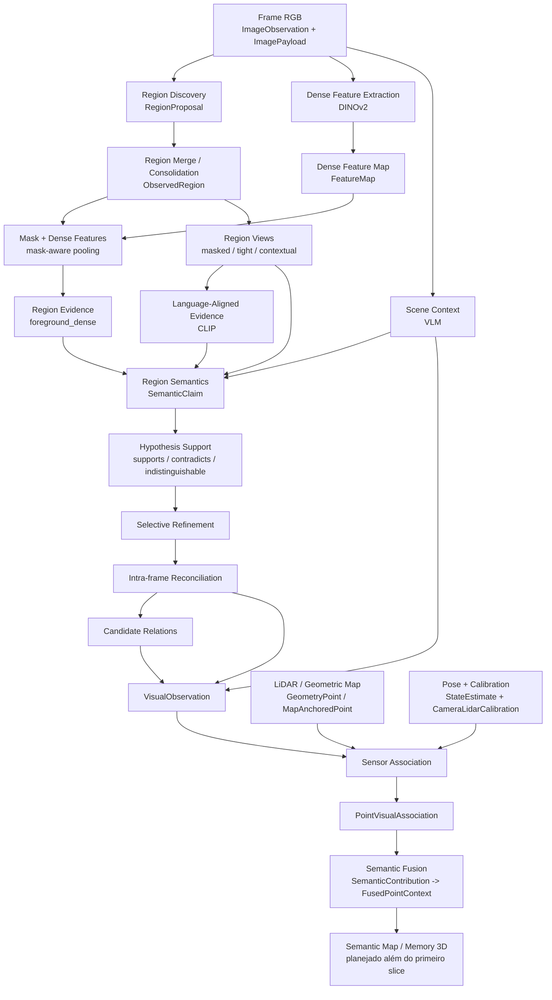

# Pipeline end-to-end do contextual-3d-mapping



Este documento acompanha a informação desde os pixels de um frame RGB até a evidência semântica ancorada em geometria 3D. O fio condutor é sempre a mesma pergunta:

> Neste ponto da pipeline, que informação existe, de onde ela veio, como foi transformada e o que será enviado para a próxima etapa?

A documentação local de cada módulo continua sendo a fonte de verdade para detalhes internos. Este documento conecta essas fronteiras em um único fluxo e marca explicitamente o que está implementado, o que está implementado apenas no primeiro slice e o que permanece planejado.

## Estado de implementação

| Capacidade | Estado atual | Observação |
| --- | --- | --- |
| `visual-perception` | implementado | pipeline canônico, contracts, backends reais/fakes, auditoria e benchmarks |
| `state-estimation` | implementado no primeiro slice | contracts e integração FAST-LIO existem |
| `geometric-map` | implementado no primeiro slice | geometria persistente e referências estáveis existem |
| `sensor-association` | implementado | projeção, suporte válido, oclusão, associação de região e rejeições explícitas |
| `semantic-fusion` | implementado no nível de ponto | fusão determinística de múltiplas contribuições e suporte espacial |
| `semantic-map` | planejado | o diretório ainda não contém implementação pública além do placeholder |
| `semantic-memory` | planejado | capacidade arquitetural reservada, ainda sem implementação concreta |
| `scene-graph` | planejado | capacidade arquitetural reservada, ainda sem implementação concreta |
| `context-reasoning` | planejado | capacidade arquitetural reservada, ainda sem implementação concreta |
| `query-engine` | planejado | capacidade arquitetural reservada, ainda sem implementação concreta |

Os exemplos abaixo usam uma única cena didática para que seja possível seguir a mesma evidência do início ao fim:

```text
frame_152
640 x 480

corredor interno
+ porta vermelha
+ extintor próximo à porta
+ marca/pichação em uma superfície
```

Os ids e valores numéricos do exemplo são ilustrativos. Os nomes de contracts, estágios e responsabilidades correspondem ao código atual.

## 1. Entrada RGB

### Objetivo

A pipeline não começa com "uma imagem" genérica. Ela começa com duas representações complementares:

- `ImageObservation`, identidade, resolução, encoding e referência auditável ao artifact de imagem;
- `ImagePayload`, pixels RGB concretos resolvidos em memória para os modelos processarem.

Essa separação evita que os contracts públicos dependam de NumPy, PIL, Torch ou de um formato de dataset específico.

### Quem produz a entrada

Adapters de dataset, aplicações ou integrações de runtime resolvem uma observação externa e a traduzem para a fronteira canônica de `visual-perception`.

```text
adapter / dataset / runtime
        |
        v
ImageObservation + ImagePayload
```

### O que recebe

Contract público simplificado:

```text
ImageObservation
{
    width
    height
    encoding
    image: SourceArtifactReference
    source: ObservationReference
}
```

`ObservationReference` concentra identidade e proveniência temporal:

```text
ObservationReference
{
    observation_id
    dataset_id
    sequence_id
    sensor_id
    sequence_index
    timestamp
    frame_id
    calibration_id?
}
```

Os pixels resolvidos ficam separados:

```text
ImagePayload
{
    pixels: RGB[H, W, 3]
    width
    height
}
```

### Representação visual da entrada

```text
frame_152, 640 x 480

┌──────────────────────────────────────┐
│                                      │
│            corridor                  │
│                        ┌────────┐     │
│                        │  red   │     │
│                [ext]   │  door │     │
│                        │        │     │
│                        └────────┘     │
│      graffiti / mark                 │
│                                      │
└──────────────────────────────────────┘
```

### O que acontece internamente

Nesta etapa ainda não há segmentação nem semântica. O sistema apenas valida que:

1. a resolução declarada é válida;
2. o encoding é suportado;
3. o payload tem shape `(H, W, 3)`;
4. identidade, timestamp, sensor e frame permanecem associados ao dado visual;
5. o artifact original pode ser recuperado posteriormente pela proveniência.

### Exemplo concreto

```text
ImageObservation
{
    width: 640
    height: 480
    encoding: "rgb8"
    source.observation_id: "frame_152"
    source.sensor_id: "camera_front"
    source.sequence_index: 152
    source.frame_id: "camera"
}

ImagePayload
{
    pixels.shape: (480, 640, 3)
}
```

### O que esta etapa sabe

```text
SABE:
qual observação está sendo processada
qual sensor a produziu
quando foi produzida
em qual frame de coordenadas ela existe
qual é a resolução e quais são os pixels RGB
```

### O que esta etapa NÃO sabe

```text
NÃO SABE:
onde estão os objetos
qual região é uma porta
qual pixel corresponde a qual ponto LiDAR
posição XYZ
identidade persistente no mapa
```

### Payload de saída

A saída é a própria entrada canônica. Ela se divide para caminhos diferentes da percepção:

```text
ImagePayload
    ├──> Region Discovery
    ├──> Dense Feature Extraction
    └──> Scene Context / Region Views
```

### Por que a próxima etapa precisa disso

Region discovery precisa dos pixels para propor geometria 2D. DINOv2 precisa dos mesmos pixels para produzir representações visuais densas. O VLM de cena precisa do frame completo para produzir contexto global.

## 2. Region Discovery

### Objetivo

Region discovery responde uma pergunta geométrica:

> Quais áreas visuais coerentes podem valer a pena analisar separadamente?

Ele não responde "isto é uma porta". No perfil real de referência, o port `RegionDiscoverer` é atendido por SAM ViT-H (`facebook/sam-vit-huge`). O resultado é class-agnostic.

### Quem produz a entrada

```text
ImagePayload
    ↓
RegionDiscoverer
```

### O que recebe

Pixels de uma imagem inteira ou de tiles, dependendo da configuração de tiling.

### Representação visual da entrada e saída

```text
RGB                                 propostas

┌───────────────────┐              ┌───────────────────┐
│        wall       │              │  AAAAA            │
│            door   │      ->      │        BBBBB      │
│       exting.     │              │      CC BBBB      │
│                   │              │                   │
└───────────────────┘              └───────────────────┘
```

Cada letra representa uma proposta de máscara independente.

### O que acontece internamente

1. A imagem pode ser dividida em tiles e escalas.
2. O backend de segmentação produz candidatos locais.
3. Cada candidato tem uma máscara, bounding box e confiança geométrica.
4. A fronteira de tiling remapeia coordenadas locais para a imagem original.
5. Propostas inválidas podem ser rejeitadas antes do merge, por exemplo por área válida, ego-veículo ou tamanho relativo.
6. As propostas remanescentes seguem como `RegionProposal`.

Uma proposta é apenas evidência geométrica candidata. SAM pode separar um objeto em partes, propor partes de uma superfície ou produzir propostas parcialmente redundantes.

### Exemplo concreto

```text
RegionProposal
{
    proposal_id: "proposal_27"
    mask: <pixels da porta e parte do batente>
    box: (302, 76, 426, 394)
    geometric_confidence: 0.94
    source: "sam"
    tile: ...
}
```

Pode existir outra proposta sobreposta:

```text
proposal_31
    mask: porta + batente

proposal_27
    mask: folha da porta
```

Isso ainda não significa duas portas.

### O que esta etapa sabe

```text
SABE:
geometria 2D candidata
quais pixels pertencem a cada proposta
bounding box
confiança geométrica do produtor
proveniência do tile/escala
```

### O que esta etapa NÃO sabe

```text
NÃO SABE:
label textual
se proposal_27 e proposal_31 são o mesmo objeto físico
posição 3D
identidade temporal
se a região é semanticamente útil
```

### Payload de saída

```text
RegionProposal
{
    proposal_id
    mask
    box
    geometric_confidence
    source
    tile
}
```

### Para quem envia

```text
RegionProposal[]
      ↓
Region Merge / Consolidation
```

### Por que a próxima etapa precisa disso

O restante do pipeline precisa de uma unidade de região estável. Enquanto houver propostas redundantes, nenhum embedding ou claim semântico deve assumir que cada proposal é uma entidade distinta.

## 3. Region Merge / Consolidation

### Objetivo

Consolidar propostas geométricas sobrepostas em `ObservedRegion`, preservando de quais propostas cada região surgiu.

### Quem produz a entrada

```text
Region Discovery
      ↓
RegionProposal[]
```

### O que recebe

Máscaras e boxes remapeados para a mesma convenção de coordenadas da imagem original.

### Representação visual

```text
proposal_27        proposal_31

   ████             ██████
   ████             ██████
   ████      +      ██████

          ↓ merge

       region_12
         █████
         █████
         █████
```

### O que acontece internamente

1. As propostas são comparadas geometricamente.
2. Regras de sobreposição/IoU determinam quais propostas devem ser consolidadas.
3. A geometria canônica da região é criada.
4. `contributing_proposal_ids` preserva a rastreabilidade até as propostas originais.
5. A confiança geométrica permanece separada de qualquer confiança semântica futura.

### Exemplo concreto

```text
ObservedRegion
{
    region_id: "region_12"
    mask: <máscara consolidada>
    box: (304, 78, 424, 392)
    geometric_confidence: 0.93
    contributing_proposal_ids: (
        "proposal_27",
        "proposal_31"
    )
    claims: ()
    evidence: ()
}
```

Neste momento `claims` e `evidence` ainda podem estar vazios.

### O que esta etapa sabe

```text
SABE:
qual é a geometria 2D canônica da região
quais proposals contribuíram
qual a confiança geométrica
```

### O que esta etapa NÃO sabe

```text
NÃO SABE:
"door"
"red"
"closed"
posição XYZ
mesma entidade em outro frame
```

### Payload de saída

O contract real é `ObservedRegion`:

```text
ObservedRegion
{
    region_id
    mask
    box
    geometric_confidence
    contributing_proposal_ids
    claims[]
    visual_embedding_ref?
    language_embedding_ref?
    evidence[]
}
```

### Para quem envia

A mesma região alimenta múltiplos estágios:

```text
ObservedRegion
    ├──> mask-aware pooling
    ├──> Region Views
    └──> Region Semantics
```

## 4. Dense Feature Extraction

### Objetivo

DINOv2 não tenta responder "isso é uma porta". Seu papel é transformar posições visuais da imagem em vetores que preservam aparência e estrutura visual.

A configuração real de referência usa:

```text
backend: dinov2
checkpoint: facebook/dinov2-base
input_resolution: maior aresta 448
patch size: 14 px no input efetivamente processado
```

### Quem produz a entrada

```text
ImagePayload
    ↓
DenseFeatureExtractor
```

### O que recebe

O frame RGB completo.

### Representação visual da entrada

Para simplificar, imagine uma grade de patches:

```text
RGB processado

┌────┬────┬────┬────┐
│ p1 │ p2 │ p3 │ p4 │
├────┼────┼────┼────┤
│ p5 │ p6 │ p7 │ p8 │
├────┼────┼────┼────┤
│ p9 │ pA │ pB │ pC │
└────┴────┴────┴────┘
```

No modelo real há muito mais posições. A grade depende da resolução efetivamente entregue ao processor e do patch size do checkpoint.

### O que acontece internamente

1. O `ImagePayload` é convertido para a representação aceita pelo processor do modelo.
2. O resize preserva aspect ratio e alinha as dimensões ao patch size 14.
3. A imagem é dividida implicitamente pelo ViT em patches.
4. Cada patch vira um token visual.
5. Self-attention permite que o token de uma posição seja condicionado também pelo restante da imagem.
6. O adapter remove tokens de prefixo, como CLS e register tokens.
7. Os tokens espaciais são reorganizados em uma grade `Hf x Wf x C`.
8. O contract `FeatureMap` registra stride, dimensão, checkpoint, preprocessing e regra de amostragem.

Visualmente:

```text
patches                      embeddings DINOv2

[p1][p2][p3][p4]             [e1][e2][e3][e4]
[p5][p6][p7][p8]    ->       [e5][e6][e7][e8]
[p9][pA][pB][pC]             [e9][eA][eB][eC]
```

Cada `eN` é um vetor C-dimensional.

```text
e7 = [0.12, -0.74, 0.31, ..., 0.08]
```

`e7` não significa literalmente `"door"`. Ele codifica características visuais daquela posição condicionadas pelo contexto da imagem.

### Exemplo concreto

A porta vermelha ocupa vários patches próximos. Cada um terá um vetor diferente, mas vetores da mesma estrutura visual podem apresentar similaridade útil.

### O que esta etapa sabe

```text
SABE:
representação visual densa por posição
estrutura de aparência
contexto visual capturado pelo backbone
```

### O que esta etapa NÃO sabe

```text
NÃO SABE:
label textual garantido
qual máscara define o objeto
posição XYZ
instância persistente
```

### Payload de saída

```text
FeatureMap
{
    data: [Hf, Wf, C]
    stride_x
    stride_y
    dimension
    model_id
    checkpoint
    representation: PATCH_GRID
    interpolation
    preprocessing
    valid_support
}
```

### Para quem envia

```text
FeatureMap
    ↓
Mask + Dense Features / Pooling
```

## 5. Mask + Dense Features / Pooling

### Objetivo

A máscara diz "onde está a região". O dense feature map diz "como cada posição é representada visualmente". O pooling combina os dois para produzir uma representação visual da região.

### Quem produz a entrada

```text
ObservedRegion.mask ─┐
                     ├──> pooling
FeatureMap ──────────┘
```

### Representação visual

```text
Dense feature map

[e1][e2][e3][e4]
[e5][e6][e7][e8]
[e9][eA][eB][eC]

Mask da region_12, reamostrada/alinhada à grade

 0   0   1   1
 0   0   1   1
 0   0   0   0

Features selecionadas:

e3, e4, e7, e8

        ↓ pooling

region_embedding
[0.18, -0.72, 0.31, ..., 0.45]
```

### O que acontece internamente

1. A máscara em resolução de imagem é alinhada à grade de features.
2. A regra de sampling do `FeatureMap` determina como consultar posições intermediárias.
3. Apenas posições suportadas pela máscara contribuem para o pooling.
4. As features selecionadas são agregadas em um vetor de região.
5. O vetor pesado é armazenado como artifact.
6. A região guarda uma referência ao artifact, não precisa serializar centenas de floats dentro de `VisualObservation`.

### Exemplo concreto

```text
region_12
    mask -> pixels da porta
    dense features -> DINOv2-base
    pooled artifact -> "artifact://.../region_12/foreground_dense"
```

### O que esta etapa sabe

```text
SABE:
assinatura visual agregada da área da máscara
qual modelo produziu o espaço vetorial
qual máscara deu suporte ao pooling
```

### O que esta etapa NÃO sabe

```text
NÃO SABE:
label textual por si só
se a máscara está semanticamente correta
se a região é a mesma porta em outro frame
```

### Payload de saída

O resultado canônico entra em evidência de região, normalmente no slot `foreground_dense`.

```text
RegionEvidenceSlot
{
    slot: foreground_dense
    region_id: region_12
    state: available
    artifact_ref: ...
    space: EmbeddingSpace(...)
    crop_box: ...
    transform: ...
    mask_ref: ...
    support_ratio: ...
}
```

### Por que a próxima etapa precisa disso

Sem uma representação agregada da região, consumidores teriam de carregar o feature map inteiro e refazer a seleção de patches para cada comparação.

## 6. Region Evidence

### Objetivo

Uma única representação visual é insuficiente. Uma máscara apertada favorece o sujeito, mas perde contexto. Um crop amplo contém contexto, mas pode diluir o sujeito. O projeto preserva múltiplos slots complementares.

### Slots reais

O enum `EvidenceSlot` contém:

```text
foreground_dense
masked_subject
tight_crop
contextual_crop
scene_conditioned
```

### Representação visual

```text
foreground_dense
    máscara sobre dense features
    sujeito visual isolado em feature space DINOv2

masked_subject
    pixels do sujeito, fundo suprimido

┌────────────┐
│            │
│   PORTA    │
│            │
└────────────┘


tight_crop
    crop justo ao redor da região

┌────────────┐
│  batente   │
│   PORTA    │
└────────────┘

contextual_crop
    crop expandido

┌──────────────────────┐
│ parede      extintor │
│        PORTA         │
│ corredor             │
└──────────────────────┘

scene_conditioned
    evidência que carrega ou considera o contexto global da cena
```

### O que acontece internamente

Cada slot registra seu próprio estado:

```text
available
missing
failed
```

Um slot `missing` ou `failed` não desaparece silenciosamente. Ele carrega um `reason`. Isso é importante para rastreabilidade: ausência de contexto não pode ser confundida com evidência neutra.

Cada slot também declara o `EmbeddingSpace`. O projeto impede comparar silenciosamente vetores incompatíveis.

### Exemplo concreto

Para `region_12`:

```text
foreground_dense
    DINOv2 visual space
    artifact_ref = dino://frame_152/region_12

masked_subject
    CLIP language-aligned space
    artifact_ref = clip://frame_152/region_12/masked

tight_crop
    CLIP language-aligned space

contextual_crop
    CLIP language-aligned space
```

### O que esta etapa sabe

```text
SABE:
quais visões complementares da região existem
qual espaço vetorial cada uma usa
qual preprocessing produziu cada artifact
qual geometria/crop corresponde a cada evidência
```

### O que esta etapa NÃO sabe

```text
NÃO SABE:
qual evidência está semanticamente correta em absoluto
identidade 3D
persistência temporal
```

## 7. Language-Aligned Evidence

### Objetivo

DINOv2 e CLIP resolvem problemas diferentes.

```text
DINOv2
    imagem -> representação visual

CLIP
    imagem/crop -> espaço compartilhado com texto
    texto       -> mesmo espaço compartilhado
```

A configuração real de referência usa `openai/clip-vit-large-patch14`.

### Quem produz a entrada

```text
Region Views
    ↓
LanguageAlignedEncoder
```

### O que acontece internamente

1. Uma view da região é codificada pelo encoder visual CLIP.
2. O vetor é normalizado de acordo com o contract do espaço.
3. O artifact registra modelo, checkpoint, dimensão e modalidade `language_aligned`.
4. Quando uma hipótese textual precisa ser verificada, o texto também é codificado no mesmo espaço.
5. Similaridade de cosseno pode então medir alinhamento entre a evidência visual e a hipótese textual.

### Representação visual

```text
crop da porta
    ↓ CLIP image encoder
[0.04, -0.21, ..., 0.17]

"door"
    ↓ CLIP text encoder
[0.05, -0.19, ..., 0.14]

           cosine similarity
```

O valor de similaridade não é automaticamente uma probabilidade nem uma confiança calibrada.

### O que esta etapa sabe

```text
SABE:
quão alinhada uma evidência visual está a uma hipótese textual
em um espaço específico e declarado
```

### O que esta etapa NÃO sabe

```text
NÃO SABE:
probabilidade calibrada da hipótese
posição 3D
mesma instância em outro frame
```

## 8. Scene Context

### Objetivo

Scene context interpreta o frame completo para produzir claims de nível de cena. Esse contexto ajuda a interpretar regiões ambíguas, mas não substitui a geometria de uma região.

A configuração real de referência usa Qwen2.5-VL-3B-Instruct em 4-bit.

### Quem produz a entrada

```text
frame RGB completo
    ↓
MultimodalReasoner
```

### Representação

```text
frame_152
    ↓ VLM

scene_type: "indoor corridor"
environment: ...
layout: ...
visibility: ...
```

O contract atual evita tratar prosa livre como geometria de região.

### O que acontece internamente

1. O frame inteiro é enviado ao reasoner multimodal.
2. A resposta estruturada é parseada para `SemanticClaim` de nível de cena.
3. Cada claim mantém evidência e proveniência do modelo.
4. O resultado é agrupado em `SceneContext`.

### Payload de saída

```text
SceneContext
{
    claims: SemanticClaim[]
}
```

### O que esta etapa sabe

```text
SABE:
tipo e contexto global provável da cena
condições globais que podem ajudar a desambiguar regiões
```

### O que esta etapa NÃO sabe

```text
NÃO SABE:
qual pixel específico corresponde a uma afirmação global
posição XYZ de uma porta
identidade persistente de uma entidade
```

## 9. Region Semantics

### Objetivo

Transformar `ObservedRegion` de geometria 2D em uma região com interpretações semânticas auditáveis.

### Quem produz a entrada

```text
ObservedRegion
+ Region Views
+ Region Evidence
+ SceneContext
        ↓
Region Semantics
```

### O que recebe

O reasoner recebe a geometria da região de forma indireta pelas views, múltiplas evidências visuais e o contexto global relevante.

### O que acontece internamente

1. As views configuradas são selecionadas.
2. O contexto de cena é anexado ao request de região.
3. O VLM produz uma interpretação estruturada.
4. O parser converte a resposta em `SemanticClaim`.
5. Claims de identidade (`LABEL`) declaram `role`, `category` e `RegionKind`.
6. Claims descritivos, como atributo, material ou condição, permanecem separados da identidade.
7. Confiança semântica nunca é confundida com `geometric_confidence`.

### Exemplo concreto

```text
region_12

primary label:
    value = "door"
    role = primary
    category = "door"
    region_kind = thing
    confidence = 0.90

alternative:
    value = "doorway"
    role = alternative

attribute:
    value = "red"

condition:
    value = "closed"
```

### `None` versus `0`

```text
confidence = None
    produtor não forneceu score

confidence = 0.0
    produtor forneceu explicitamente score zero
```

A ausência não deve ser convertida em zero.

### Geometria versus semântica

```text
ObservedRegion.geometric_confidence
    qualidade da máscara/box

SemanticClaim.confidence
    score bruto do produtor semântico, quando existe

SemanticSupport.calibrated_confidence
    score calibrado, apenas quando existe calibração válida
```

### Payload de saída

A região continua sendo `ObservedRegion`, agora com `claims` anexados.

```text
ObservedRegion
{
    region_id: region_12
    mask: ...
    box: ...
    claims: [
        LABEL("door", primary),
        LABEL("doorway", alternative),
        ATTRIBUTE("red"),
        CONDITION("closed")
    ]
    evidence: [...]
}
```

### O que esta etapa sabe

```text
SABE:
interpretações semânticas prováveis da região
alternativas registradas pelo produtor
atributos e condições observados
```

### O que esta etapa NÃO sabe

```text
NÃO SABE:
se region_12 é a mesma porta de frame_158
posição XYZ
se a hipótese sobreviverá à evidência multi-view
```

## 10. Hypothesis Support

### Objetivo

Uma hipótese do VLM não deve se tornar verdade apenas porque foi escrita como label. O estágio de support mede sinais independentes usando evidência language-aligned.

### Estados reais do sinal

```text
supports
contradicts
indistinguishable
unavailable
```

### Representação

```text
hipótese primary: "door"
hipótese alternative: "doorway"

contextual_crop -> CLIP image embedding
"door"         -> CLIP text embedding
"doorway"      -> CLIP text embedding

score(door)    = 0.241
score(doorway) = 0.228
margin         = 0.013

se margem < piso configurado:
    status = indistinguishable
```

Os números são ilustrativos. O ponto conceitual é que `0.241` não é 24,1% de probabilidade.

### O que acontece internamente

1. As hipóteses concorrentes de uma região são reunidas.
2. O texto de cada hipótese é codificado pelo language-aligned encoder.
3. Evidências de slots compatíveis são comparadas no mesmo `EmbeddingSpace`.
4. Score e margem são preservados como medidas brutas.
5. O status expressa se a evidência apoia, contradiz, não distingue ou não está disponível.
6. A calibração, quando disponível, produz `SemanticSupport`; caso contrário os sinais continuam explícitos sem fingir uma confiança calibrada.

### Payload relevante

```text
HypothesisSupportSignal
{
    source
    hypothesis
    slot
    status
    score?
    margin?
    space?
    reason?
}
```

### O que esta etapa sabe

```text
SABE:
se uma fonte independente favorece ou contradiz uma hipótese
se o sinal é inconclusivo
se o sinal não pôde ser produzido
```

### O que esta etapa NÃO sabe

```text
NÃO SABE:
verdade final do mundo
identidade 3D
probabilidade calibrada, a menos que exista calibration artifact válido
```

## 11. Selective Refinement

### Objetivo

Reanalisar somente regiões para as quais existe uma razão explícita de evidência, e somente quando o novo passe oferece evidência diferente da que já foi usada.

### Razões implementadas

O código atual define, entre outras:

```text
missing_semantics
unsupported_primary
competing_hypotheses
contradictory_claims
region_kind_contradiction
abstained_support
failed_calibration
evidence_slot_unavailable
insufficient_foreground
small_region
```

`small_region` é um modificador de risco e não justifica uma chamada sozinho.

### Exemplo concreto

```text
VLM:
    "wooden pallet"

mask:
    cobre pallet + grande parte da parede

foreground evidence:
    máscara ocupa pouco do bounding box

        ↓

reason = insufficient_foreground

        ↓

novo passe com escalation_views

        ↓

nova interpretação anexada, sem apagar a anterior
```

### O que acontece internamente

1. `region_refinement_reasons` inspeciona claims, sinais, support, estrutura e slots.
2. `select_refinement_targets` prioriza alvos dentro do orçamento.
3. O pipeline verifica se `escalation_views` adiciona evidência nova.
4. As regiões selecionadas são reinterpretadas.
5. O histórico é append-only em `RefinementStep`.
6. Claims anteriores não são apagados.

### O que esta etapa sabe

```text
SABE:
por que uma região precisa de outro passe
qual evidência anterior existia
qual evidência nova foi oferecida
qual produtor executou o refinamento
```

### O que esta etapa NÃO sabe

```text
NÃO SABE:
se a hipótese refinada representa uma entidade persistente no mapa
```

## 12. Reconciliation intra-frame

### Objetivo

Resolver redundância semântica dentro do mesmo frame sem declarar identidade 3D persistente.

### Intuição

Duas regiões do mesmo frame podem ser manifestações de uma mesma superfície ou entidade visual:

```text
region_12  -> "door"
region_17  -> "red door panel"
```

A reconciliação pode formar uma hipótese contextual de agrupamento.

### Regra conceitual obrigatória

```text
mesmo frame
    ≠
mesma entidade física confirmada em 3D
```

### O que acontece internamente

1. Conceitos podem ser canonicalizados para comparação local.
2. Consistência estrutural e grupos de superfície podem ser avaliados.
3. O resultado pode gerar `ContextualEntityHypothesis` em `VisualObservation.entity_hypotheses`.
4. Nenhuma região original é removida.
5. Nenhuma geometria é alterada para fingir fusão 3D.

### O que esta etapa sabe

```text
SABE:
que duas ou mais regiões do mesmo frame são candidatas a uma interpretação conjunta
```

### O que esta etapa NÃO sabe

```text
NÃO SABE:
identidade persistente entre frames
posição 3D compartilhada confirmada
```

## 13. Relations

### Objetivo

Registrar relações candidatas entre regiões da mesma observação sem promover essas relações diretamente a verdade 3D.

### Exemplos

```text
fire extinguisher
       |
       | near
       v
      door
```

```text
graffiti
    |
    | on
    v
surface
```

### O que acontece internamente

O pipeline pode combinar relações derivadas de geometria 2D com relações candidatas consultadas ao reasoner multimodal. O vocabulário de relação é controlado e existe saída explícita para nenhuma relação.

Relações como profundidade física não devem ser inferidas apenas da imagem quando a geometria 3D ainda não foi consultada.

### O que esta etapa sabe

```text
SABE:
relações candidatas observáveis no frame
quais region_ids participam
proveniência da relação
```

### O que esta etapa NÃO sabe

```text
NÃO SABE:
relação métrica 3D validada
persistência temporal da relação
```

## 14. VisualObservation

### Objetivo

`VisualObservation` é a saída 2D canônica do módulo `visual-perception`. Ela reúne tudo que foi inferido sobre uma única imagem sem fingir que essa imagem já virou mapa 3D.

### Contract real

```text
VisualObservation
{
    source: ObservationReference
    image_width
    image_height
    scene_context: SceneContext
    regions: ObservedRegion[]
    relations: CandidateRelation[]
    entity_hypotheses: ContextualEntityHypothesis[]
    schema_version
    coordinate_convention
}
```

A versão atual do schema é `3`.

### Exemplo simplificado

```text
VisualObservation frame_152

scene_context:
    scene_type = "indoor corridor"

regions:

    region_12
        mask -> porta
        box -> (304, 78, 424, 392)
        foreground_dense -> artifact DINOv2
        contextual_crop -> artifact CLIP
        primary label -> door
        attribute -> red
        condition -> closed

    region_13
        mask -> extintor
        primary label -> fire extinguisher

relations:
    region_13 near region_12
```

### Ponto conceitual central

```text
VisualObservation
    = observação visual estruturada de UM frame

VisualObservation
    ≠ mapa semântico 3D
```

### Para quem envia

A fronteira de integração traduz as regiões canônicas para evidência consumível por `sensor-association`.

```text
VisualObservation
      ↓
sensor-association
```

### Por que a próxima etapa precisa disso

A associação 2D→3D precisa, no mínimo, da geometria das máscaras, do `region_id`, do label selecionado e de referências de feature. Esses elementos permitem dizer qual evidência visual corresponde ao pixel no qual um ponto 3D foi projetado.

## 15. Geometria 3D / LiDAR / geometric-map

### Objetivo

Fornecer a geometria autoritativa do mundo. `visual-perception` não cria XYZ.

### De onde vêm os pontos

O fluxo geométrico começa com `state-estimation`:

```text
LiDAR + IMU
    ↓
state-estimation
    ↓
MotionCorrectedLidarFrame + StateEstimate
    ↓
geometric-map
    ↓
GeometryPoint
```

### Contract de ponto persistente

```text
GeometryPoint
{
    reference: GeometryReference
    coordinates_m: (x, y, z) no frame do mapa
    source_coordinates_m
    source_observation
    provenance
}
```

`GeometryReference` preserva uma identidade estável dentro de um mapa:

```text
GeometryReference
{
    map_id
    geometry_id
}
```

### Scan recém-adquirido versus ponto persistente

O `sensor-association` suporta duas fronteiras:

```text
associate_points
    scan LiDAR recém-chegado -> RGB

associate_map_points
    pontos já persistidos no geometric-map -> RGB
```

O segundo caminho existe para anexar contexto diretamente à geometria autoritativa, evitando manter duas amostragens concorrentes da mesma superfície no viewer.

### Exemplo concreto

```text
map_point_92814

GeometryReference:
    map_id = corridor_02_map
    geometry_id = map_point_92814

coordinates_m:
    (4.21, 1.33, 0.87)
```

### O que esta etapa sabe

```text
SABE:
posição 3D
identidade geométrica persistente
origem LiDAR e proveniência
```

### O que esta etapa NÃO sabe

```text
NÃO SABE:
label visual
qual região RGB cobre o ponto
embedding semântico da imagem
```

## 16. Pose + Calibration

### Objetivo

Criar a ponte matemática entre as coordenadas 3D do ponto e o sistema de pixels da câmera.

### Pose

`StateEstimate` publica a pose no mesmo instante da observação que a ancora.

```text
StateEstimate
{
    pose
    reference
    provenance
}
```

### Calibração

O contract real de associação é `CameraLidarCalibration`:

```text
CameraLidarCalibration
{
    calibration_id
    artifact
    model
    fx, fy, cx, cy
    lidar_to_camera
    mirror_xi?
    distortion_k1, distortion_k2
    distortion_p1, distortion_p2
    front_hemisphere_only
}
```

Modelos de câmera suportados:

```text
pinhole
equidistant_fisheye
mei
```

### Intrinsics versus extrinsics

```text
intrinsics
    descrevem como raios no frame da câmera viram pixels

extrinsics
    descrevem a transformação rígida LiDAR -> câmera

pose
    relaciona o frame do mapa/veículo no instante da observação
```

### Exemplo visual

```text
P_world = (4.21, 1.33, 0.87)

        ↓ transform map -> camera

P_camera = (x_c, y_c, z_c)

        ↓ camera model + intrinsics

(u, v) = (354, 221)
```

### Timestamp e sincronização

Uma associação válida também depende de alinhamento temporal. RGB e LiDAR devem compartilhar o clock esperado e respeitar a tolerância temporal configurada. Uma excelente calibração espacial não corrige um par de observações capturadas em instantes incompatíveis.

### O que esta etapa sabe

```text
SABE:
como transformar coordenadas entre frames
como projetar um raio 3D para pixel
qual artifact de calibração foi utilizado
```

### O que esta etapa NÃO sabe

```text
NÃO SABE:
qual região semântica contém o pixel
se o ponto está ocluído por outro ponto
```

## 17. Sensor Association

### Objetivo

Responder, para cada ponto 3D candidato:

> Se este ponto fosse observado por esta câmera neste instante, onde ele cairia na imagem e qual evidência visual válida o cobre?

### Quem produz as entradas

```text
VisualObservation / RgbFrame
GeometryPoint / MapAnchoredPoint
StateEstimate / transforms
CameraLidarCalibration
```

### Fluxo visual

```text
ponto XYZ
    ↓
transformação para o frame da câmera
    ↓
P_camera
    ↓
projeção pelo modelo calibrado
    ↓
pixel (u,v)
    ↓
checagem: está na frente da câmera?
    ↓
checagem: está dentro da imagem?
    ↓
checagem: pertence ao suporte óptico válido?
    ↓
oclusão
    ↓
qual máscara contém (u,v)?
    ↓
cor + region_id + label + feature_reference
```

### Rejeições explícitas

`AssociationStatus` contém:

```text
associated
behind_camera
outside_image
outside_valid_support
occluded
```

Exemplo:

```text
point XYZ
    ↓
P_camera.z <= 0
    ↓
status = behind_camera
```

Uma rejeição não pode carregar pixel, cor, região ou feature residual.

### Oclusão

Para scan recém-adquirido, z-buffer por pixel exato pode ser suficiente.

Para mapa acumulado e esparso, `associate_map_points` usa células de pixel e consulta vizinhança 3x3. Isso reduz vazamento de contexto através de buracos na amostragem da superfície frontal. A profundidade comparada é a do eixo óptico, não a distância radial.

### Membership de máscara

Depois que o ponto sobrevive à projeção e à oclusão:

```text
pixel = (354, 221)

region_12.mask contém (354, 221)?
    sim

region_id = region_12
label = door
feature_reference = ...
```

### O que esta etapa sabe

```text
SABE:
qual ponto 3D é visível no frame
qual pixel corresponde ao ponto
qual cor existe naquele pixel
qual região visual cobre o pixel
qual evidência semântica/feature é referenciada pela região
```

### O que esta etapa NÃO sabe

```text
NÃO SABE:
qual label deve vencer entre vários frames
entidade semântica persistente final
```

## 18. PointVisualAssociation

### Objetivo

Materializar a ligação auditável entre geometria persistente e evidência RGB.

### Contract real

```text
PointVisualAssociation
{
    geometry: GeometryReference
    lidar_observation: ObservationReference
    rgb_observation: ObservationReference
    calibration: CameraLidarCalibration
    status: AssociationStatus
    pixel?
    color_rgb?
    region_id?
    label?
    feature_reference?
}
```

### Exemplo concreto

```text
PointVisualAssociation
{
    geometry: map_point_92814
    rgb_observation: frame_152
    status: associated
    pixel: (354, 221)
    color_rgb: (151, 34, 31)
    region_id: region_12
    label: "door"
    feature_reference: "artifact://.../region_12/..."
}
```

A mudança de domínio é importante:

```text
antes:
    region_12 está em pixels

agora:
    map_point_92814, em XYZ, recebeu evidência proveniente de region_12
```

### O que esta etapa sabe

```text
SABE:
qual geometria recebeu qual evidência de qual frame
qual calibração sustentou a projeção
qual pixel e região originaram a associação
```

### O que esta etapa NÃO sabe

```text
NÃO SABE:
se "door" deve vencer "doorway" em observações futuras
```

## 19. Semantic Fusion

### Objetivo

Transformar várias classificações independentes do mesmo ponto persistente em um contexto semântico fundido, preservando os concorrentes.

Esta etapa já está implementada no nível de ponto.

### Mudança conceitual

Antes da fusão:

```text
frame_152 diz:
    map_point_92814 -> door

frame_158 diz:
    map_point_92814 -> doorway

frame_165 diz:
    map_point_92814 -> door
```

Depois da fusão:

```text
map_point_92814
    primary label = door
    agreement = 2 / 3
    contributions = [todas preservadas]
```

### Contract de entrada

```text
SemanticContribution
{
    observation_id
    timestamp_ns
    region_id
    label
    confidence?
    calibrated_confidence?
    support_state?
    visual_support?
    region_quality?
}
```

### Regra atual

As contribuições são ordenadas deterministicamente usando, nesta ordem de finalidade:

1. confiança calibrada, quando existe;
2. confiança bruta, como fallback;
3. `visual_support`;
4. `region_quality`;
5. timestamp e `region_id` como desempate estável.

Os sinais de support não são somados arbitrariamente. Isso evita fingir uma calibração que o sistema ainda não possui.

### Contract de saída

```text
FusedPointContext
{
    label
    observation_id
    region_id
    confidence?
    agreement
    contributions[]
}
```

### Suporte espacial

`measure_spatial_support` adiciona uma segunda fonte de evidência: a vizinhança geométrica 3D.

```text
ponto rotulado como door
        ↓
3x3x3 voxels ao redor
        ↓
quantos vizinhos rotulados concordam?
```

Se houver vizinhos insuficientes, o resultado é `None`, não zero. Ausência de evidência não é contradição.

### DINO similarity não confirma identidade

Mesmo se dois frames gerarem embeddings muito parecidos:

```text
embedding A ≈ embedding B
```

isso não prova:

```text
mesma instância física
```

Na evolução do sistema, identidade persistente pode combinar:

```text
posição 3D
+ geometria
+ semântica
+ tempo
+ histórico de observações
+ consistência entre sensores
+ similaridade de representações
```

O primeiro slice atual funde contribuições por `GeometryReference`, ou seja, as contribuições já chegam ancoradas na mesma identidade geométrica de ponto.

### O que esta etapa sabe

```text
SABE:
qual classificação vence segundo a regra atual
quantas observações concordam
quais observações discordam
qual região de cada frame contribuiu
```

### O que esta etapa NÃO sabe

```text
NÃO SABE:
um modelo completo de entidade 3D persistente
hierarquia de objetos/salas
memória contextual consultável de alto nível
```

## 20. Semantic Map / Semantic Memory

### Estado atual

A arquitetura reserva `semantic-map` para informação semântica persistente vinculada à geometria do mundo, mas esse módulo ainda não possui implementação pública concreta. Portanto, o formato abaixo é conceitual e não deve ser tratado como schema existente.

### Objetivo planejado

A próxima mudança de nível é deixar de pensar em "classificações de frames" e passar a representar conhecimento persistente do ambiente.

Conceitualmente:

```text
observações 2D independentes
        ↓
associações ponto ↔ região
        ↓
fusão por geometria
        ↓
estado semântico persistente
        ↓
memória / entidades / relações / consulta
```

Uma futura entidade poderia precisar responder perguntas como:

```text
qual posição ocupa?
quais pontos geométricos a suportam?
quais frames a observaram?
quais regiões 2D deram origem à hipótese?
quais labels concorreram?
quais evidências contradisseram?
qual calibração foi usada em cada associação?
```

Não existe hoje um contract `entity_42` implementado que deva ser documentado como definitivo. Qualquer schema de entidade persistente deve ser criado apenas quando `semantic-map` implementar essa responsabilidade.

## Exemplo completo: acompanhando uma porta da imagem até o mapa 3D

Esta seção acompanha a mesma evidência sem trocar de exemplo.

### A. Frame RGB

```text
frame_152
640 x 480

┌──────────────────────────────────────┐
│                                      │
│               corridor               │
│                         ┌───────┐    │
│               [ext]     │ door  │    │
│                         │ red   │    │
│                         └───────┘    │
│                                      │
└──────────────────────────────────────┘
```

Payload:

```text
{
    source: frame_152,
    RGB: pixels[480,640,3]
}
```

### B. Region discovery

```text
frame_152
    ↓ SAM
proposal_27
proposal_31
```

Payload cresce para:

```text
{
    proposal_id,
    mask,
    bbox,
    geometric_confidence
}
```

### C. Region merge

```text
proposal_27 + proposal_31
        ↓
     region_12
```

Payload:

```text
{
    region_id: region_12,
    mask,
    bbox,
    geometric_confidence,
    contributing_proposal_ids
}
```

### D. DINOv2

```text
frame RGB
    ↓ patches
DINOv2 dense feature map

[e1][e2][e3]...
```

### E. Mask pooling

```text
region_12.mask
      +
dense feature map
      ↓
foreground_dense embedding
```

Payload lógico:

```text
{
    region_id: region_12,
    mask,
    bbox,
    visual_embedding_ref
}
```

### F. Language-aligned evidence

```text
masked_subject / tight_crop / contextual_crop
        ↓ CLIP
language-aligned artifacts
```

### G. Semantic interpretation

```text
Region Views
+ SceneContext
+ Region Evidence
        ↓ Qwen2.5-VL

primary = door
alternative = doorway
attribute = red
condition = closed
```

Payload:

```text
{
    region_id: region_12,
    mask,
    bbox,
    evidence[],
    semantic_claims[]
}
```

### H. Hypothesis support

```text
"door" vs "doorway"
        +
CLIP evidence
        ↓
support signals
```

Nenhum cosseno vira confiança automaticamente.

### I. VisualObservation

```text
VisualObservation frame_152
{
    scene_context,
    regions: [region_12, region_13, ...],
    relations,
    entity_hypotheses
}
```

### J. Ponto 3D

```text
map_point_92814
XYZ = (4.21, 1.33, 0.87)
```

### K. Projeção

```text
XYZ world
    ↓ pose / transform
XYZ camera
    ↓ camera model
pixel = (354,221)
```

### L. Membership

```text
region_12.mask contém (354,221)
        ↓
sim
```

### M. PointVisualAssociation

```text
{
    geometry: map_point_92814,
    rgb_observation: frame_152,
    pixel: (354,221),
    region_id: region_12,
    label: door,
    feature_reference: ...,
    calibration: ...
}
```

### N. Próximos frames

```text
frame_152 -> door
frame_158 -> doorway
frame_165 -> door
```

Todos podem contribuir para a mesma `GeometryReference` quando o ponto persistente é reobservado.

### O. Semantic fusion

```text
SemanticContribution(frame_152, door)
SemanticContribution(frame_158, doorway)
SemanticContribution(frame_165, door)
            ↓
FusedPointContext
{
    label: door,
    agreement: 0.667,
    contributions: 3
}
```

### P. Estado persistente futuro

Hoje o primeiro slice termina com contexto semântico fundido por geometria e artifacts de integração. A promoção disso para entidades e memória 3D persistentes pertence aos módulos ainda planejados.

## Diferenças conceituais que não devem ser misturadas

### Pixel

Uma amostra discreta da imagem.

```text
(u,v) = (354,221)
```

### Patch

Bloco de pixels usado pelo Vision Transformer para gerar um token visual.

```text
14 x 14 pixels no input DINOv2 de referência
        ↓
1 token espacial
```

O patch é definido no input efetivamente processado pelo backbone, não necessariamente em escala 1:1 com os pixels do frame original.

### Mask

Conjunto de pixels pertencentes a uma proposta/região 2D.

```text
0000000
0011100
0011100
0011100
0000000
```

### Region

Unidade 2D canônica com id, mask, box, proveniência geométrica, claims e evidências.

```text
ObservedRegion
```

### Dense feature

Vetor visual associado a uma posição da grade produzida pelo backbone.

```text
e7 = [ ... ]
```

### Region embedding

Agregação de várias dense features ou codificação de uma view da região.

```text
mask + e3,e4,e7,e8
        ↓
pooling
        ↓
region embedding
```

### Language-aligned embedding

Vetor em espaço no qual evidência visual e texto podem ser comparados, como CLIP.

```text
image vector ↔ text vector
```

### SemanticClaim

Afirmação auditável, textual e tipada sobre uma região ou cena.

```text
LABEL("door")
ATTRIBUTE("red")
CONDITION("closed")
```

### VisualObservation

Pacote 2D completo de um único frame.

```text
scene + regions + relations + intra-frame hypotheses
```

### PointVisualAssociation

Ligação rastreável entre um `GeometryReference` 3D e evidência visual de um frame específico.

### FusedPointContext

Escolha semântica atual para um ponto persistente depois de considerar múltiplas contribuições.

### Entidade 3D persistente

Conceito futuro de nível mais alto. Não é equivalente a region, point association nem fused point context, e ainda não possui schema implementado no `semantic-map`.

## Responsabilidade por tecnologia

```text
SAM / RegionDiscoverer
    = geometria 2D candidata

DINOv2
    = representação visual densa

mask-aware pooling
    = representação visual agregada da região

CLIP / LanguageAlignedEncoder
    = evidência visual comparável a linguagem

Qwen2.5-VL / MultimodalReasoner
    = interpretação e contexto semântico

Hypothesis Support
    = verificação independente das hipóteses sem transformar similaridade em probabilidade

sensor-association
    = ligação geométrica 2D ↔ 3D

semantic-fusion
    = integração de classificações de múltiplas observações sobre a mesma geometria

semantic-map
    = persistência semântica de alto nível, ainda planejada
```

## Rastreabilidade: como responder "de onde veio este conhecimento?"

Para uma evidência que chegou até um ponto 3D, o caminho auditável esperado é:

```text
GeometryReference
    ↓
PointVisualAssociation
    ├── rgb_observation
    ├── lidar_observation
    ├── calibration
    ├── pixel
    ├── region_id
    └── feature_reference
          ↓
VisualObservation
    ↓
ObservedRegion
    ├── contributing_proposal_ids
    ├── mask
    ├── box
    ├── claims
    └── evidence slots
          ↓
RegionEvidenceSlot
    ├── artifact_ref
    ├── EmbeddingSpace
    ├── preprocessing
    ├── crop geometry
    └── source_artifact_refs
```

Depois da fusão:

```text
FusedPointContext
    ↓
contributions[]
    ↓
observation_id + region_id + confidence/support
```

Assim, para o que já está implementado, é possível rastrear:

```text
qual frame contribuiu
qual região foi usada
qual máscara originou a associação
qual feature artifact foi referenciado
qual interpretação foi produzida
qual ponto 3D recebeu a evidência
qual calibração foi usada
quantas contribuições sustentam o label fundido
quais contribuições discordam
```

A rastreabilidade de uma futura entidade de alto nível deverá preservar essa cadeia em vez de copiá-la para um novo schema sem proveniência.

## Influência da literatura versus implementação do projeto

A arquitetura pública do projeto não é definida por um paper específico. As referências abaixo influenciam ideias e avaliações, mas os contracts documentados neste arquivo são decisões do próprio repositório.

### VLMaps

Referência: `Visual Language Maps for Robot Navigation`, arXiv:2210.05714.

Ideia relevante:

```text
features visuais/linguísticas 2D
    +
geometria 3D
    ↓
representação espacial consultável
```

No VLMaps, embeddings visual-language por pixel são associados à reconstrução e agregados no mapa. O projeto atual compartilha a motivação de ancorar evidência visual em geometria, mas não implementa a grade top-down VLMap nem copia seu schema.

### CLIP-Fields

Referência: `CLIP-Fields: Weakly Supervised Semantic Fields for Robotic Memory`, RSS 2023.

Ideia relevante:

```text
múltiplas observações
    ↓
semântica ligada ao espaço 3D
    ↓
memória consultável
```

O projeto atual não implementa o neural field implícito de CLIP-Fields. A influência conceitual está na separação entre observações 2D, evidência visual/linguística e memória espacial persistente.

### Online Knowledge Integration for 3D Semantic Mapping

Referência: arXiv:2411.18147.

A decomposição clássica entre geometria, aquisição semântica e integração de conhecimento ajuda a justificar a separação de ownership entre `geometric-map`, percepção, fusão, scene graph e raciocínio. O projeto mantém essas capacidades substituíveis em módulos distintos.

### Vernata

Referência: `Vernata: Self-Supervised Learning of LiDAR Point Representations`, arXiv:2608.06919.

O trabalho mostra o valor de associar features 2D densas a pontos LiDAR para supervisão cross-modal. O projeto atual não implementa o treinamento Vernata. A relação com a pipeline é conceitual: calibração e projeção corretas são a ponte necessária para qualquer transferência consistente de evidência 2D para 3D.

## Onde aprofundar cada parte

- `modules/visual-perception/docs/pipelines.md`, pipeline interno de percepção visual.
- `modules/visual-perception/docs/model-backends.md`, SAM, DINOv2, CLIP e Qwen de referência.
- `modules/visual-perception/docs/dense-evidence.md`, resolução e evidência densa.
- `modules/visual-perception/docs/artifacts.md`, referências de vetores e artifacts pesados.
- `modules/visual-perception/docs/api-contracts.md`, contracts públicos e distinções conceituais.
- `modules/visual-perception/docs/integration.md`, tradução de `VisualObservation` para consumidores downstream.
- `modules/sensor-association/README.md`, projeção, suporte válido, oclusão e fronteiras scan/map.
- `modules/semantic-fusion/README.md`, ranking de contribuições e suporte espacial.
- `docs/system-flow.md`, composição de módulos sem entrar nos algoritmos internos.
- `docs/architecture.md`, ownership de capacidades e regras arquiteturais.
