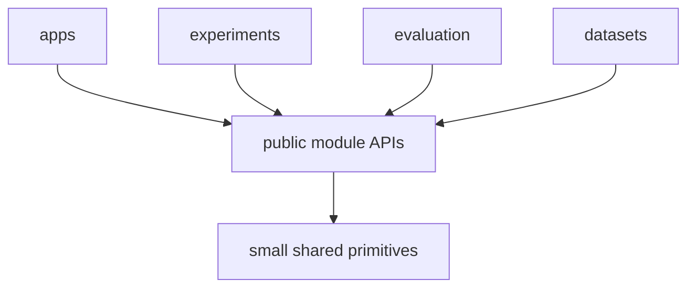

# Engineering Principles

This document records repository-wide implementation decisions that should remain stable as individual research modules evolve.

The project optimizes for readability, maintainability, explicit data flow, replaceability, and scientific reproducibility while preserving strong boundaries between research capabilities.

## Architectural style

The repository uses a **capability-oriented modular architecture**.

The main unit of organization is a capability with a clear responsibility, public boundary, tests, configuration, and local documentation.

A reader should be able to understand a capability primarily by opening its module.

The preferred structural pattern is:

```text
repository
    -> runnable applications
    -> capability modules
    -> small shared primitives
```

Within a capability, use the smallest internal structure that communicates the behavior clearly.

## Why this architecture fits the project

The main sources of change are:

- algorithms;
- learned models;
- sensor integrations;
- geometric and semantic representations;
- datasets;
- experiments;
- persistence strategies;
- runtime composition.

The architecture therefore favors:

1. understanding one capability locally;
2. replacing implementations behind stable behavior;
3. explicit transformations between multimodal observations;
4. experiments that can select and compare implementations;
5. module-level ownership of research code;
6. small, stable integration boundaries.

## Capability ownership

Every significant behavior has one obvious owner.

Current ownership is:

- `state-estimation`: pose, trajectory, and motion-corrected LiDAR observations;
- `geometric-map`: persistent world geometry;
- `visual-perception`: structured visual and semantic observations from RGB;
- `point-representation`: learned representations for LiDAR points;
- `sensor-association`: temporal and geometric RGB/LiDAR association;
- `semantic-fusion`: consolidation of semantic evidence across sources, views, and time;
- `semantic-map`: persistent semantic state linked to world geometry;
- `semantic-memory`: semantic and spatial retrieval structures;
- `scene-graph`: entities, hierarchy, and relationships;
- `context-reasoning`: contextual inference with provenance;
- `query-engine`: semantic, spatial, and contextual query composition.

Resolve ownership before implementation whenever a new feature appears to span several capabilities.

## Locality of implementation

Place capability-specific code with the module that owns it.

This includes:

- third-party runtimes;
- conversion code;
- model loading;
- backend-specific implementations;
- persistence helpers;
- module configuration;
- training and inference support.

Examples:

```text
modules/state-estimation/
    FAST_LIO-backed runtime

modules/geometric-map/
    Open3D-specific implementation

modules/visual-perception/
    model runtime and preprocessing
```

This keeps the code required to understand one capability physically close together.

## Public module boundary

Each module exposes the smallest useful public surface.

Consumers depend on:

- documented public data types;
- documented functions or classes;
- explicit protocols for real variation points;
- stable module entry points.

Internal model objects, caches, training-only structures, storage details, and backend-specific objects remain implementation details of the owning module.

The compatibility boundary is the public API.

## Shared code policy

Repository-wide shared code is reserved for concepts that are both globally owned and semantically stable.

Good candidates include:

- timestamps;
- coordinate frame identifiers;
- poses and rigid transforms;
- map and artifact identifiers;
- simple provenance primitives.

Capability-specific types stay with their module. A learned embedding format, model tensor structure, or backend schema remains owned by the capability that defines it.

When a shared package is introduced, prefer a small structure such as:

```text
shared/
├── geometry/
├── time/
└── types/
```

Promote a concept to shared code only after its meaning is stable across consumers.

## SOLID as design guidance

SOLID guides code and dependency design.

### Single Responsibility

A component represents one coherent responsibility and one primary reason to change.

Split behavior when responsibilities evolve independently.

### Open/Closed

Expose stable variation points where multiple implementations exist or are intentionally compared.

Typical project examples include multiple fusion methods, pose estimators, point encoders, storage backends, or research variants.

### Liskov Substitution

Implementations of the same public contract preserve the same consumer-visible behavior.

Substitution-relevant invariants should be documented and tested, including units, frames, ordering, error semantics, and lifecycle assumptions.

### Interface Segregation

Interfaces are shaped around one consumer need.

For example, map reading and map writing may be separate contracts when the consumers differ.

### Dependency Inversion

High-level orchestration depends on stable capabilities while concrete implementations satisfy those capabilities.

Example:

```text
mapping runtime -> PoseEstimator <- FAST_LIO-backed estimator
```

This keeps volatile external technology behind a stable project responsibility.

## Abstraction threshold

Introduce an abstraction when it makes a concrete boundary or variation point clearer.

Common triggers are:

- multiple implementations;
- a planned comparison experiment;
- isolation of an expensive or external dependency;
- a module boundary that requires a stable contract;
- contract-level testing with substitutes.

For local behavior with one straightforward implementation, prefer direct code and direct construction.

## Explicit data flow

Important transformations should be visible:

```text
input observation
    -> boundary validation
    -> capability-specific transformation
    -> explicit output type
    -> next capability
```

For multimodal robotics data, preserve relevant metadata such as:

- timestamp;
- sensor identity;
- coordinate frame;
- units;
- calibration identity;
- transform provenance;
- source observation identity;
- confidence or uncertainty;
- model/checkpoint provenance when needed for reproducibility.

A downstream consumer should be able to determine how an observation was produced and how it is spatially and temporally interpreted.

## Boundary validation

Validate assumptions when data crosses a module boundary.

Important examples are:

- coordinate-frame compatibility;
- timestamp synchronization;
- transform validity;
- tensor and embedding dimensions;
- supported point attributes;
- map version compatibility;
- provenance required by fusion or evaluation.

Fail early with actionable diagnostics when an invariant is violated.

## Configuration ownership

A module owns parameters that control its internal algorithm.

An application or experiment owns parameters that select implementations and compose modules.

This creates a simple distinction:

```text
algorithm parameter -> module config
composition choice   -> app or experiment config
```

Use typed and explicit configuration where practical. Document defaults that materially affect experiments.

## Research implementation rule

Public architecture is named after project capabilities.

Scientific provenance belongs in implementation and module documentation.

Example:

```text
capability: PoseEstimator
implementation: FAST_LIO-backed estimator
research notes: modules/state-estimation/docs/
```

The same rule applies to VLMs, point encoders, fusion methods, scene-graph techniques, datasets, and storage technologies.

Issues should define observable capability behavior, inputs, outputs, constraints, tests, and acceptance criteria. Module documentation can then record which research work informed the implementation.

## Readability rules

Prefer code that communicates intent locally.

Use:

- descriptive capability names;
- short call paths;
- explicit boundary types;
- focused files when responsibilities are distinct;
- comments for non-obvious reasoning;
- module documentation for design rationale.

Prefer precise names such as:

```text
PointEncoder
PoseEstimator
ObservationMatcher
TemporalFusion
SemanticMapReader
```

over generic names when a more specific responsibility is known.

## Dependency direction

Dependency direction follows capability ownership and public APIs.

At repository level:



For cross-module use:

```text
consumer -> producer public API
```

Keep these dependencies explicit and acyclic whenever practical.

When two modules need substantial access to each other's internal concepts, reconsider the ownership boundary.

## Testing strategy

Tests protect public behavior and scientific reproducibility.

Use:

- unit tests for deterministic transformations;
- contract tests for interchangeable implementations;
- integration tests for module boundaries;
- representative application tests for end-to-end composition;
- benchmarks for runtime, memory, and accuracy-sensitive components;
- regression fixtures for known failure modes.

Tests should make internal refactoring safe by focusing on observable behavior and stable invariants.

## Documentation as part of architecture

A design decision is complete when its rationale is recoverable.

Repository-wide decisions belong in root `docs/`.

Module-specific decisions belong in `modules/<module>/docs/`.

Changes to ownership, public contracts, dependency direction, or repository structure should update the relevant documentation in the same work.

## Structural decision checklist

Before accepting a structural change, verify:

1. Is there one obvious owner for the behavior?
2. Can a reader understand the change mostly within that owner module?
3. Are inputs, outputs, and invariants explicit?
4. Does the public boundary expose only what consumers need?
5. Are external implementation details contained locally?
6. Are units, frames, timestamps, and provenance explicit where required?
7. Can the behavior be tested through its public boundary?
8. Can intended implementations be replaced without changing unrelated consumers?
9. Is dependency direction clear and preferably acyclic?
10. Is this the smallest structure that communicates the design clearly?

A design that satisfies these points matches the engineering direction of the repository.