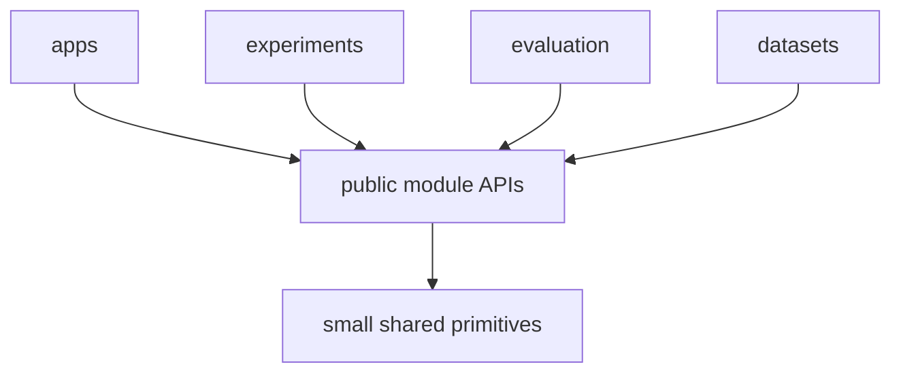

# Engineering Principles

This document records repository-wide implementation decisions that should remain stable as individual research modules evolve.

The objective is not to maximize architectural ceremony. The objective is to make the project easy to understand, modify, test, compare, and maintain while preserving strong boundaries between research capabilities.

## Architectural style

The repository uses a **capability-oriented modular architecture**.

It intentionally does **not** adopt Clean Architecture as a repository-wide pattern.

Clean Architecture concepts may be useful locally when a concrete module genuinely needs them, but contributors must not introduce its conventional layers mechanically across the project.

The repository should not evolve into repeated structures such as:

```text
domain/
application/
infrastructure/
ports/
adapters/
repositories/
use_cases/
```

unless a specific local problem clearly justifies them.

## Why this decision exists

This is a research-oriented system whose main sources of change are algorithms, learned models, sensor integrations, representations, datasets, and experiments.

The architecture therefore optimizes for:

1. understanding a capability by opening one module;
2. replacing one implementation without rewriting unrelated modules;
3. making data flow explicit;
4. keeping experiments close to the capability being evaluated;
5. avoiding framework-style abstraction that obscures research code;
6. preserving clean integration boundaries as implementations change.

The project should remain understandable to a reader who is unfamiliar with the implementation history.

## Capability ownership

Every significant behavior should have one obvious owner.

Examples:

- pose and trajectory estimation belong to `state-estimation`;
- persistent geometry belongs to `geometric-map`;
- visual semantic observations belong to `visual-perception`;
- learned LiDAR point features belong to `point-representation`;
- RGB/LiDAR geometric association belongs to `sensor-association`;
- temporal and multi-view semantic evidence consolidation belongs to `semantic-fusion`;
- persistent semantic state belongs to `semantic-map`;
- semantic/spatial retrieval structures belong to `semantic-memory`;
- entities and relationships belong to `scene-graph`;
- contextual inference belongs to `context-reasoning`;
- user-facing semantic/spatial query composition belongs to `query-engine`.

If a new feature does not have an obvious owner, resolve ownership before implementing it.

Do not split one responsibility between several modules merely to preserve an architectural pattern.

## Locality over horizontal layers

Code that is specific to one capability should live with that capability.

For example, a third-party odometry runtime used exclusively by `state-estimation` should be implemented under `state-estimation`, not under a repository-wide infrastructure layer.

The same rule applies to model runtimes, conversion code, persistence helpers, backend-specific implementations, and configuration that are owned by one module.

This reduces the number of directories a reader must inspect to understand one feature.

## Public module boundary

Each module should expose the smallest useful public surface.

Consumers may depend on:

- documented public types;
- documented public functions or classes;
- explicit protocols/interfaces that define a real variation point;
- stable module entry points.

Consumers must not depend on:

- private submodules;
- internal model objects;
- cache implementation;
- storage layout;
- training-only structures;
- undocumented configuration internals;
- third-party library objects that are not part of the public contract.

The public API is the compatibility boundary. Internal organization may change freely as long as the public behavior remains valid.

## Shared code policy

Shared code is intentionally small.

A type belongs in repository-wide shared code only when it is both:

1. conceptually owned by the whole system rather than one capability;
2. stable enough that several modules should agree on exactly the same meaning.

Good candidates include:

- timestamps;
- coordinate frame identifiers;
- poses and rigid transforms;
- map or artifact identifiers;
- simple repository-wide provenance primitives.

Bad candidates include:

- one module's embedding format;
- one model's tensor structure;
- one persistence backend's schema;
- convenience utilities that happen to be imported twice.

Do not create a generic `utils` dumping ground.

## Historical root directories

The repository may still contain root-level `adapters/` and `contracts/` directories created during earlier architectural iterations.

They must not be interpreted as mandatory Clean Architecture layers.

New capability-specific integrations and contracts should be kept with their owning modules. Only genuinely repository-wide primitives should be promoted to shared code.

When touching legacy placeholders, prefer simplifying or migrating them rather than expanding them into horizontal architecture layers.

## SOLID as code-design guidance

SOLID is a design constraint, not a folder template.

### Single Responsibility

A component should represent one coherent responsibility and one primary reason to change.

Split behavior when responsibilities change for different reasons, not merely to reduce file size.

### Open/Closed

Enable extension where a real family of implementations exists.

A strategy or protocol is valuable for cases such as multiple fusion methods, multiple pose estimators, or interchangeable persistence backends. It is unnecessary when no meaningful variation exists.

### Liskov Substitution

Two implementations of the same public contract must behave consistently from the consumer's perspective.

Document invariants, units, coordinate frames, ordering guarantees, error behavior, and lifecycle assumptions when they are part of substitution correctness.

### Interface Segregation

Expose narrow interfaces around consumer needs.

For example, reading a semantic map and writing a semantic map may be separate contracts if consumers need only one side.

### Dependency Inversion

Application orchestration and high-level modules should depend on stable capability behavior rather than on concrete external libraries.

Dependency inversion should isolate meaningful volatility. It should not produce one interface for every class.

## Abstraction threshold

An abstraction should normally be introduced only when one of these is true:

- there are already multiple implementations;
- a planned experiment explicitly compares interchangeable implementations;
- an expensive or external dependency needs isolation;
- a module boundary needs a stable contract;
- testing requires a substitute that should satisfy the same behavior.

A speculative "we may need this later" is not sufficient by itself.

Prefer duplication of a few obvious lines over a premature generic abstraction that hides intent. Remove duplication when the common concept is proven.

## Explicit data flow

The system should favor visible transformations:

```text
input observation
    -> validation
    -> capability-specific transformation
    -> explicit output type
    -> next capability
```

Avoid hidden global registries, implicit singleton state, mutable cross-module caches, or ambient dependencies.

For multimodal robotics data, important metadata must remain explicit when relevant:

- timestamp;
- sensor/frame identity;
- coordinate frame;
- units;
- calibration or transform provenance;
- source observation identity;
- confidence or uncertainty;
- model/checkpoint provenance where necessary for reproducibility.

Do not silently discard metadata required to reconstruct how a result was produced.

## Boundary validation

Validate assumptions where data crosses a module boundary.

Examples include:

- incompatible coordinate frames;
- unsynchronized timestamps;
- invalid transforms;
- unexpected tensor or embedding dimensions;
- unsupported point attributes;
- incompatible map versions;
- missing provenance required by fusion or evaluation.

Prefer an early explicit failure over downstream corruption.

## Configuration decisions

Configuration should be close to its owner.

A module owns parameters that control its internal algorithm. An application owns parameters that select implementations or compose several modules.

Avoid one global configuration object containing every setting in the repository.

Default values should be safe, reproducible, and documented when they materially affect experiments.

## Research-code rule

Research provenance is important, but architectural naming should remain capability-based.

Do not name the public architecture after a paper, repository, model family, or dataset when that name would couple the system to one implementation.

For example, prefer a public `PoseEstimator` capability with a concrete implementation backed by a specific odometry system over making that odometry system the architectural boundary itself.

Similarly, issues should define the required capability, behavior, tests, and acceptance criteria without making an external paper the specification. Module documentation may record which ideas, algorithms, or comparisons influenced the implementation.

## Readability rules

Prefer code that communicates intent without requiring architectural archaeology.

Use:

- descriptive domain/capability names;
- short call paths;
- explicit types at module boundaries;
- small files when responsibilities are distinct;
- comments for non-obvious reasoning, not for restating code;
- module documentation for design rationale.

Avoid:

- generic `manager`, `handler`, `helper`, or `utils` classes when a precise name exists;
- pass-through layers with no behavior;
- wrappers whose only purpose is satisfying an architectural pattern;
- factories when direct construction is clearer;
- service locators or global registries without a concrete need;
- circular module dependencies.

## Dependency direction

There is no universal layer stack. Dependency direction follows capability ownership and public APIs.

At a high level:



Cross-module dependencies should be explicit and acyclic whenever practical.

If two modules repeatedly need each other's private concepts, the boundary is probably wrong and should be reconsidered rather than patched with more abstraction.

## Testing strategy

Tests should protect public behavior and scientific reproducibility.

Use:

- unit tests for deterministic transformations;
- contract tests for interchangeable implementations;
- integration tests for module boundaries;
- representative application tests for end-to-end composition;
- benchmarks for runtime, memory, or accuracy-sensitive components;
- regression fixtures for previously observed failure modes.

Avoid tests that freeze incidental internal structure and make refactoring unnecessarily expensive.

## Documentation as part of architecture

A non-obvious design decision is incomplete until its rationale is recoverable.

Repository-wide decisions belong in root `docs/`.

Module-specific decisions belong in `modules/<module>/docs/`.

If a contributor changes an established boundary, ownership rule, public contract, or dependency direction, the relevant documentation should change in the same work.

## Review checklist

Before accepting a structural change, verify:

1. Is there one obvious owner for the new behavior?
2. Can a reader understand the change without opening unrelated directories?
3. Is a new abstraction solving a concrete problem?
4. Does the public boundary expose only what consumers need?
5. Are external implementation details contained?
6. Are units, frames, timestamps, and provenance explicit where required?
7. Can the important behavior be tested without depending on private internals?
8. Does the change preserve or improve replaceability?
9. Does it introduce a circular or hidden dependency?
10. Is the resulting design simpler than the reasonable alternatives?

If the answer to the last question is no, prefer the simpler design.