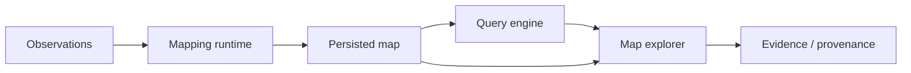

# Map Lifecycle

This document defines the repository-level lifecycle of a map without prescribing internal algorithms or concrete storage technologies.

## 1. Observation ingestion

Live sensors, recorded sessions, and datasets are translated by adapters into stable project contracts. Raw source identity, timestamps, coordinate frames, calibration references, and provenance must be preserved.

## 2. Motion estimation and geometry

`state-estimation` provides motion estimates and corrected LiDAR observations. `geometric-map` uses contract-compatible outputs to build persistent world geometry.

## 3. Semantic enrichment

Visual and learned point representations are associated with geometry, fused across observations, and attached to the semantic map through stable geometry references.

## 4. Memory and context

Mapped semantic information feeds semantic memory, scene-graph construction, contextual reasoning, and query indexes.

## 5. Persistence

A map is persisted as a logical collection of related artifacts rather than as one mandatory file format.

A map manifest should be capable of referencing at least:

```text
MapManifest
├── map identity
├── coordinate frame
├── bounds
├── trajectory
├── geometry artifacts
├── semantic artifacts
├── observations
├── scene graph
├── indexes
└── provenance
```

Concrete databases, object stores, point-cloud formats, and index implementations remain adapters.

## 6. Reopen and query

A persisted map can be opened without rerunning the original mapping pipeline. `query-engine` provides semantic, spatial, relational, and contextual retrieval over available map state.

## 7. Explore and inspect evidence

`map-explorer` consumes geometry, semantic overlays, query results, observations, and provenance. A query result should remain traceable to the evidence and map artifacts that support it.



## Completeness criterion

The repository is end-to-end complete when a contract-compatible RGB, LiDAR, and motion input can be processed into a persistent 3D semantic/contextual map, reopened later, queried through public interfaces, visualized spatially, and traced back to supporting observations and provenance.
