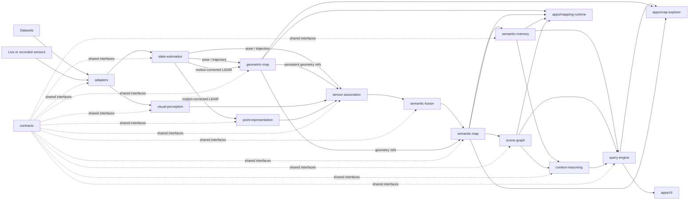
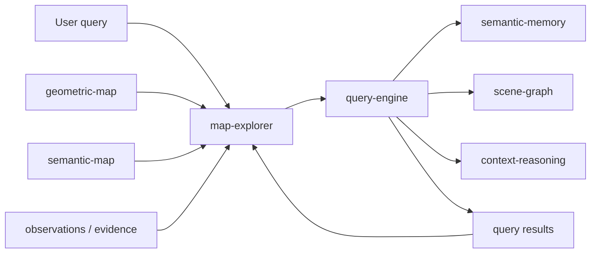

# System Flow

This document shows the repository-level flow between modules and applications. It intentionally represents composition and data movement between boundaries, not internal algorithms.

Arrows between modules represent exchange through compatible contracts, not direct implementation dependencies.



## Mapping flow

The mapping flow converts sensor or dataset observations into persistent geometric, semantic, and contextual state.

```text
input observations
    -> state estimation
    -> persistent geometry
    -> learned and visual representations
    -> sensor association
    -> semantic fusion
    -> semantic map
    -> semantic memory / scene graph
    -> contextual reasoning and indexes
```

`mapping-runtime` is the composition entry point for this flow. It does not replace any module and does not own their algorithms.

## Query and exploration flow

After a map exists, query-time interaction does not require rerunning state estimation. Applications consume persistent map state and public query interfaces.



A result may identify an entity, region, position, geometry reference, relation, observation, evidence item, or provenance record. The application can then focus the corresponding 3D region and expose the observations that support the result.

## Persistence flow

Persistence is a cross-cutting boundary rather than a sequential research stage. Public storage contracts allow map state, observations, evidence, and indexes to survive process termination and be reopened by another application.

Concrete storage formats and database technologies remain adapters.

## Interpretation

`evaluation/`, `experiments/`, and `tests/` are intentionally not represented as sequential stages. They are cross-cutting consumers that may exercise individual modules or complete compositions independently.

A workflow may replace, isolate, or omit stages when its contracts permit that composition. Dataset-provided ground-truth poses, for example, may substitute a live state estimator in an experiment without changing downstream public contracts.
