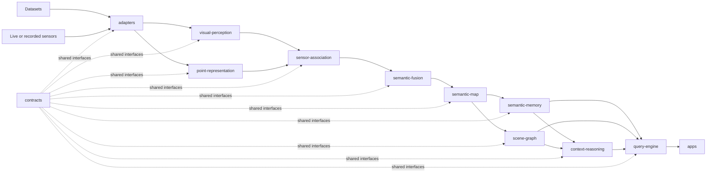

# System Flow

This document shows the repository-level flow between modules. It intentionally represents only composition and data movement between boundaries. It does not describe how any module performs its work internally.

Arrows between modules represent exchange through compatible contracts, not direct implementation dependencies.

## Interpretation

The diagram is a topology of the intended integration path, not a specification of internal algorithms and not a requirement that every runnable experiment use every module.

A workflow may replace, isolate, or omit stages when its contracts permit that composition. The important invariant is that module boundaries remain explicit and that interoperability is expressed through repository contracts.

`evaluation/`, `experiments/`, and `tests/` are intentionally not represented as sequential stages. They are cross-cutting consumers that may exercise individual modules or complete compositions independently.
