# Fluxo completo do contextual-3d-mapping

Este documento descreve a pipeline **completa do repositório**, não apenas o módulo `visual-perception`. Ele mostra como dados, contracts, referências, geometria, evidência visual, semântica, proveniência e aplicações se relacionam do ingresso dos sensores até o mapa contextual consolidado.

A regra desta página é distinguir explicitamente:

```text
fluxo implementado
    !=
fluxo opcional / lateral
    !=
capacidade planejada
```

Linhas contínuas representam relações implementadas ou contracts materializados. Linhas tracejadas representam capacidades planejadas ou integrações futuras ainda não materializadas como fluxo canônico.

## 1. Pipeline canônica completa

```mermaid
flowchart TD

    %% =========================================================
    %% SOURCES
    %% =========================================================

    subgraph SRC["FONTES EXTERNAS"]
        LIVE["Sensores ao vivo\nRGB + LiDAR + IMU"]
        BAG["ROS bag / sessão gravada"]
        DATASET["Dataset adapter"]
        FIXTURE["Fixture / benchmark / teste"]
        CALIB_FILE["Artifact de calibração\nintrínseca + extrínseca"]
    end

    %% =========================================================
    %% ADAPTERS
    %% =========================================================

    subgraph ADP["ADAPTERS DE REPOSITÓRIO"]
        ROS2["adapters/ros2\ntradução ROS 2 -> contracts"]
        DSADP["adapters/datasets\nnormalização de dataset"]
        STORAGE["adapters/map-storage\npersistência / artifacts"]
    end

    LIVE --> ROS2
    BAG --> ROS2
    DATASET --> DSADP

    %% =========================================================
    %% SHARED CONTRACTS
    %% =========================================================

    subgraph CONTRACTS["CONTRACTS COMPARTILHADOS"]
        OBSREF["ObservationReference"]
        TIME["timestamps / clock_id"]
        SPATIAL["frames / transforms"]
        RUN["run provenance"]
        MAPCONTRACT["map identifiers / map contracts"]
    end

    ROS2 --> OBSREF
    ROS2 --> TIME
    ROS2 --> SPATIAL
    DSADP --> OBSREF
    DSADP --> TIME
    DSADP --> SPATIAL
    FIXTURE --> OBSREF

    %% =========================================================
    %% COMPOSITION ROOT
    %% =========================================================

    subgraph RUNTIME["apps/mapping-runtime  |  COMPOSITION ROOT"]
        ORCH["wiring + configuração\nordem de execução\nlifecycle"]
        WINDOW["bag-window / keyframe identity"]
        RUNCTX["run / segment identity"]
    end

    OBSREF --> ORCH
    TIME --> ORCH
    SPATIAL --> ORCH
    BAG --> WINDOW
    WINDOW --> ORCH
    RUN --> RUNCTX
    RUNCTX --> ORCH

    %% =========================================================
    %% RGB BRANCH
    %% =========================================================

    subgraph RGBPATH["RAMO RGB  |  visual-perception"]
        RGB["ImageObservation + ImagePayload"]
        AREAS["ImageAreaMasks\nvalid area + ego"]
        SCONCEPT["Scene Concept Discovery\nQwen / Gemini"]
        CGROUND["Concept Grounding\nSAM3 PCS"]
        GDISC["Generic Region Discovery\nSAM3 tracker + tiling"]
        PFILTER["Proposal Filtering"]
        RMERGE["Cross-scale Merge"]
        FREEZE["GEOMETRY FREEZE\nmask + bbox + region_id"]
        EVID["Multi-context Evidence\nRegionView + DINO + CLIP image"]
        SCENE["SceneContext\nQwen / Gemini"]
        PRIOR["Optional temporal prior"]
        RSEM["Region Semantics\nprimary + alternatives"]
        CLIPTXT["CLIP text embeddings"]
        SUPPORT["Independent hypothesis support"]
        CAL["Semantic calibration"]
        REFINE["Selective refinement"]
        GREL["Geometric relations"]
        RECON["Intra-frame reconciliation"]
        SREL["Semantic relations"]
        PUB["Contextual publication"]
        VAUDIT["Final audit"]
        VOBS["VisualObservation"]
    end

    ORCH --> RGB
    RGB --> AREAS
    RGB --> SCONCEPT
    AREAS --> SCONCEPT
    SCONCEPT --> CGROUND
    RGB --> GDISC
    CGROUND --> PFILTER
    GDISC --> PFILTER
    AREAS --> PFILTER
    PFILTER --> RMERGE
    RMERGE --> FREEZE
    FREEZE --> EVID
    RGB --> EVID
    RGB --> SCENE
    AREAS --> SCENE
    FREEZE --> PRIOR
    EVID --> PRIOR
    FREEZE --> RSEM
    EVID --> RSEM
    SCENE --> RSEM
    PRIOR --> RSEM
    RSEM --> CLIPTXT
    EVID --> SUPPORT
    CLIPTXT --> SUPPORT
    SUPPORT --> CAL
    SCENE --> CAL
    CAL --> REFINE
    REFINE --> GREL
    GREL --> RECON
    RECON --> SREL
    SCENE --> SREL
    SREL --> PUB
    PUB --> VAUDIT
    VAUDIT --> VOBS

    %% =========================================================
    %% LIDAR / MOTION BRANCH
    %% =========================================================

    subgraph MOTION["RAMO LiDAR + IMU  |  state-estimation"]
        LIDAR["LiDAR observation"]
        IMU["IMU observation"]
        EST["state-estimation\nFAST-LIO integration / contracts"]
        STATE["StateEstimate / trajectory / pose"]
        MCLOUD["motion-corrected LiDAR"]
    end

    ORCH --> LIDAR
    ORCH --> IMU
    LIDAR --> EST
    IMU --> EST
    EST --> STATE
    EST --> MCLOUD

    %% =========================================================
    %% GEOMETRIC MAP
    %% =========================================================

    subgraph GMAP["geometric-map  |  GEOMETRIA PERSISTENTE"]
        GPERSIST["persist / transform geometry"]
        GPOINT["GeometryPoint"]
        GREF["GeometryReference\nmap_id + geometry_id"]
        BOUNDS["Bounds3D / spatial access"]
    end

    STATE --> GPERSIST
    MCLOUD --> GPERSIST
    MAPCONTRACT --> GPERSIST
    GPERSIST --> GPOINT
    GPERSIST --> GREF
    GPERSIST --> BOUNDS

    %% =========================================================
    %% POINT REPRESENTATION SIDE PATH
    %% =========================================================

    subgraph PREP["point-representation  |  RAMO OPCIONAL"]
        PTRANS["deterministic point transforms"]
        PENC["PointEncoder port"]
        PEMB["PointEmbedding / 3D representation"]
    end

    GPOINT --> PTRANS
    PTRANS --> PENC
    PENC --> PEMB

    %% =========================================================
    %% CALIBRATION + POSE
    %% =========================================================

    subgraph CALPOSE["POSE + CALIBRAÇÃO"]
        CALIB["CameraLidarCalibration\nmodel + intrinsics + lidar_to_camera"]
        POSE["pose map/world -> camera\nat RGB timestamp"]
    end

    CALIB_FILE --> CALIB
    STATE --> POSE

    %% =========================================================
    %% SENSOR ASSOCIATION
    %% =========================================================

    subgraph ASSOC["sensor-association  |  2D -> 3D"]
        PROJ["transform GeometryPoint -> camera"]
        CAMERA["camera model projection\npinhole / fisheye / MEI"]
        SUPPORT3D["valid optical support"]
        OCC["visibility / occlusion"]
        MASKMEM["ObservedRegion mask membership"]
        STATUS["AssociationStatus\nassociated / behind / outside / occluded"]
        PVA["PointVisualAssociation"]
    end

    GPOINT --> PROJ
    POSE --> PROJ
    CALIB --> PROJ
    PROJ --> CAMERA
    CAMERA --> SUPPORT3D
    SUPPORT3D --> OCC
    VOBS --> MASKMEM
    OCC --> MASKMEM
    MASKMEM --> STATUS
    GREF --> PVA
    STATUS --> PVA
    VOBS --> PVA
    CALIB --> PVA

    %% =========================================================
    %% SEMANTIC CONTRIBUTIONS + FUSION
    %% =========================================================

    subgraph FUSION["semantic-fusion  |  MULTI-VIEW + 3D"]
        CONTRIB["SemanticContribution\nper observation / region / point"]
        GROUP["group by GeometryReference"]
        RANK["quality ranking\ncalibrated_confidence > confidence > visual_support > region_quality"]
        AGREEMENT["multi-keyframe agreement"]
        SPATIALSUP["3D spatial support"]
        FUSED["FusedPointContext"]
    end

    PVA --> CONTRIB
    CONTRIB --> GROUP
    GREF --> GROUP
    GROUP --> RANK
    GROUP --> AGREEMENT
    BOUNDS --> SPATIALSUP
    GPOINT --> SPATIALSUP
    RANK --> FUSED
    AGREEMENT --> FUSED
    SPATIALSUP --> FUSED
    PEMB -. "canal futuro/independente" .-> FUSED

    %% =========================================================
    %% CONTEXT RUN
    %% =========================================================

    subgraph CONTEXTRUN["RUN CONTEXTUAL PUBLICADA"]
        CTX["context.json / contextual run"]
        PRUN["PublishedContextRun"]
        GFINGER["geometry_fingerprint"]
    end

    VOBS --> CTX
    PVA --> CTX
    FUSED --> CTX
    STATE --> CTX
    CALIB --> CTX
    GREF --> CTX
    RUNCTX --> CTX
    CTX --> PRUN
    GPOINT --> GFINGER
    GFINGER --> PRUN

    %% =========================================================
    %% SEMANTIC MAP
    %% =========================================================

    subgraph SMAP["semantic-map  |  CONSOLIDAÇÃO ENTRE RUNS"]
        COMPAT{"same map_id + map_frame +\ngeometry_fingerprint?"}
        CONSOL["consolidate_context_runs()"]
        CMAP["ConsolidatedContextMap"]
    end

    PRUN --> COMPAT
    COMPAT -->|"sim"| CONSOL
    COMPAT -->|"não"| REJECTRUN["reject incompatible run"]
    CONSOL --> CMAP

    %% =========================================================
    %% STORAGE + APPLICATIONS
    %% =========================================================

    CTX --> STORAGE
    CMAP --> STORAGE

    subgraph APPS["APPLICATIONS"]
        CLI["apps/cli\nrun / compare / publish"]
        EXPLORER["apps/map-explorer\n3D view + evidence inspection"]
    end

    ORCH --> CLI
    CLI --> STORAGE
    STORAGE --> EXPLORER

    %% =========================================================
    %% PLANNED CAPABILITIES
    %% =========================================================

    subgraph FUTURE["CAPACIDADES PLANEJADAS"]
        MEMORY["semantic-memory"]
        GRAPH["scene-graph"]
        CREASON["context-reasoning"]
        QUERY["query-engine"]
    end

    CMAP -.-> MEMORY
    CMAP -.-> GRAPH
    MEMORY -.-> CREASON
    GRAPH -.-> CREASON
    CREASON -.-> QUERY
    QUERY -.-> EXPLORER
    QUERY -.-> CLI
```

## 2. Relação de ownership entre módulos

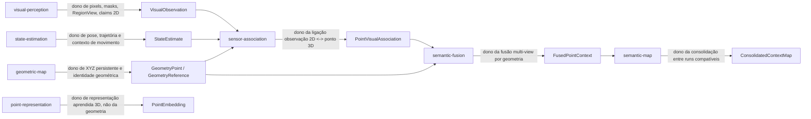

A consequência dessa separação é importante:

- `visual-perception` não cria XYZ persistente;
- `geometric-map` não decide labels;
- `sensor-association` não pergunta novamente ao VLM o que existe no pixel;
- `semantic-fusion` não reprojeta pontos e não refaz percepção 2D;
- `semantic-map` não registra mapas diferentes nem resolve alinhamento espacial entre geometrias incompatíveis;
- `mapping-runtime` compõe capacidades, mas não deve implementar a lógica científica pertencente a um módulo.

## 3. Relação temporal e de identidade

A pipeline depende de identidade e tempo preservados desde a fonte. A relação completa é:

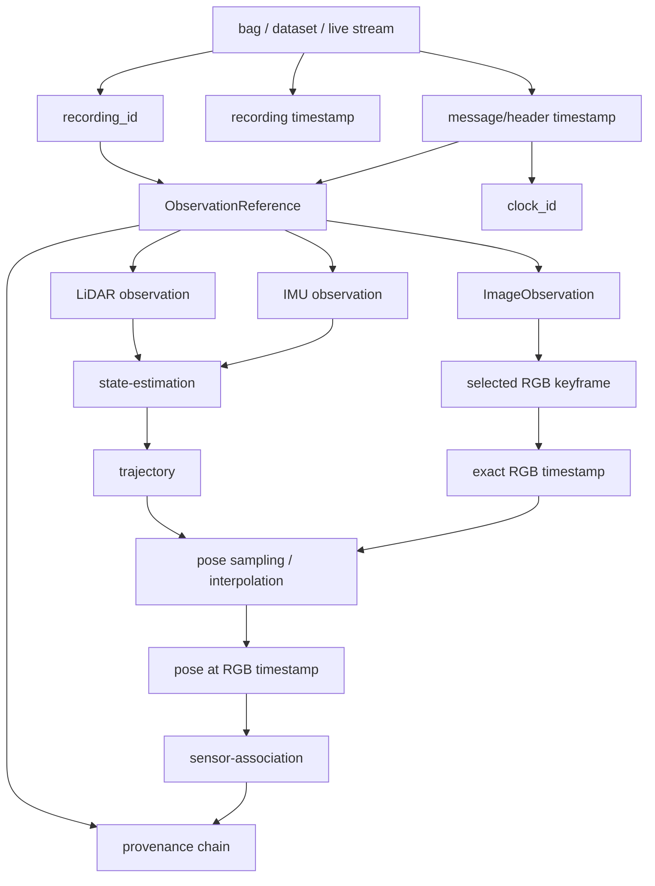

No `corridor-02`, o runtime preserva separadamente o tempo de gravação do bag e o timestamp de header. A pose usada para associação deve corresponder ao instante RGB, e o runtime rejeita extrapolação ou gaps temporais acima da política configurada.

## 4. Relação geométrica entre LiDAR, mapa e câmera

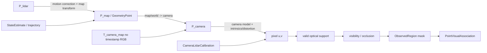

Essa relação é a fronteira onde um erro de pose, calibração ou visibilidade pode parecer um erro semântico. Por isso os diagnósticos mantêm esses canais separados.

## 5. Relação completa da evidência visual

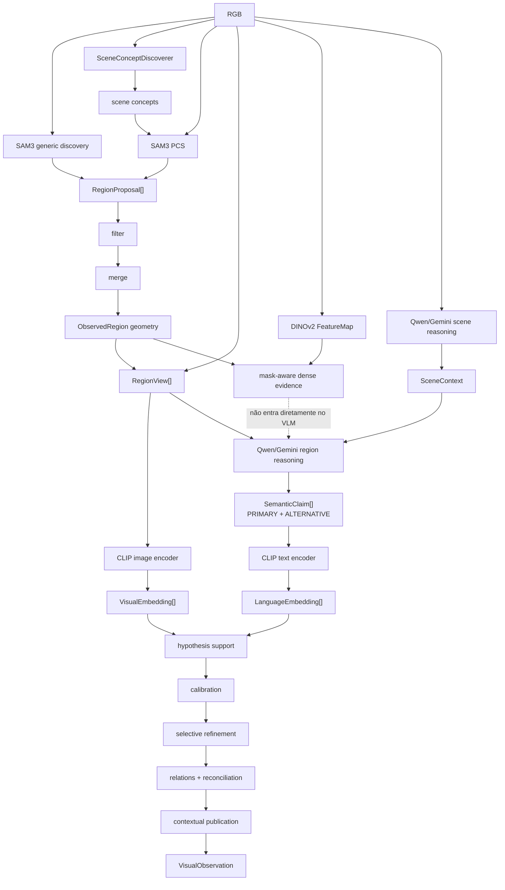

Os canais têm funções diferentes:

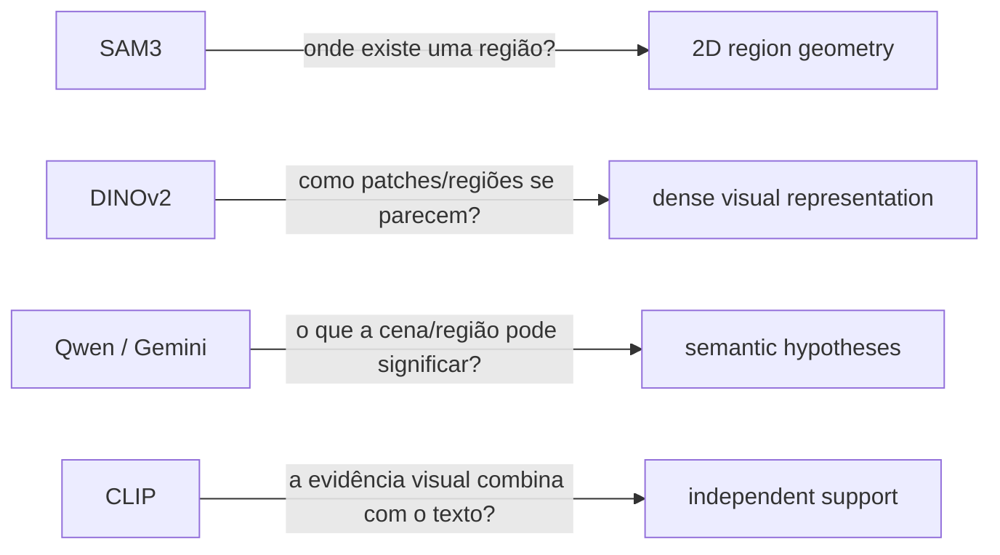

## 6. Relação entre `VisualObservation` e geometria persistente

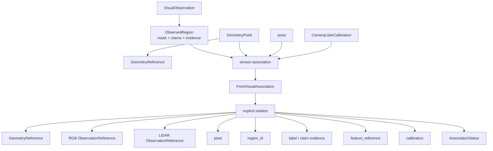

`PointVisualAssociation` não transforma uma label 2D em verdade 3D. Ela registra que uma observação visual específica alcançou uma geometria específica sob uma pose, uma calibração e uma decisão de visibilidade específicas.

## 7. Relação multi-frame e fusão semântica

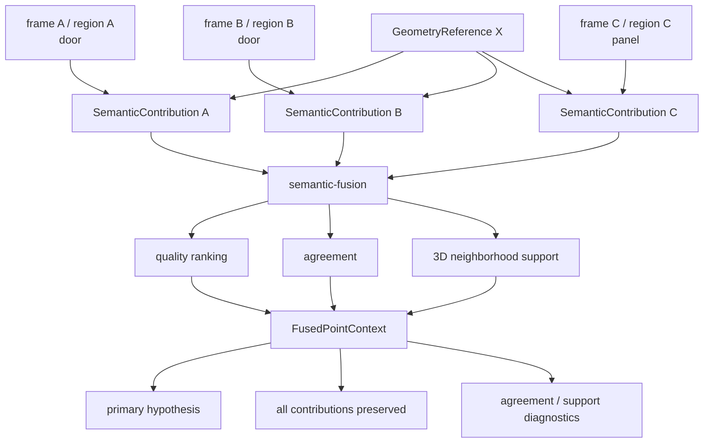

A fusão agrupa contribuições pela mesma `GeometryReference`; não sobrescreve cada observação conforme novos frames chegam.

## 8. Relação entre runs e `semantic-map`

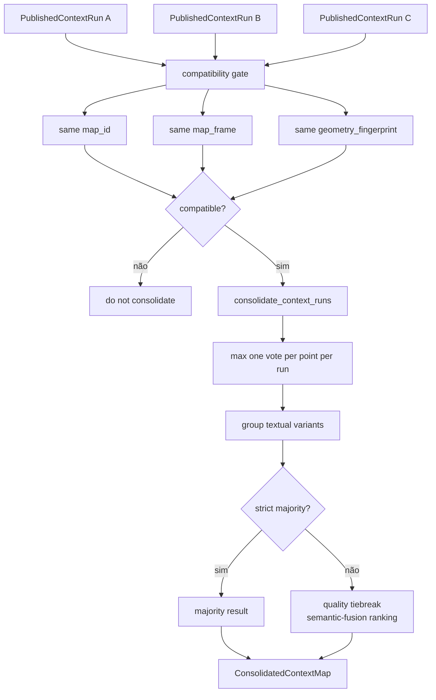

`semantic-map` consolida runs publicadas sobre **a mesma geometria**. Ele não é um módulo de registro espacial entre mapas independentes.

## 9. Relação de proveniência ponta a ponta

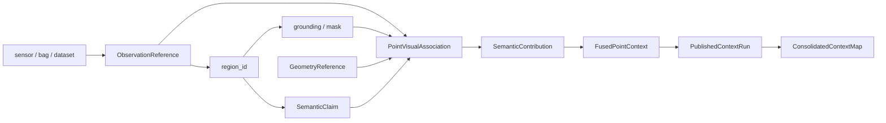

A cadeia deve permitir voltar de um ponto consolidado para:

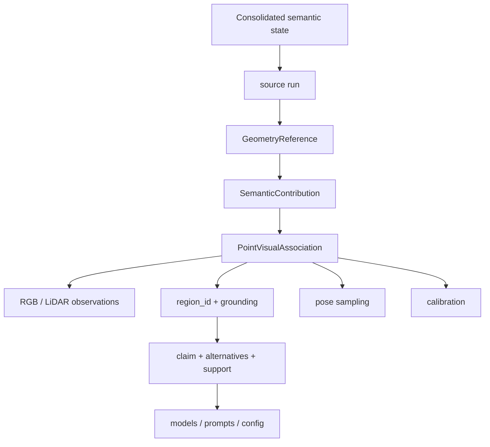

## 10. Relação com armazenamento e aplicações

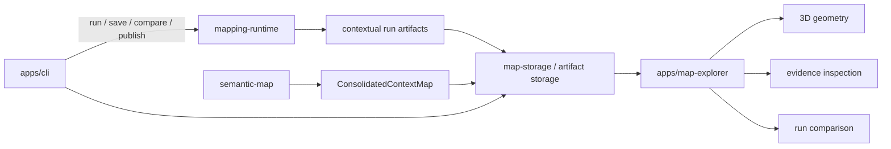

## 11. Capacidades planejadas e relações futuras

As capacidades seguintes aparecem na arquitetura, mas ainda não possuem contract público completo equivalente aos módulos materializados.

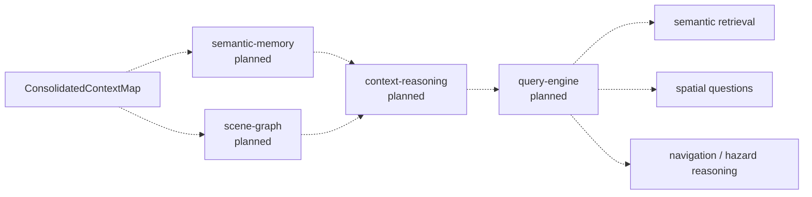

Uma futura `scene-graph` deverá distinguir pelo menos:

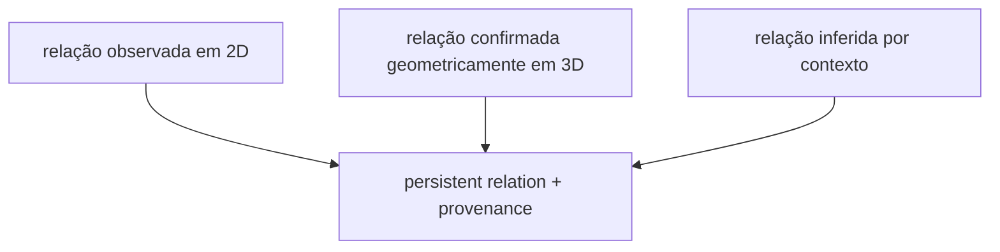

Exemplos de relações de domínio pretendidas incluem `ON`, `ADJACENT_TO` e `BLOCKS`, sempre com proveniência e suporte, e não apenas uma aresta sem origem.

## 12. Dependências entre módulos em uma única visão

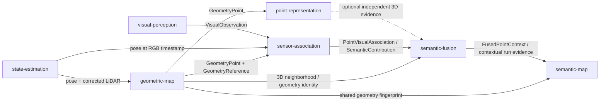

## 13. Ordem operacional de uma execução contextual real

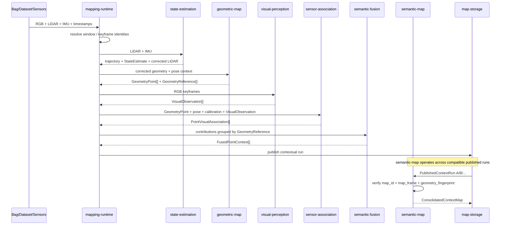

## 14. O que não deve ser confundido

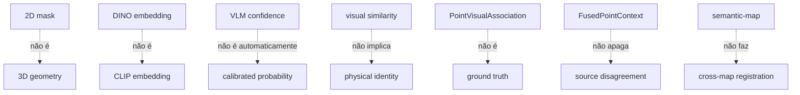

## Próxima leitura

- [`docs/README.md`](./README.md), índice estágio por estágio;
- [`modules/visual-perception/docs/pipeline-flow.md`](../modules/visual-perception/docs/pipeline-flow.md), fluxo interno completo de percepção visual;
- [`modules/visual-perception/docs/model-flow.md`](../modules/visual-perception/docs/model-flow.md), relação entre SAM3, DINOv2, CLIP e Qwen/Gemini;
- [`modules/state-estimation/docs/README.md`](../modules/state-estimation/docs/README.md);
- [`modules/geometric-map/docs/README.md`](../modules/geometric-map/docs/README.md);
- [`modules/sensor-association/docs/README.md`](../modules/sensor-association/docs/README.md);
- [`modules/semantic-fusion/docs/README.md`](../modules/semantic-fusion/docs/README.md);
- [`modules/semantic-map/docs/index.md`](../modules/semantic-map/docs/index.md);
- [`apps/mapping-runtime/README.md`](../apps/mapping-runtime/README.md).
