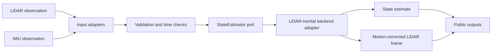
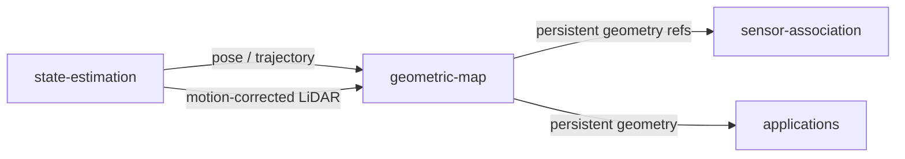
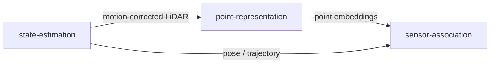
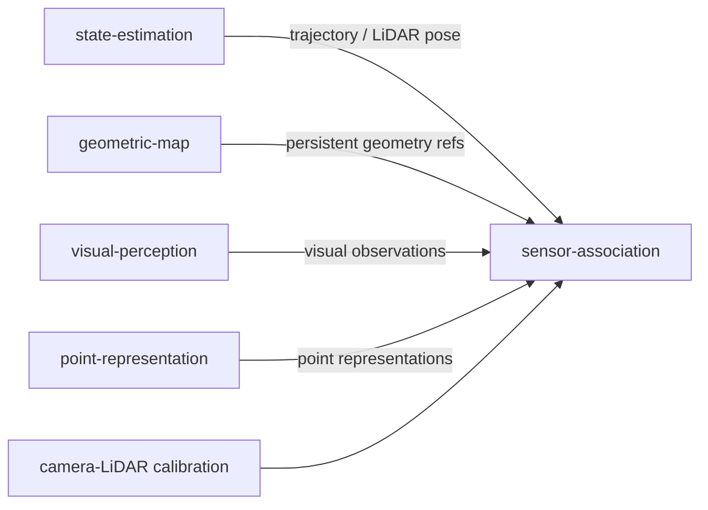

# State Estimation Architecture

`state-estimation` is the geometric motion boundary between raw LiDAR/IMU observations and downstream persistent 3D mapping and semantic processing.

## Internal flow



The backend adapter is replaceable. FAST-LIO is the initial concrete integration target, but no downstream consumer should depend on FAST-LIO-specific messages, configuration structures, ROS types, or internal state.

## Public outputs

The module is expected to expose contract-compatible information conceptually equivalent to:

```text
StateEstimate
├── timestamp
├── pose
├── velocity?
├── covariance?
├── coordinate_frame
├── validity
└── provenance

MotionCorrectedLiDARFrame
├── timestamp
├── points
├── coordinate_frame
├── pose_reference
└── provenance
```

Exact schemas are defined by implementation issues rather than this document.

## Boundary with geometric-map

`geometric-map` owns persistent world geometry. It consumes contract-compatible pose/trajectory information and motion-corrected LiDAR observations from `state-estimation`.



`state-estimation` therefore does not own persistent reconstruction, map chunking, map storage, spatial indexing, or visualization.

## Boundary with point-representation

`point-representation` consumes point geometry and produces learned point embeddings. It must not own odometry, pose estimation, IMU fusion, scan deskewing, trajectory estimation, or persistent geometric-map ownership.



## Boundary with sensor-association

`state-estimation` may provide the platform trajectory and LiDAR-side pose information required for multimodal alignment. It does not calibrate the camera to the LiDAR and does not generate point-to-pixel or point-to-feature correspondences.



## External backend isolation

The initial backend integration must be isolated under infrastructure code. The adapter is responsible for translating external runtime inputs and outputs into module contracts.

Backend-specific concerns include:

- middleware message types;
- process lifecycle;
- sensor topic names;
- LiDAR-IMU extrinsics;
- backend configuration files;
- runtime diagnostics;
- external dependency installation.

None of these concerns should leak into the domain or downstream modules.
