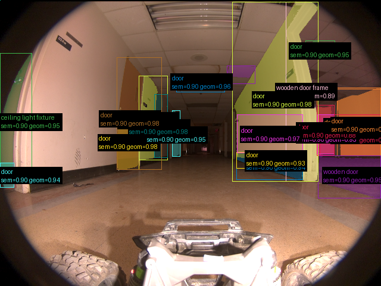
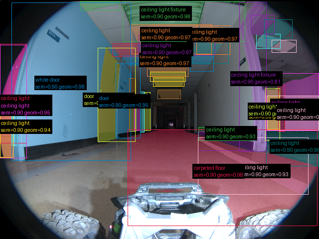
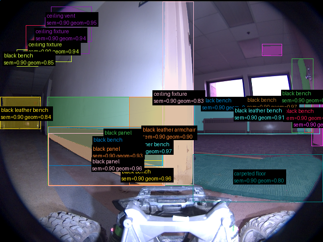

# Validação do pipeline real — 2026-09-16-run-003-frames

Revisão: `6c6a1b44` · Frames: 3 · Pico de VRAM: 6.96 GB (budget: 8.0 GB) · Pico de RSS do host: 10.46 GB

Ver `manifest.json` para configuração completa e log de estágios.

## corridor-02-000

**scene_type:** corridor · **regiões canônicas:** 58 (21 publicadas, 37 contexto estrutural) · **relações:** 312 · **falhas de interpretação:** 0 · **audit:** ✅ pass (63 warnings)

## corridor-02-001

**scene_type:** corridor · **regiões canônicas:** 62 (42 publicadas, 20 contexto estrutural) · **relações:** 372 · **falhas de interpretação:** 0 · **audit:** ✅ pass (57 warnings)

## corridor-02-002

**scene_type:** corridor · **regiões canônicas:** 56 (22 publicadas, 34 contexto estrutural) · **relações:** 390 · **falhas de interpretação:** 0 · **audit:** ✅ pass (51 warnings)
