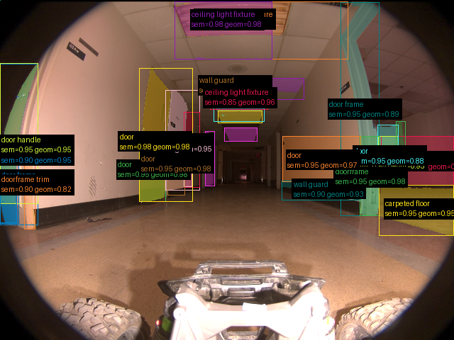
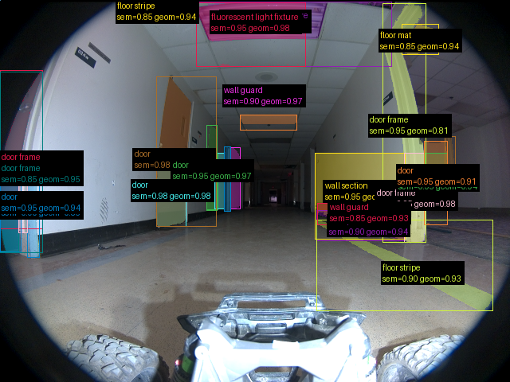
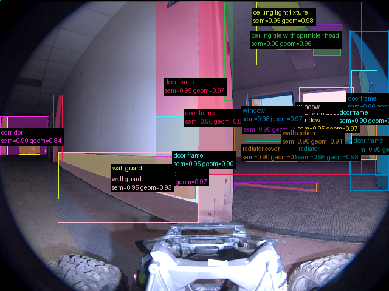

# Validação do pipeline real — 2026-09-16-run-004-frames

Revisão: `6c6a1b44` · Frames: 3 · Pico de VRAM: 4.50 GB (budget: 8.0 GB) · Pico de RSS do host: 4.39 GB

Ver `manifest.json` para configuração completa e log de estágios.

## corridor-02-000

**scene_type:** hallway · **regiões canônicas:** 58 (29 publicadas, 29 contexto estrutural) · **relações:** 321 · **falhas de interpretação:** 1 · **audit:** ✅ pass (28 warnings)

## corridor-02-001

**scene_type:** hallway · **regiões canônicas:** 62 (28 publicadas, 34 contexto estrutural) · **relações:** 384 · **falhas de interpretação:** 0 · **audit:** ✅ pass (33 warnings)

## corridor-02-002

**scene_type:** office hallway · **regiões canônicas:** 56 (30 publicadas, 26 contexto estrutural) · **relações:** 401 · **falhas de interpretação:** 1 · **audit:** ✅ pass (28 warnings)
