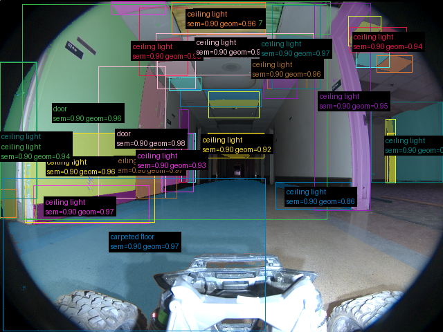
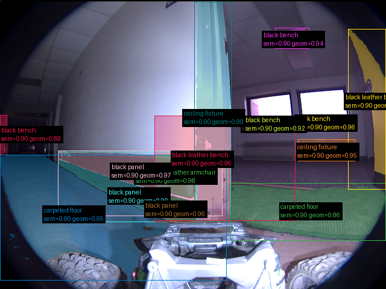

# Validação do pipeline real — 2026-09-16-run-009-frames

Revisão: `b46bd1e9` · Frames: 3 · Pico de VRAM: 6.91 GB (budget: 8.0 GB) · Pico de RSS do host: 10.48 GB

Ver `manifest.json` para configuração completa e log de estágios.

## corridor-02-000

**scene_type:** corridor · **regiões canônicas:** 51 (19 publicadas, 32 contexto estrutural) · **relações:** 297 · **falhas de interpretação:** 0 · **audit:** ✅ pass (58 warnings)

## corridor-02-001

**scene_type:** corridor · **regiões canônicas:** 48 (35 publicadas, 13 contexto estrutural) · **relações:** 267 · **falhas de interpretação:** 0 · **audit:** ✅ pass (48 warnings)

## corridor-02-002

**scene_type:** corridor · **regiões canônicas:** 35 (15 publicadas, 20 contexto estrutural) · **relações:** 164 · **falhas de interpretação:** 0 · **audit:** ✅ pass (43 warnings)
