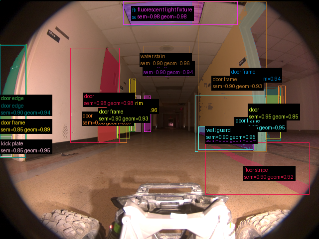
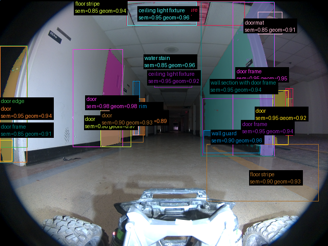
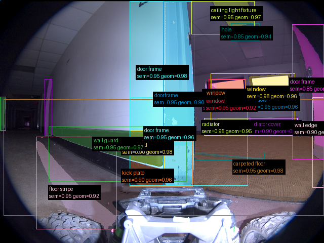

# Validação do pipeline real — 2026-09-16-run-010-frames

Revisão: `b46bd1e9` · Frames: 3 · Pico de VRAM: 5.29 GB (budget: 8.0 GB) · Pico de RSS do host: 4.88 GB

Ver `manifest.json` para configuração completa e log de estágios.

## corridor-02-000

**scene_type:** hallway · **regiões canônicas:** 51 (24 publicadas, 27 contexto estrutural) · **relações:** 304 · **falhas de interpretação:** 0 · **audit:** ✅ pass (27 warnings)

## corridor-02-001

**scene_type:** hallway · **regiões canônicas:** 48 (24 publicadas, 24 contexto estrutural) · **relações:** 278 · **falhas de interpretação:** 0 · **audit:** ✅ pass (31 warnings)

## corridor-02-002

**scene_type:** office hallway · **regiões canônicas:** 35 (23 publicadas, 12 contexto estrutural) · **relações:** 175 · **falhas de interpretação:** 0 · **audit:** ✅ pass (20 warnings)
