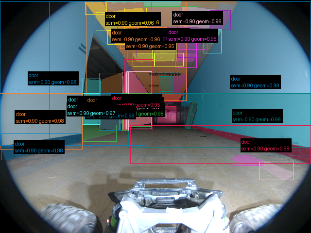
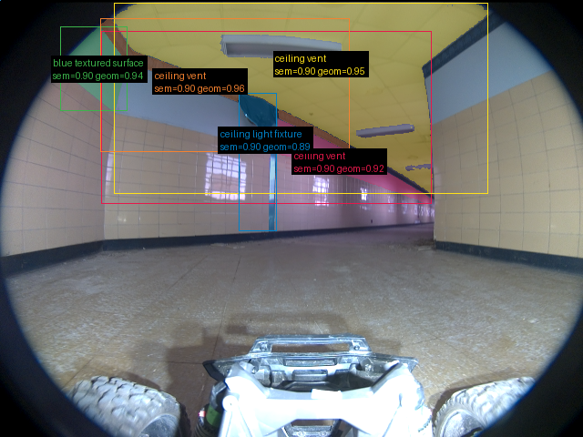

# Validação do pipeline real — 2026-09-16-run-015-frames

Revisão: `b46bd1e9` · Frames: 3 · Pico de VRAM: 6.97 GB (budget: 8.0 GB) · Pico de RSS do host: 10.48 GB

Ver `manifest.json` para configuração completa e log de estágios.

## corridor-02-04234

**scene_type:** corridor · **regiões canônicas:** 53 (46 publicadas, 7 contexto estrutural) · **relações:** 497 · **falhas de interpretação:** 0 · **audit:** ✅ pass (34 warnings)

## corridor-02-04595

**scene_type:** indoor · **regiões canônicas:** 59 (5 publicadas, 54 contexto estrutural) · **relações:** 578 · **falhas de interpretação:** 0 · **audit:** ✅ pass (76 warnings)

## corridor-02-04955

**scene_type:** corridor · **regiões canônicas:** 64 (2 publicadas, 62 contexto estrutural) · **relações:** 565 · **falhas de interpretação:** 0 · **audit:** ✅ pass (91 warnings)
