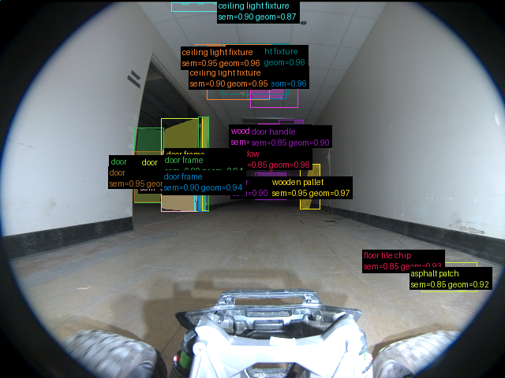
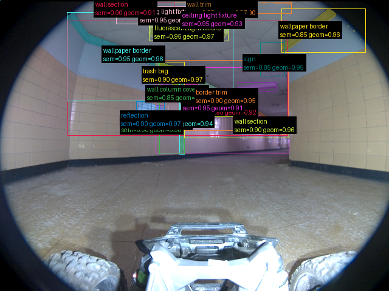
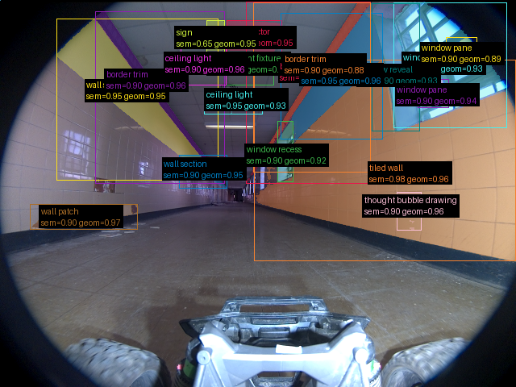

# Validação do pipeline real — 2026-09-16-run-016-frames

Revisão: `b46bd1e9` · Frames: 3 · Pico de VRAM: 4.50 GB (budget: 8.0 GB) · Pico de RSS do host: 4.56 GB

Ver `manifest.json` para configuração completa e log de estágios.

## corridor-02-04234

**scene_type:** hallway · **regiões canônicas:** 53 (21 publicadas, 32 contexto estrutural) · **relações:** 509 · **falhas de interpretação:** 0 · **audit:** ✅ pass (38 warnings)

## corridor-02-04595

**scene_type:** hallway · **regiões canônicas:** 59 (21 publicadas, 38 contexto estrutural) · **relações:** 587 · **falhas de interpretação:** 0 · **audit:** ✅ pass (36 warnings)

## corridor-02-04955

**scene_type:** hallway · **regiões canônicas:** 64 (19 publicadas, 45 contexto estrutural) · **relações:** 573 · **falhas de interpretação:** 0 · **audit:** ✅ pass (44 warnings)
