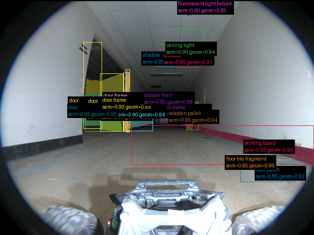
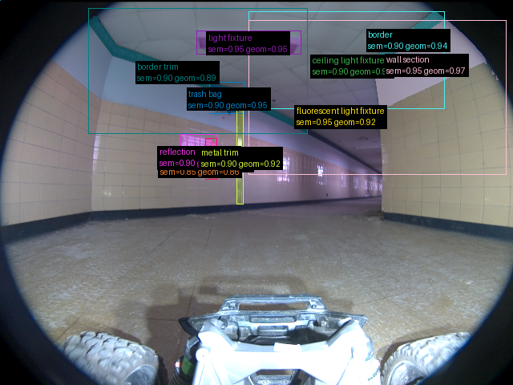
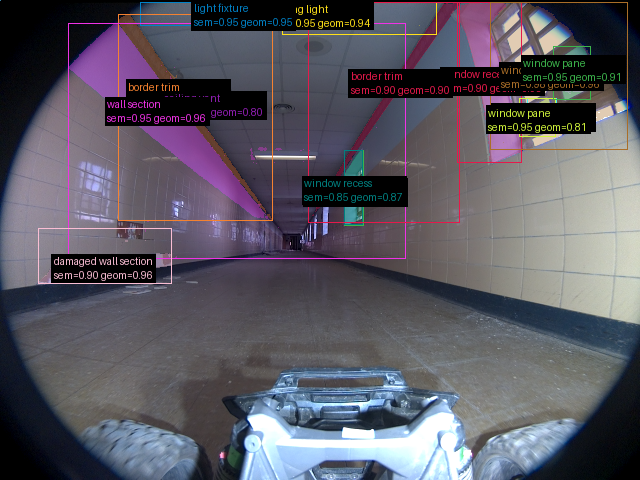

# Validação do pipeline real — 2026-09-16-run-022-frames

Revisão: `b46bd1e9` · Frames: 3 · Pico de VRAM: 5.29 GB (budget: 8.0 GB) · Pico de RSS do host: 4.77 GB

Ver `manifest.json` para configuração completa e log de estágios.

## corridor-02-04234

**scene_type:** hallway · **regiões canônicas:** 41 (18 publicadas, 23 contexto estrutural) · **relações:** 339 · **falhas de interpretação:** 0 · **audit:** ✅ pass (32 warnings)

## corridor-02-04595

**scene_type:** hallway · **regiões canônicas:** 27 (11 publicadas, 16 contexto estrutural) · **relações:** 153 · **falhas de interpretação:** 0 · **audit:** ✅ pass (20 warnings)

## corridor-02-04955

**scene_type:** hallway · **regiões canônicas:** 59 (14 publicadas, 45 contexto estrutural) · **relações:** 557 · **falhas de interpretação:** 0 · **audit:** ✅ pass (43 warnings)
