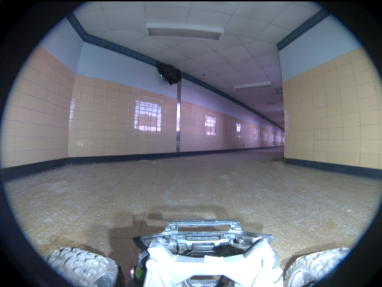
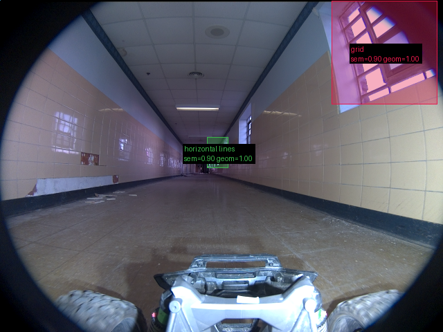

# Validação do pipeline real — 2026-09-16-run-023-frames

Revisão: `b46bd1e9` · Frames: 3 · Pico de VRAM: 6.90 GB (budget: 8.0 GB) · Pico de RSS do host: 11.36 GB

Ver `manifest.json` para configuração completa e log de estágios.

## corridor-02-04234

**scene_type:** corridor · **regiões canônicas:** 6 (6 publicadas, 0 contexto estrutural) · **relações:** 9 · **falhas de interpretação:** 0 · **audit:** ✅ pass (3 warnings)

## corridor-02-04595

**scene_type:** indoor · **regiões canônicas:** 8 (0 publicadas, 8 contexto estrutural) · **relações:** 7 · **falhas de interpretação:** 0 · **audit:** ✅ pass (15 warnings)

## corridor-02-04955

**scene_type:** corridor · **regiões canônicas:** 10 (2 publicadas, 8 contexto estrutural) · **relações:** 21 · **falhas de interpretação:** 0 · **audit:** ✅ pass (24 warnings)
