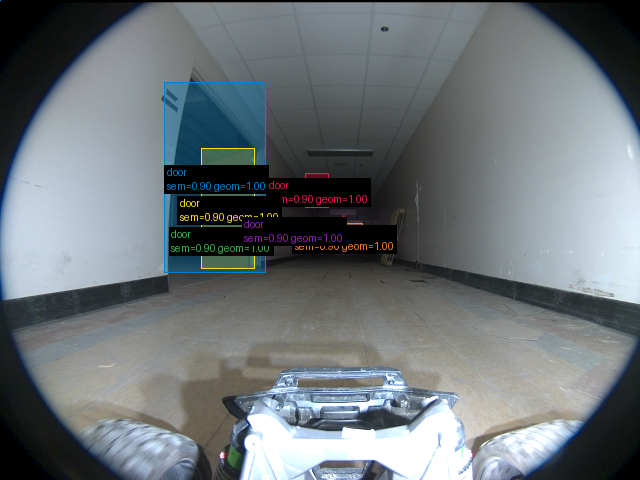

# Validação do pipeline real — 2026-09-16-run-025-frames

Revisão: `b46bd1e9` · Frames: 3 · Pico de VRAM: 6.75 GB (budget: 8.0 GB) · Pico de RSS do host: 10.43 GB

Ver `manifest.json` para configuração completa e log de estágios.

## corridor-02-04234

**scene_type:** corridor · **regiões canônicas:** 6 (6 publicadas, 0 contexto estrutural) · **relações:** 9 · **falhas de interpretação:** 0 · **audit:** ✅ pass (3 warnings)

## corridor-02-04595

**scene_type:** indoor · **regiões canônicas:** 8 (0 publicadas, 8 contexto estrutural) · **relações:** 7 · **falhas de interpretação:** 0 · **audit:** ✅ pass (15 warnings)

## corridor-02-04955

**FALHOU:** `BackendExecutionError("O backend 'featup' falhou durante a elevação aprendida FeatUp/JBU: CUDA out of memory. Tried to allocate 294.00 MiB. GPU 0 has a total capacity of 7.65 GiB of which 211.56 MiB is free. Process 1581 has 4.34 MiB memory in use. Including non-PyTorch memory, this process has 6.99 GiB memory in use. Of the allocated memory 6.75 GiB is allocated by PyTorch, and 98.85 MiB is reserved by PyTorch but unallocated. If reserved but unallocated memory is large try setting PYTORCH_CUDA_ALLOC_CONF=expandable_segments:True to avoid fragmentation.  See documentation for Memory Management  (https://docs.pytorch.org/docs/stable/notes/cuda.html#optimizing-memory-usage-with-pytorch-cuda-alloc-conf)")`
