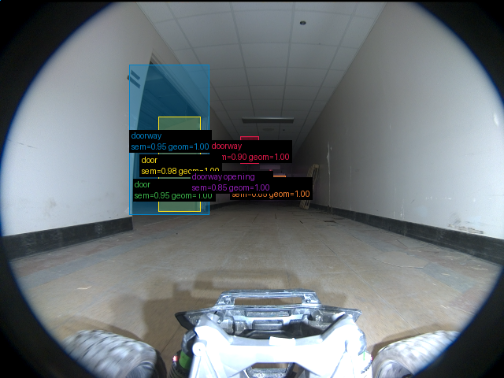
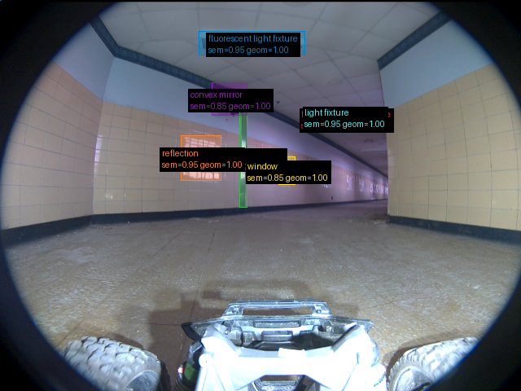
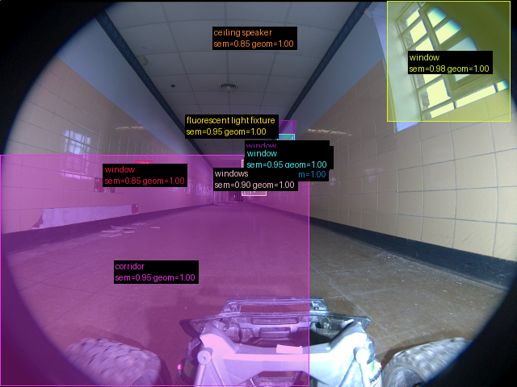

# Validação do pipeline real — 2026-09-16-run-026-frames

Revisão: `b46bd1e9` · Frames: 3 · Pico de VRAM: 4.90 GB (budget: 8.0 GB) · Pico de RSS do host: 4.90 GB

Ver `manifest.json` para configuração completa e log de estágios.

## corridor-02-04234

**scene_type:** hallway · **regiões canônicas:** 6 (6 publicadas, 0 contexto estrutural) · **relações:** 11 · **falhas de interpretação:** 0 · **audit:** ✅ pass (3 warnings)

## corridor-02-04595

**scene_type:** hallway · **regiões canônicas:** 8 (7 publicadas, 1 contexto estrutural) · **relações:** 8 · **falhas de interpretação:** 0 · **audit:** ✅ pass (5 warnings)

## corridor-02-04955

**scene_type:** hallway · **regiões canônicas:** 10 (10 publicadas, 0 contexto estrutural) · **relações:** 22 · **falhas de interpretação:** 0 · **audit:** ✅ pass (3 warnings)
