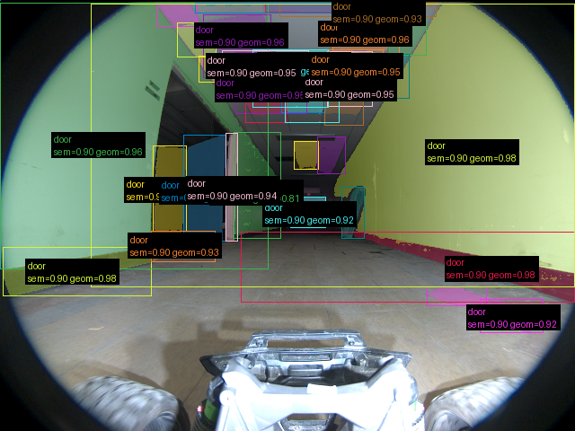
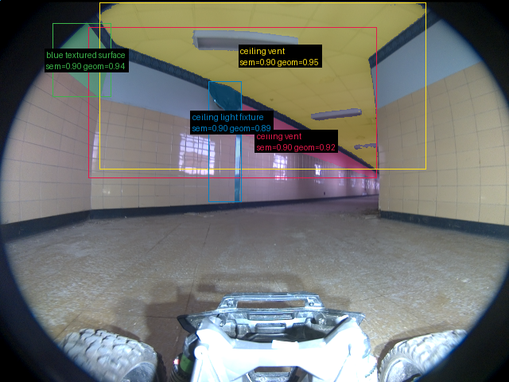
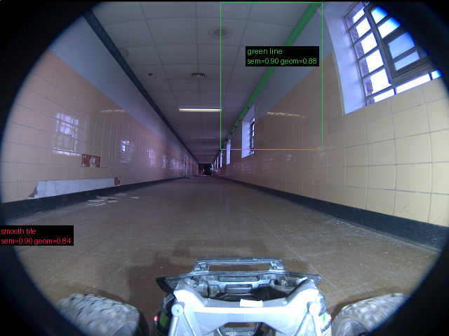

# Validação do pipeline real — 2026-09-16-run-027-frames

Revisão: `b46bd1e9` · Frames: 3 · Pico de VRAM: 6.88 GB (budget: 8.0 GB) · Pico de RSS do host: 10.45 GB

Ver `manifest.json` para configuração completa e log de estágios.

## corridor-02-04234

**scene_type:** corridor · **regiões canônicas:** 38 (34 publicadas, 4 contexto estrutural) · **relações:** 238 · **falhas de interpretação:** 0 · **audit:** ✅ pass (27 warnings)

## corridor-02-04595

**scene_type:** indoor · **regiões canônicas:** 38 (4 publicadas, 34 contexto estrutural) · **relações:** 252 · **falhas de interpretação:** 0 · **audit:** ✅ pass (48 warnings)

## corridor-02-04955

**scene_type:** corridor · **regiões canônicas:** 47 (2 publicadas, 45 contexto estrutural) · **relações:** 296 · **falhas de interpretação:** 0 · **audit:** ✅ pass (71 warnings)
