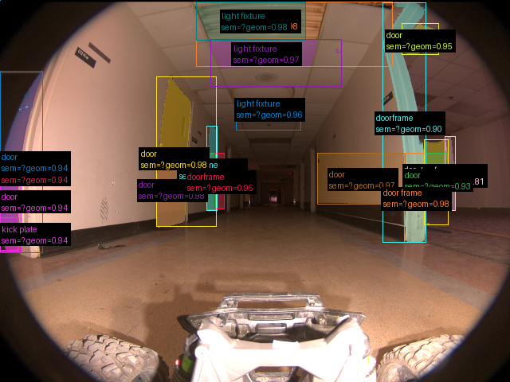
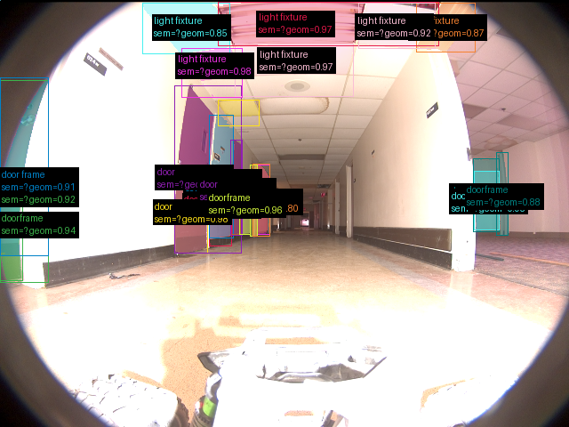
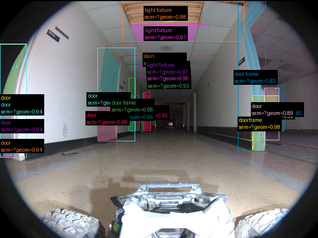
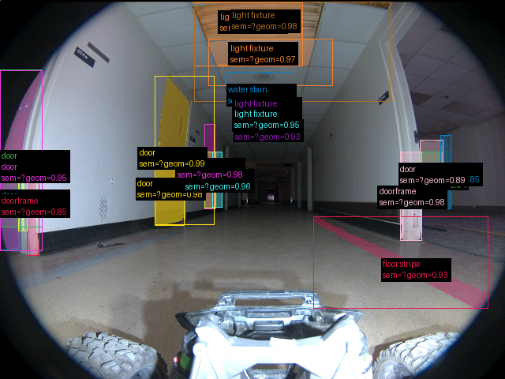

# Validação do pipeline real — 2026-09-17-run-034-step12-gemini-sam

Revisão: `b46bd1e9` · Frames: 4 · Pico de VRAM: 4.50 GB (budget: 8.0 GB) · Pico de RSS do host: 4.12 GB

Ver `manifest.json` para configuração completa e log de estágios.

## corridor-02-00001

**scene_type:** hallway · **regiões canônicas:** 59 (20 publicadas, 39 contexto estrutural) · **relações:** 338 · **falhas de interpretação:** 0 · **audit:** ✅ pass (11 warnings)

## corridor-02-00012

**scene_type:** hallway · **regiões canônicas:** 51 (23 publicadas, 28 contexto estrutural) · **relações:** 232 · **falhas de interpretação:** 0 · **audit:** ✅ pass (8 warnings)

## corridor-02-00024

**scene_type:** hallway · **regiões canônicas:** 58 (20 publicadas, 38 contexto estrutural) · **relações:** 337 · **falhas de interpretação:** 0 · **audit:** ✅ pass (10 warnings)

## corridor-02-00048

**scene_type:** hallway · **regiões canônicas:** 60 (22 publicadas, 38 contexto estrutural) · **relações:** 363 · **falhas de interpretação:** 0 · **audit:** ✅ pass (5 warnings)
