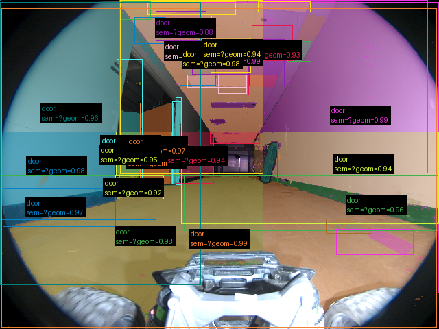
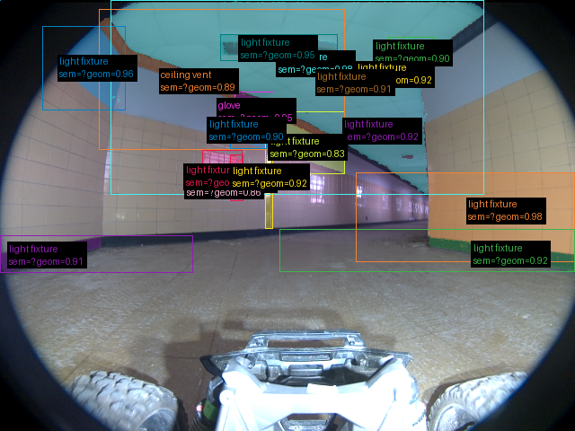
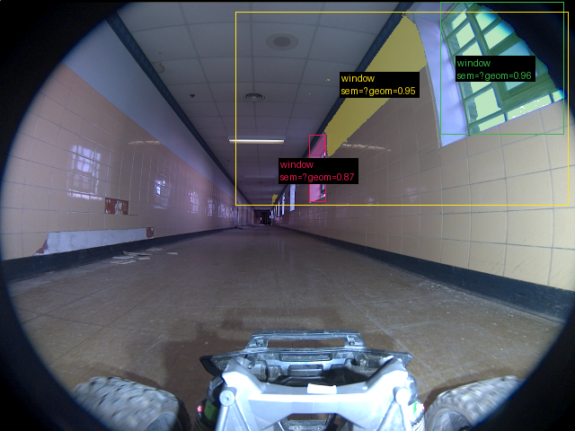

# Validação do pipeline real — 2026-09-17-run-037-frames

Revisão: `b46bd1e9` · Frames: 3 · Pico de VRAM: 6.88 GB (budget: 8.0 GB) · Pico de RSS do host: 10.33 GB

Ver `manifest.json` para configuração completa e log de estágios.

## corridor-02-04234

**scene_type:** corridor · **regiões canônicas:** 41 (40 publicadas, 1 contexto estrutural) · **relações:** 326 · **falhas de interpretação:** 0 · **audit:** ✅ pass (0 warnings)

## corridor-02-04595

**scene_type:** indoor · **regiões canônicas:** 27 (18 publicadas, 9 contexto estrutural) · **relações:** 143 · **falhas de interpretação:** 0 · **audit:** ✅ pass (2 warnings)

## corridor-02-04955

**scene_type:** corridor · **regiões canônicas:** 59 (3 publicadas, 56 contexto estrutural) · **relações:** 545 · **falhas de interpretação:** 0 · **audit:** ✅ pass (1 warnings)
