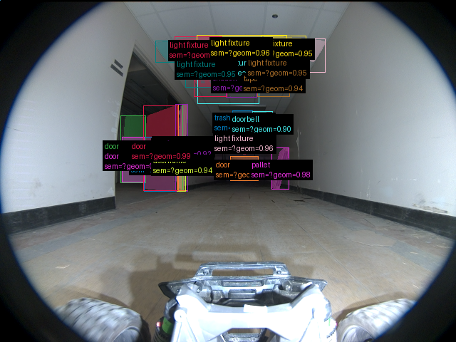
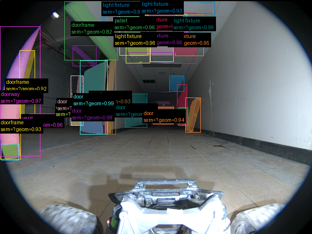
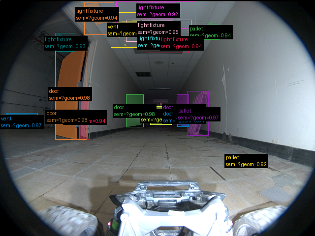
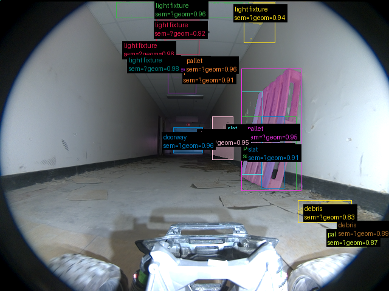

# Validação do pipeline real — 2026-09-17-run-038-step12-176s-gemini-sam

Revisão: `b46bd1e9` · Frames: 4 · Pico de VRAM: 4.50 GB (budget: 8.0 GB) · Pico de RSS do host: 4.27 GB

Ver `manifest.json` para configuração completa e log de estágios.

## corridor-02-04235

**scene_type:** hallway · **regiões canônicas:** 50 (25 publicadas, 25 contexto estrutural) · **relações:** 459 · **falhas de interpretação:** 0 · **audit:** ✅ pass (8 warnings)

## corridor-02-04247

**scene_type:** hallway · **regiões canônicas:** 58 (33 publicadas, 25 contexto estrutural) · **relações:** 507 · **falhas de interpretação:** 0 · **audit:** ✅ pass (2 warnings)

## corridor-02-04259

**scene_type:** hallway · **regiões canônicas:** 58 (18 publicadas, 40 contexto estrutural) · **relações:** 525 · **falhas de interpretação:** 0 · **audit:** ✅ pass (11 warnings)

## corridor-02-04282

**scene_type:** hallway · **regiões canônicas:** 46 (17 publicadas, 29 contexto estrutural) · **relações:** 414 · **falhas de interpretação:** 0 · **audit:** ✅ pass (15 warnings)
