# Validação do pipeline real — 20260904T045559Z

Revisão: `36ef954` · Frames: 18 · Pico de VRAM observado: 4.57 GB (budget: 8.0 GB)

Ver `manifest.json` para configuração completa e log de estágios.

## corridor-02-000

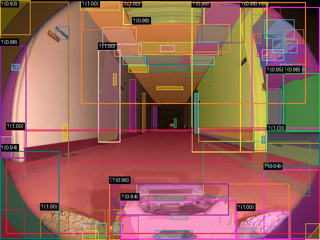

**scene_type:** corridor · **regiões:** 91 · **relações:** 453 · **falhas de interpretação:** 91 · **audit:** ✅ pass (1 warnings)

## corridor-02-001

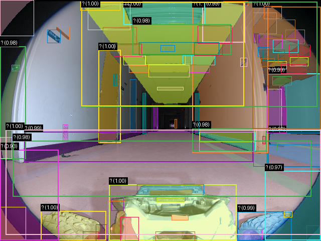

**scene_type:** corridor · **regiões:** 89 · **relações:** 444 · **falhas de interpretação:** 89 · **audit:** ✅ pass (1 warnings)

## corridor-02-002

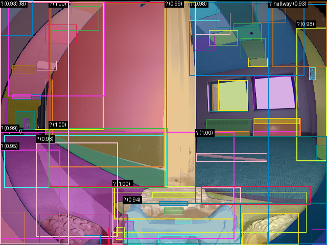

**scene_type:** indoor · **regiões:** 72 · **relações:** 368 · **falhas de interpretação:** 36 · **audit:** ✅ pass (69 warnings)

## corridor-02-003

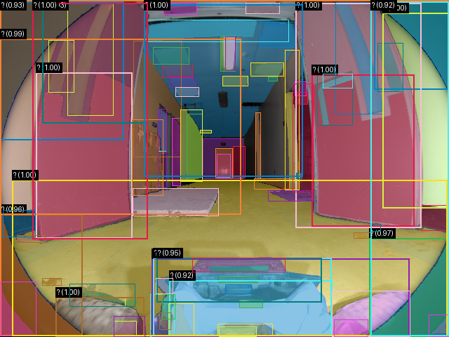

**scene_type:** abandoned_corridor · **regiões:** 86 · **relações:** 505 · **falhas de interpretação:** 71 · **audit:** ✅ pass (27 warnings)

## corridor-02-004

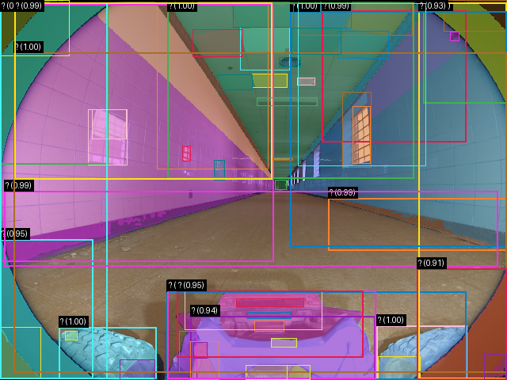

**scene_type:** indoor · **regiões:** 62 · **relações:** 365 · **falhas de interpretação:** 50 · **audit:** ✅ pass (24 warnings)

## corridor-02-005

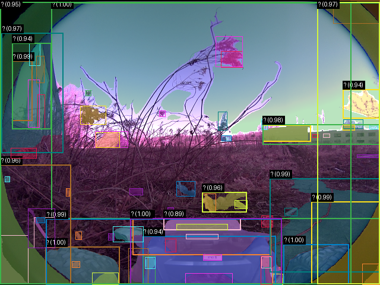

**scene_type:** indoor · **regiões:** 73 · **relações:** 338 · **falhas de interpretação:** 70 · **audit:** ✅ pass (4 warnings)

## corridor-02-006

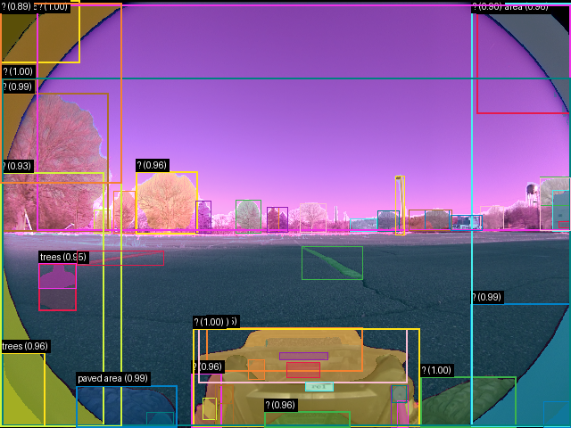

**scene_type:** outdoor · **regiões:** 53 · **relações:** 212 · **falhas de interpretação:** 36 · **audit:** ✅ pass (28 warnings)

## corridor-02-007

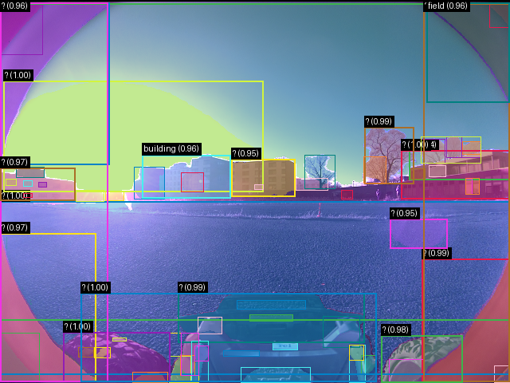

**scene_type:** outdoor · **regiões:** 69 · **relações:** 335 · **falhas de interpretação:** 53 · **audit:** ✅ pass (31 warnings)

## corridor-02-008

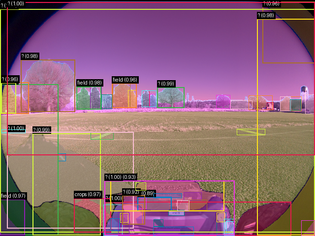

**scene_type:** Agriculture · **regiões:** 60 · **relações:** 307 · **falhas de interpretação:** 45 · **audit:** ✅ pass (29 warnings)

## corridor-02-009

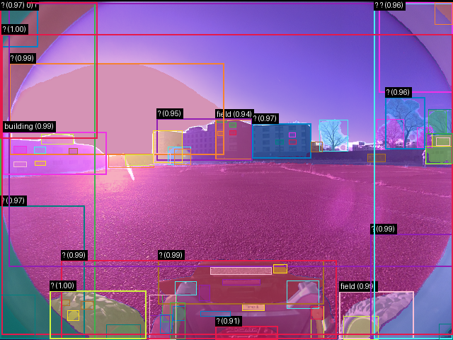

**scene_type:** outdoor · **regiões:** 74 · **relações:** 385 · **falhas de interpretação:** 51 · **audit:** ✅ pass (47 warnings)

## corridor-02-010

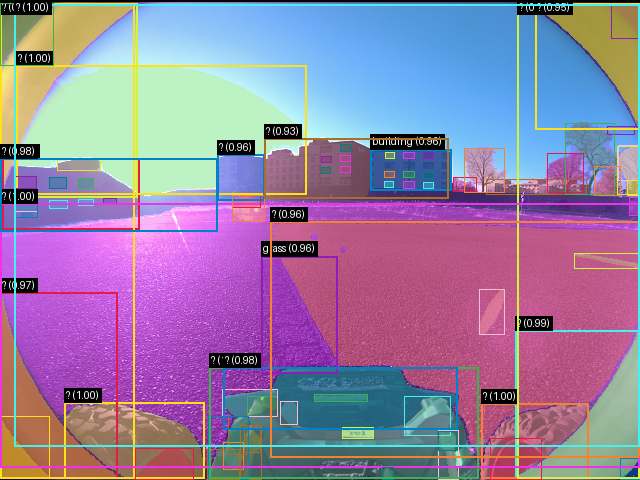

**scene_type:** Sports · **regiões:** 79 · **relações:** 424 · **falhas de interpretação:** 64 · **audit:** ✅ pass (30 warnings)

## corridor-02-011

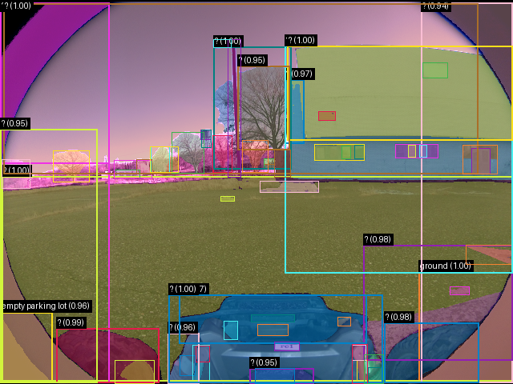

**scene_type:** indoor · **regiões:** 67 · **relações:** 321 · **falhas de interpretação:** 47 · **audit:** ✅ pass (35 warnings)

## corridor-02-012

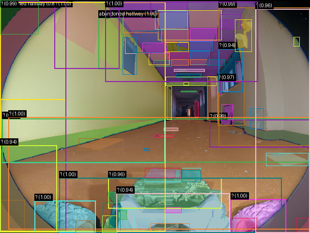

**scene_type:** abandoned_corridor · **regiões:** 78 · **relações:** 378 · **falhas de interpretação:** 50 · **audit:** ✅ pass (42 warnings)

## corridor-02-013

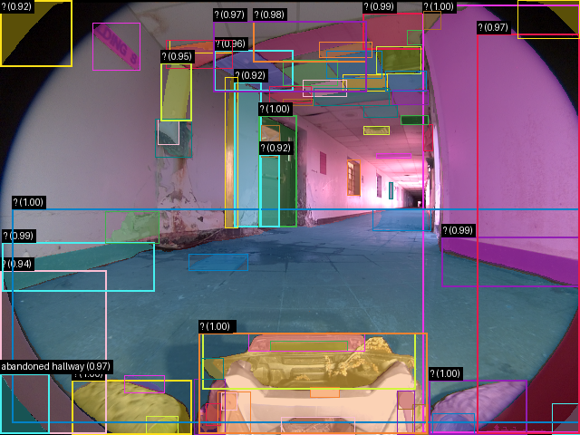

**scene_type:** abandoned_corridor · **regiões:** 67 · **relações:** 206 · **falhas de interpretação:** 55 · **audit:** ✅ pass (18 warnings)

## corridor-02-014

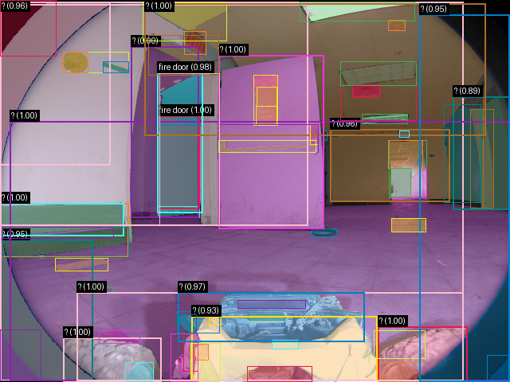

**scene_type:** indoor · **regiões:** 77 · **relações:** 446 · **falhas de interpretação:** 58 · **audit:** ✅ pass (38 warnings)

## corridor-02-015

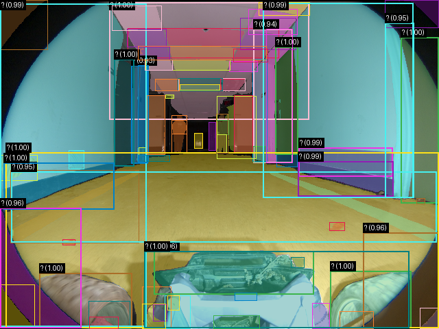

**scene_type:** indoor · **regiões:** 78 · **relações:** 377 · **falhas de interpretação:** 70 · **audit:** ✅ pass (10 warnings)

## corridor-02-016

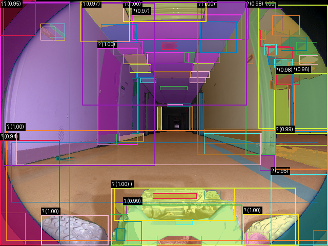

**scene_type:** corridor · **regiões:** 89 · **relações:** 464 · **falhas de interpretação:** 85 · **audit:** ✅ pass (9 warnings)

## corridor-02-017

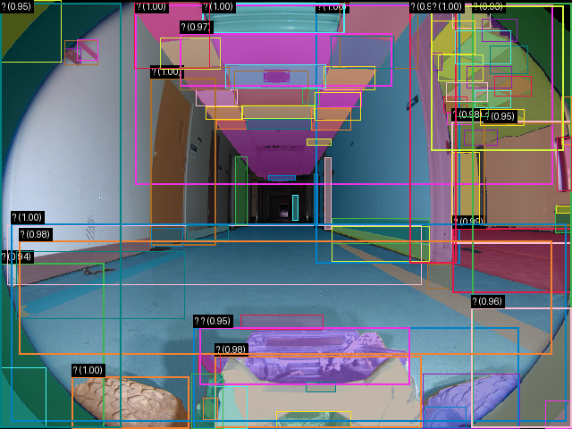

**scene_type:** corridor · **regiões:** 87 · **relações:** 476 · **falhas de interpretação:** 83 · **audit:** ✅ pass (9 warnings)
