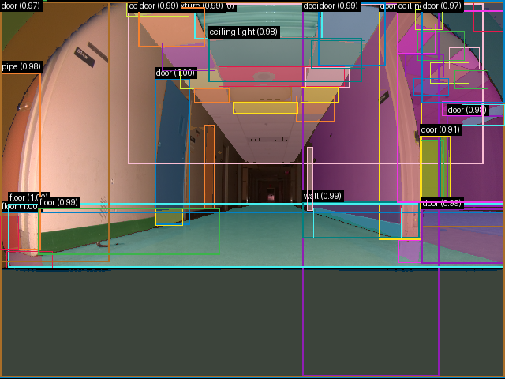
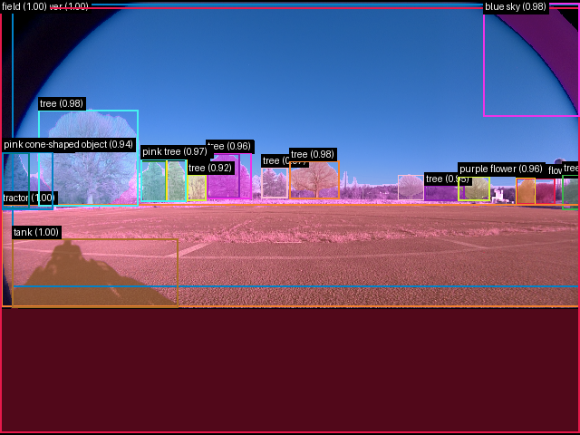
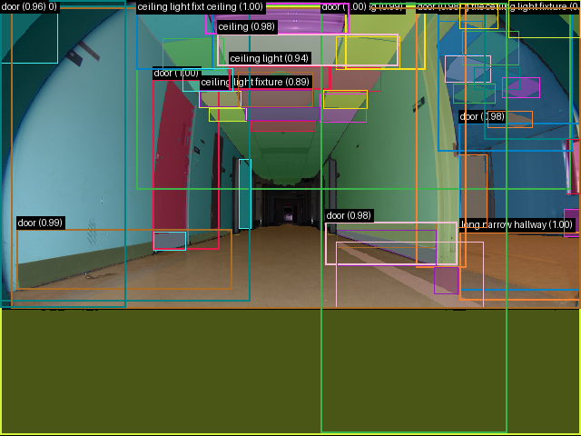

# Validação do pipeline real — 20260907T011359Z

Revisão: `78e6504` · Frames: 3 · Pico de VRAM observado: 4.57 GB (budget: 8.0 GB)

Ver `manifest.json` para configuração completa e log de estágios.

## corridor-02-000

**scene_type:** corridor · **regiões canônicas:** 54 · **regiões pós-processadas:** desabilitado · **relações:** 339 · **falhas de interpretação:** 0 · **audit:** ✅ pass (108 warnings)

## corridor-02-008

**scene_type:** field · **regiões canônicas:** 22 · **regiões pós-processadas:** desabilitado · **relações:** 79 · **falhas de interpretação:** 0 · **audit:** ✅ pass (39 warnings)

## corridor-02-017

**scene_type:** corridor · **regiões canônicas:** 50 · **regiões pós-processadas:** desabilitado · **relações:** 349 · **falhas de interpretação:** 0 · **audit:** ✅ pass (97 warnings)
