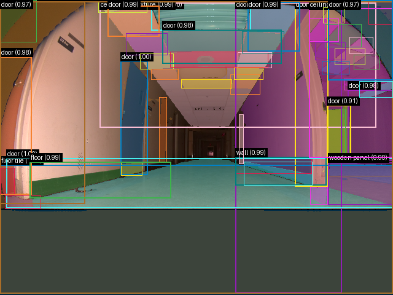

# Validação do pipeline real — 20260907T012616Z

Revisão: `78e6504` · Frames: 1 · Pico de VRAM observado: 4.57 GB (budget: 8.0 GB)

Ver `manifest.json` para configuração completa e log de estágios.

## corridor-02-000

**scene_type:** corridor · **regiões canônicas:** 54 · **regiões pós-processadas:** desabilitado · **relações:** 339 · **falhas de interpretação:** 0 · **audit:** ✅ pass (106 warnings)
