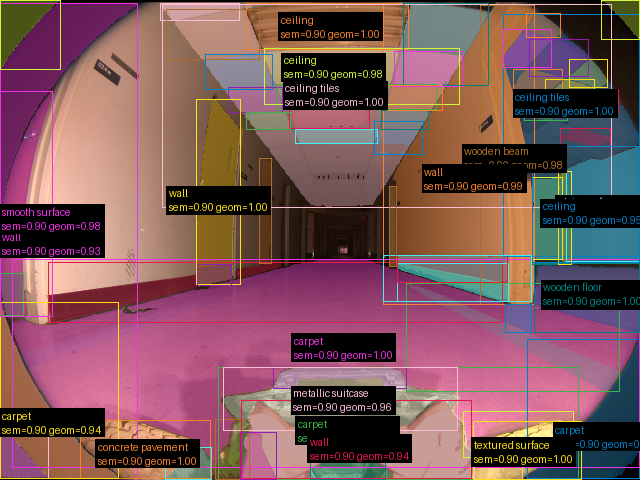
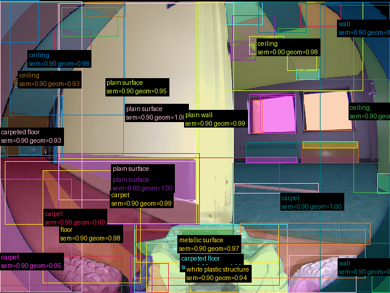

# Validação do pipeline real — 20260907T035046Z

Revisão: `abb755b` · Frames: 2 · Pico de VRAM observado: 4.57 GB (budget: 8.0 GB)

Ver `manifest.json` para configuração completa e log de estágios.

## corridor-02-000

**scene_type:** corridor · **regiões canônicas:** 66 · **regiões pós-processadas:** desabilitado · **relações:** 337 · **falhas de interpretação:** 0 · **audit:** ✅ pass (131 warnings)

## corridor-02-002

**scene_type:** corridor · **regiões canônicas:** 60 · **regiões pós-processadas:** desabilitado · **relações:** 291 · **falhas de interpretação:** 0 · **audit:** ✅ pass (114 warnings)
