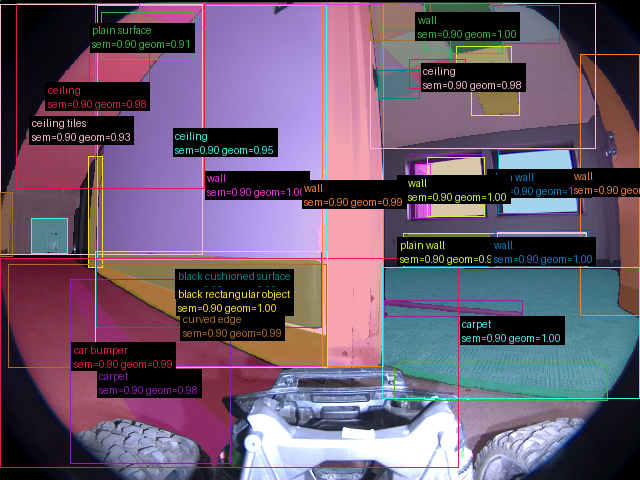

# Validação do pipeline real — 20260908T003114Z

Revisão: `abb755b` · Frames: 1 · Pico de VRAM observado: 4.57 GB (budget: 8.0 GB)

Ver `manifest.json` para configuração completa e log de estágios.

## corridor-02-002

**scene_type:** corridor · **regiões canônicas:** 38 · **relações:** 150 · **falhas de interpretação:** 0 · **audit:** ✅ pass (52 warnings)
