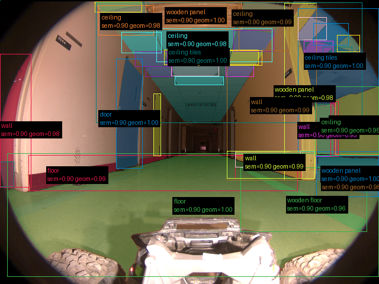
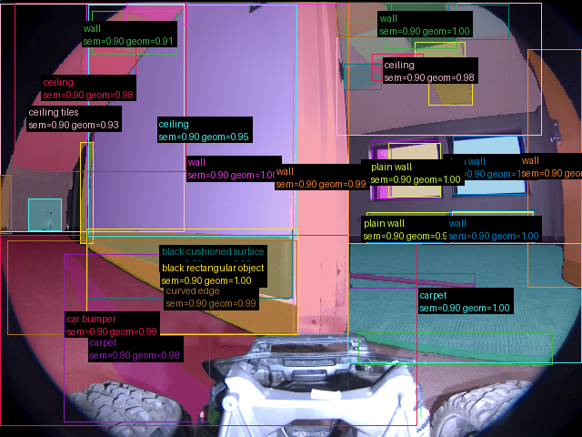
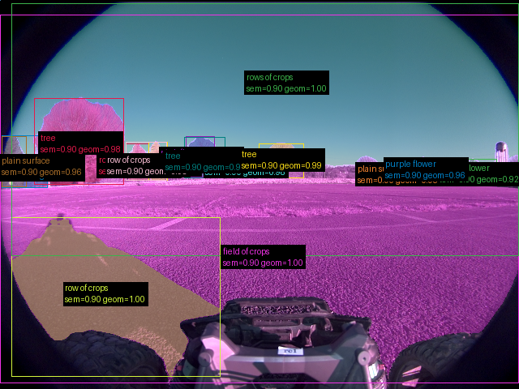
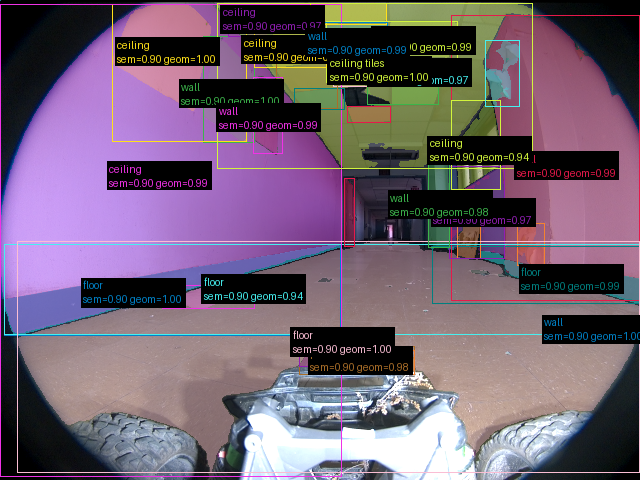
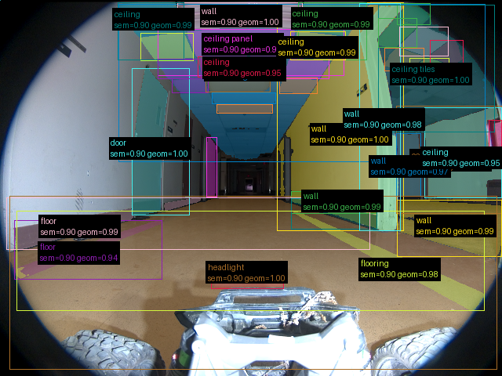

# Validação do pipeline real — 20260908T131207Z

Revisão: `03ec593` · Frames: 5 · Pico de VRAM observado: 4.57 GB (budget: 8.0 GB)

Ver `manifest.json` para configuração completa e log de estágios.

## corridor-02-000

**scene_type:** corridor · **regiões canônicas:** 40 · **relações:** 210 · **falhas de interpretação:** 0 · **audit:** ✅ pass (51 warnings)

## corridor-02-002

**scene_type:** corridor · **regiões canônicas:** 38 · **relações:** 150 · **falhas de interpretação:** 0 · **audit:** ✅ pass (55 warnings)

## corridor-02-008

**scene_type:** agricultural field · **regiões canônicas:** 16 · **relações:** 44 · **falhas de interpretação:** 0 · **audit:** ✅ pass (16 warnings)

## corridor-02-012

**scene_type:** corridor · **regiões canônicas:** 33 · **relações:** 138 · **falhas de interpretação:** 0 · **audit:** ✅ pass (53 warnings)

## corridor-02-017

**scene_type:** corridor · **regiões canônicas:** 38 · **relações:** 184 · **falhas de interpretação:** 0 · **audit:** ✅ pass (49 warnings)
