# Validação do pipeline real — 20260909T205243Z

Revisão: `478fe63` · Frames: 16 · Pico de VRAM observado: 4.57 GB (budget: 8.0 GB)

Ver `manifest.json` para configuração completa e log de estágios.

## corridor-02-04234

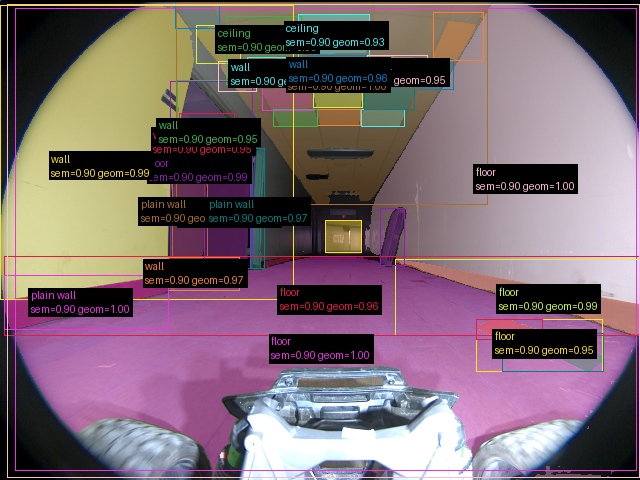

**scene_type:** corridor · **regiões canônicas:** 35 · **relações:** 223 · **falhas de interpretação:** 0 · **audit:** ✅ pass (43 warnings)

## corridor-02-04282

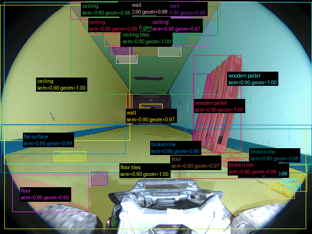

**scene_type:** corridor · **regiões canônicas:** 37 · **relações:** 198 · **falhas de interpretação:** 0 · **audit:** ✅ pass (42 warnings)

## corridor-02-04331

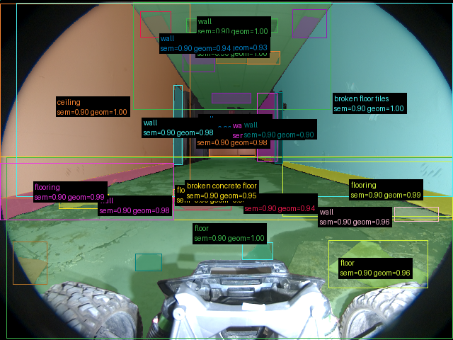

**scene_type:** corridor · **regiões canônicas:** 32 · **relações:** 134 · **falhas de interpretação:** 0 · **audit:** ✅ pass (34 warnings)

## corridor-02-04379

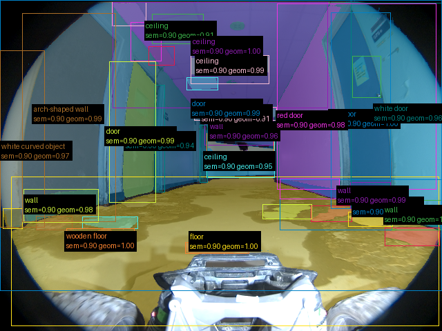

**scene_type:** corridor · **regiões canônicas:** 36 · **relações:** 183 · **falhas de interpretação:** 0 · **audit:** ✅ pass (36 warnings)

## corridor-02-04426

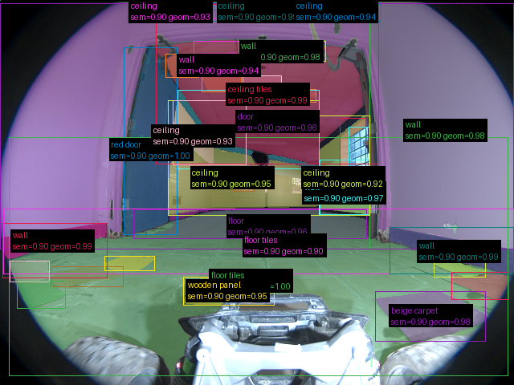

**scene_type:** indoor · **regiões canônicas:** 39 · **relações:** 193 · **falhas de interpretação:** 0 · **audit:** ✅ pass (44 warnings)

## corridor-02-04475

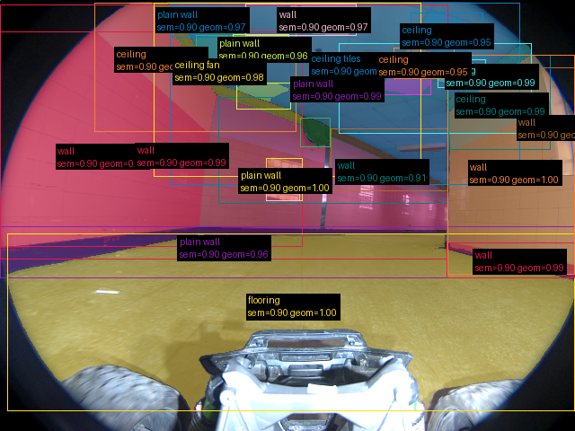

**scene_type:** indoor · **regiões canônicas:** 29 · **relações:** 176 · **falhas de interpretação:** 0 · **audit:** ✅ pass (38 warnings)

## corridor-02-04523

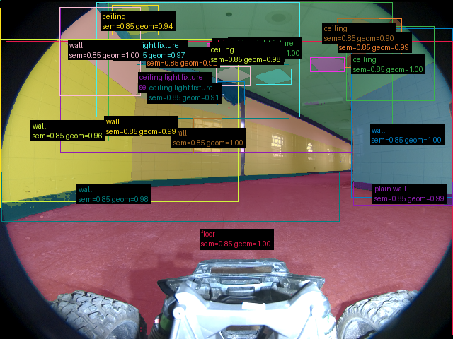

**scene_type:** indoor · **regiões canônicas:** 24 · **relações:** 146 · **falhas de interpretação:** 0 · **audit:** ✅ pass (25 warnings)

## corridor-02-04570

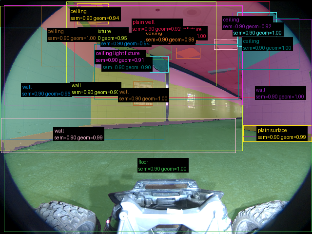

**scene_type:** indoor · **regiões canônicas:** 25 · **relações:** 160 · **falhas de interpretação:** 0 · **audit:** ✅ pass (24 warnings)

## corridor-02-04618

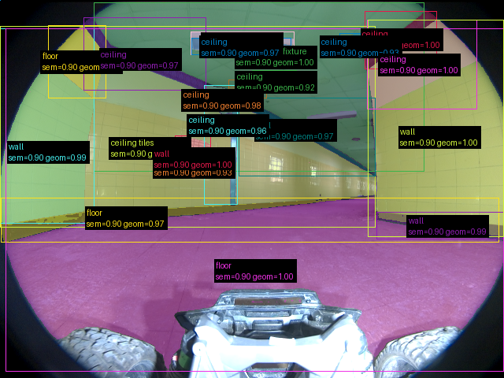

**scene_type:** corridor · **regiões canônicas:** 21 · **relações:** 99 · **falhas de interpretação:** 0 · **audit:** ✅ pass (20 warnings)

## corridor-02-04666

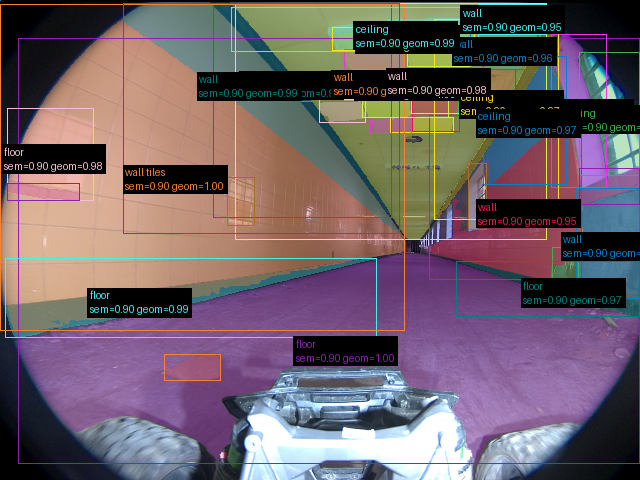

**scene_type:** corridor · **regiões canônicas:** 36 · **relações:** 213 · **falhas de interpretação:** 0 · **audit:** ✅ pass (43 warnings)

## corridor-02-04714

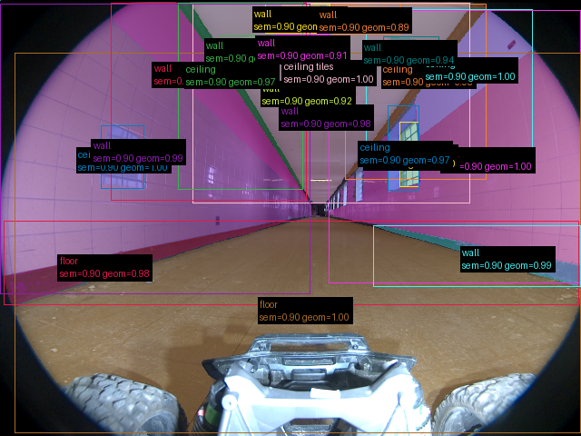

**scene_type:** corridor · **regiões canônicas:** 20 · **relações:** 95 · **falhas de interpretação:** 0 · **audit:** ✅ pass (21 warnings)

## corridor-02-04762

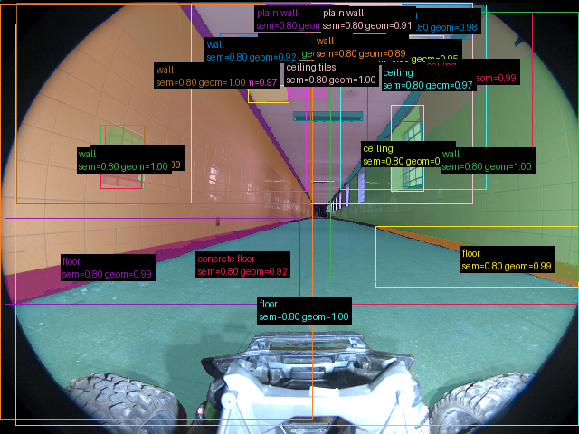

**scene_type:** corridor · **regiões canônicas:** 26 · **relações:** 143 · **falhas de interpretação:** 0 · **audit:** ✅ pass (34 warnings)

## corridor-02-04810

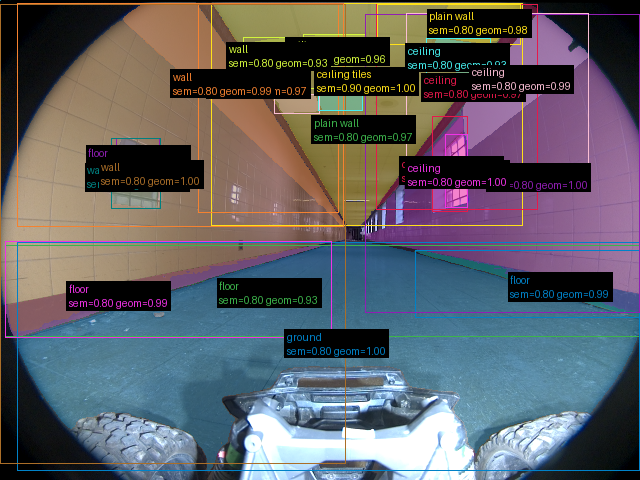

**scene_type:** corridor · **regiões canônicas:** 22 · **relações:** 96 · **falhas de interpretação:** 0 · **audit:** ✅ pass (29 warnings)

## corridor-02-04859

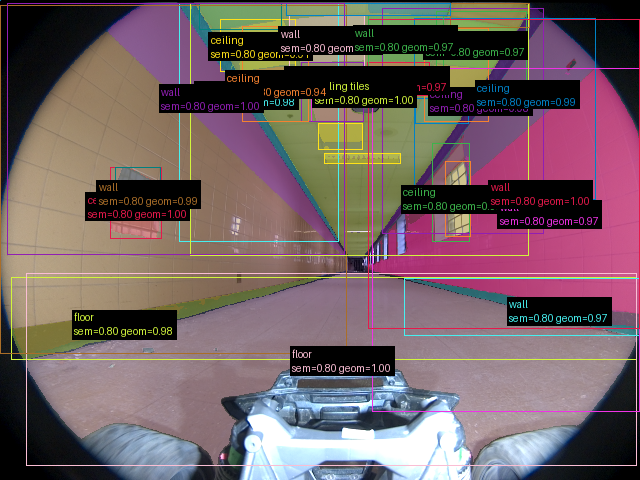

**scene_type:** corridor · **regiões canônicas:** 30 · **relações:** 181 · **falhas de interpretação:** 0 · **audit:** ✅ pass (33 warnings)

## corridor-02-04907

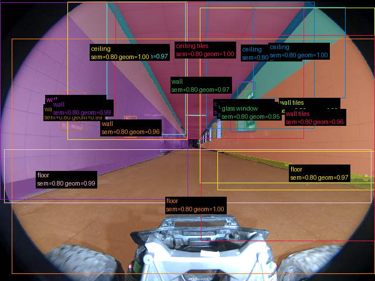

**scene_type:** corridor · **regiões canônicas:** 18 · **relações:** 88 · **falhas de interpretação:** 0 · **audit:** ✅ pass (23 warnings)

## corridor-02-04955

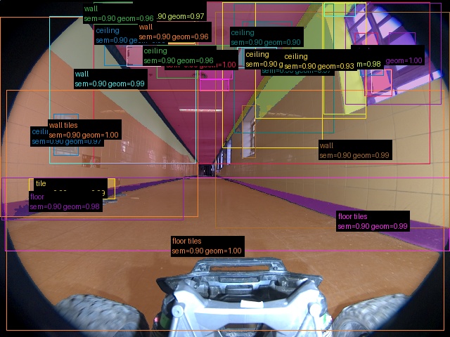

**scene_type:** corridor · **regiões canônicas:** 32 · **relações:** 181 · **falhas de interpretação:** 0 · **audit:** ✅ pass (33 warnings)
