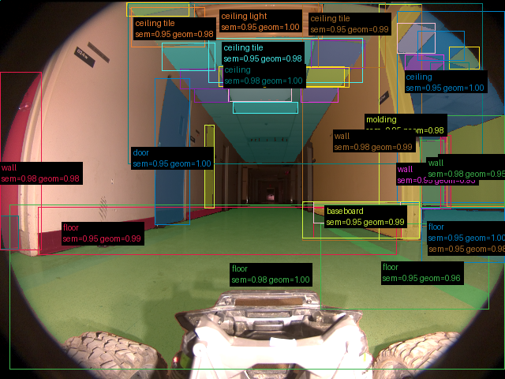
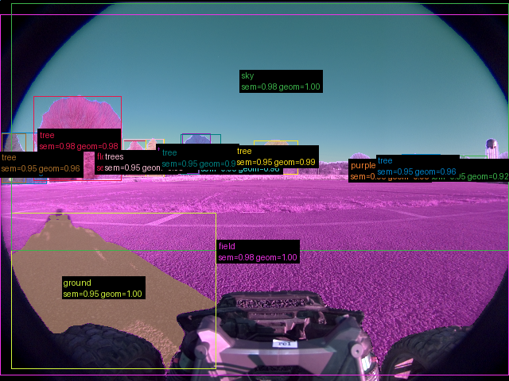
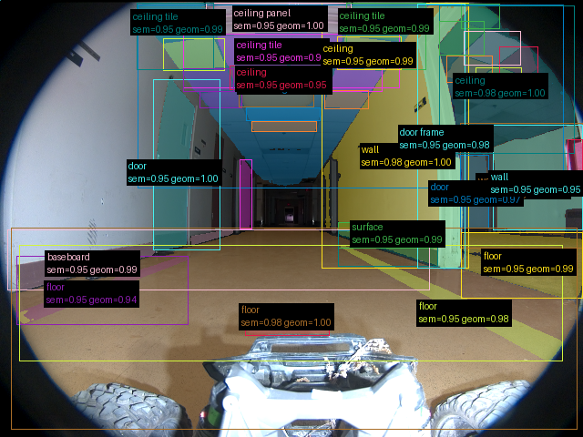

# Validação do pipeline real — 20260910T122608Z

Revisão: `9c29270` · Frames: 3 · Pico de VRAM observado: 4.57 GB (budget: 8.0 GB)

Ver `manifest.json` para configuração completa e log de estágios.

## corridor-02-000

**scene_type:** corridor · **regiões canônicas:** 40 · **relações:** 226 · **falhas de interpretação:** 0 · **audit:** ✅ pass (6 warnings)

## corridor-02-008

**scene_type:** open field · **regiões canônicas:** 16 · **relações:** 50 · **falhas de interpretação:** 0 · **audit:** ✅ pass (0 warnings)

## corridor-02-017

**scene_type:** corridor · **regiões canônicas:** 38 · **relações:** 200 · **falhas de interpretação:** 0 · **audit:** ✅ pass (4 warnings)
