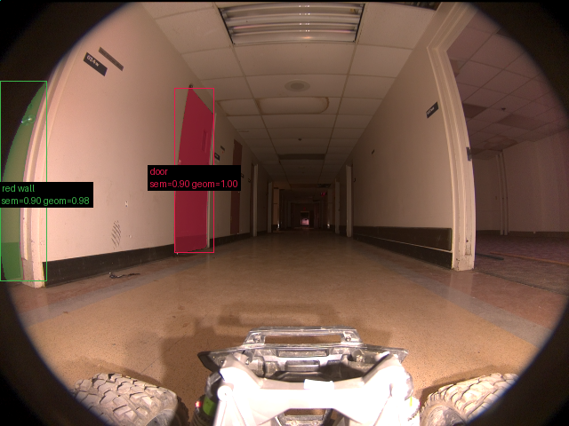
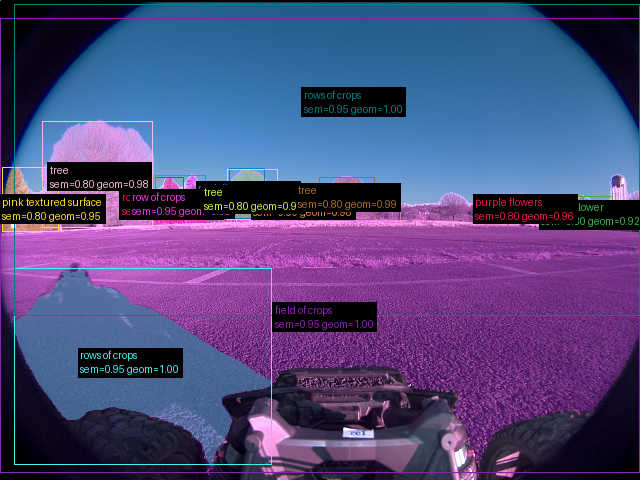
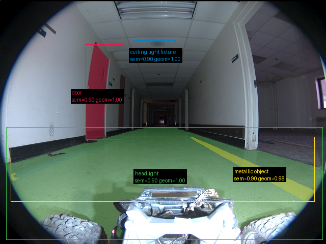

# Validação do pipeline real — 20260910T175410Z

Revisão: `3ac763a` · Frames: 3 · Pico de VRAM observado: 4.57 GB (budget: 8.0 GB)

Ver `manifest.json` para configuração completa e log de estágios.

## corridor-02-000

**scene_type:** corridor · **regiões canônicas:** 40 (2 publicadas, 38 contexto estrutural) · **relações:** 218 · **falhas de interpretação:** 0 · **audit:** ✅ pass (42 warnings)

## corridor-02-008

**scene_type:** agricultural field · **regiões canônicas:** 16 (13 publicadas, 3 contexto estrutural) · **relações:** 46 · **falhas de interpretação:** 0 · **audit:** ✅ pass (8 warnings)

## corridor-02-017

**scene_type:** corridor · **regiões canônicas:** 38 (4 publicadas, 34 contexto estrutural) · **relações:** 191 · **falhas de interpretação:** 0 · **audit:** ✅ pass (43 warnings)
