# Validação do pipeline real — 20260910T183839Z

Revisão: `0131e25` · Frames: 16 · Pico de VRAM observado: 4.57 GB (budget: 8.0 GB)

Ver `manifest.json` para configuração completa e log de estágios.

## corridor-02-04234

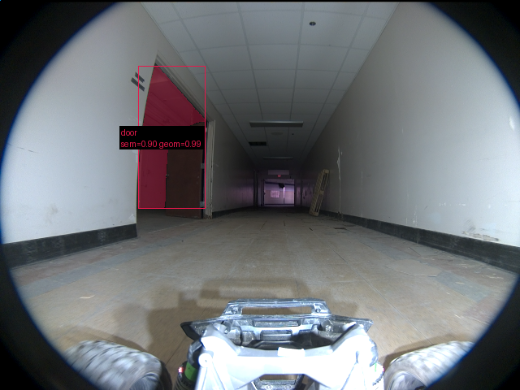

**scene_type:** corridor · **regiões canônicas:** 35 (1 publicadas, 34 contexto estrutural) · **relações:** 223 · **falhas de interpretação:** 0 · **audit:** ✅ pass (44 warnings)

## corridor-02-04282

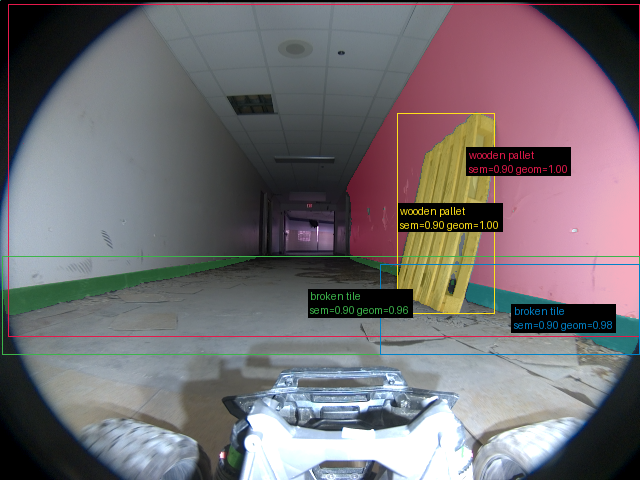

**scene_type:** corridor · **regiões canônicas:** 37 (4 publicadas, 33 contexto estrutural) · **relações:** 198 · **falhas de interpretação:** 0 · **audit:** ✅ pass (41 warnings)

## corridor-02-04331

**scene_type:** corridor · **regiões canônicas:** 32 (3 publicadas, 29 contexto estrutural) · **relações:** 135 · **falhas de interpretação:** 0 · **audit:** ✅ pass (35 warnings)

## corridor-02-04379

**scene_type:** corridor · **regiões canônicas:** 36 (9 publicadas, 27 contexto estrutural) · **relações:** 183 · **falhas de interpretação:** 0 · **audit:** ✅ pass (40 warnings)

## corridor-02-04426

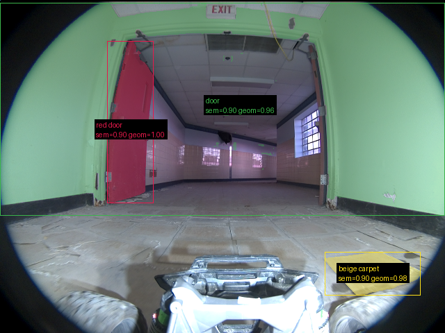

**scene_type:** indoor · **regiões canônicas:** 39 (3 publicadas, 36 contexto estrutural) · **relações:** 193 · **falhas de interpretação:** 0 · **audit:** ✅ pass (48 warnings)

## corridor-02-04475

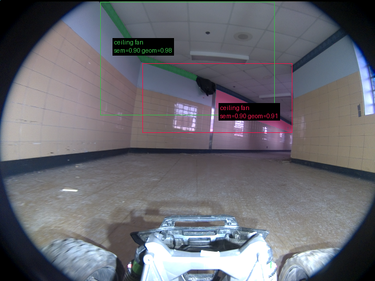

**scene_type:** indoor · **regiões canônicas:** 29 (2 publicadas, 27 contexto estrutural) · **relações:** 175 · **falhas de interpretação:** 0 · **audit:** ✅ pass (34 warnings)

## corridor-02-04523

**scene_type:** indoor · **regiões canônicas:** 24 (4 publicadas, 20 contexto estrutural) · **relações:** 149 · **falhas de interpretação:** 0 · **audit:** ✅ pass (27 warnings)

## corridor-02-04570

**scene_type:** indoor · **regiões canônicas:** 25 (3 publicadas, 22 contexto estrutural) · **relações:** 161 · **falhas de interpretação:** 0 · **audit:** ✅ pass (27 warnings)

## corridor-02-04618

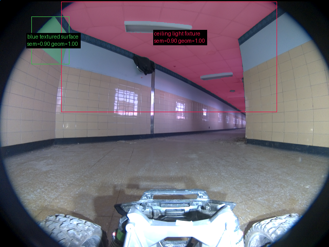

**scene_type:** corridor · **regiões canônicas:** 21 (2 publicadas, 19 contexto estrutural) · **relações:** 100 · **falhas de interpretação:** 0 · **audit:** ✅ pass (25 warnings)

## corridor-02-04666

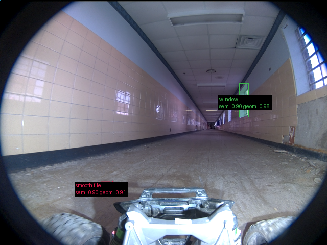

**scene_type:** corridor · **regiões canônicas:** 36 (2 publicadas, 34 contexto estrutural) · **relações:** 215 · **falhas de interpretação:** 0 · **audit:** ✅ pass (43 warnings)

## corridor-02-04714

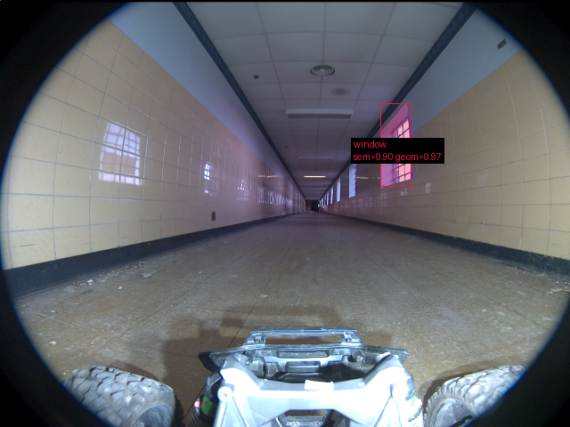

**scene_type:** corridor · **regiões canônicas:** 20 (1 publicadas, 19 contexto estrutural) · **relações:** 95 · **falhas de interpretação:** 0 · **audit:** ✅ pass (21 warnings)

## corridor-02-04762

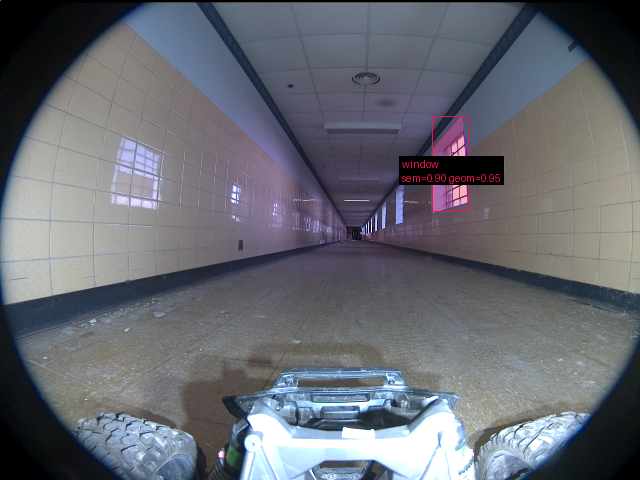

**scene_type:** corridor · **regiões canônicas:** 26 (1 publicadas, 25 contexto estrutural) · **relações:** 143 · **falhas de interpretação:** 0 · **audit:** ✅ pass (32 warnings)

## corridor-02-04810

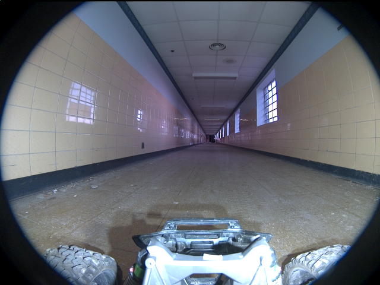

**scene_type:** corridor · **regiões canônicas:** 22 (0 publicadas, 22 contexto estrutural) · **relações:** 96 · **falhas de interpretação:** 0 · **audit:** ✅ pass (27 warnings)

## corridor-02-04859

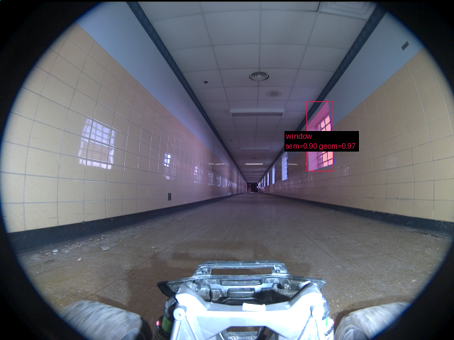

**scene_type:** corridor · **regiões canônicas:** 30 (1 publicadas, 29 contexto estrutural) · **relações:** 180 · **falhas de interpretação:** 0 · **audit:** ✅ pass (38 warnings)

## corridor-02-04907

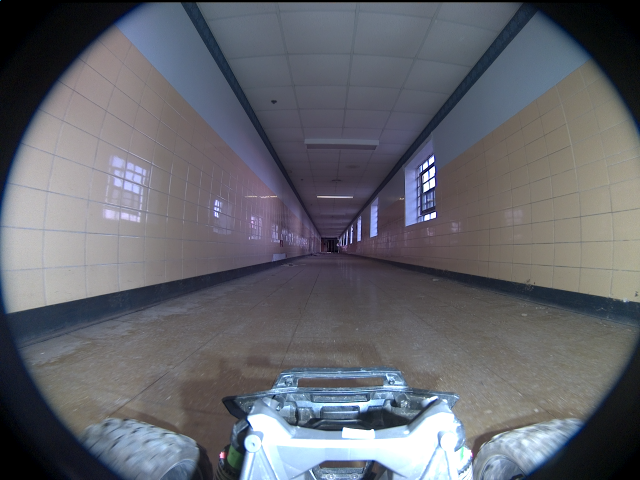

**scene_type:** corridor · **regiões canônicas:** 18 (0 publicadas, 18 contexto estrutural) · **relações:** 86 · **falhas de interpretação:** 0 · **audit:** ✅ pass (23 warnings)

## corridor-02-04955

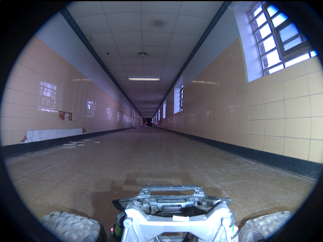

**scene_type:** corridor · **regiões canônicas:** 32 (0 publicadas, 32 contexto estrutural) · **relações:** 181 · **falhas de interpretação:** 0 · **audit:** ✅ pass (33 warnings)
