# Validação do pipeline real — 20260910T211622Z

Revisão: `0131e25` · Frames: 16 · Pico de VRAM observado: 4.57 GB (budget: 8.0 GB)

Ver `manifest.json` para configuração completa e log de estágios.

## corridor-02-04234

**scene_type:** corridor · **regiões canônicas:** 35 (1 publicadas, 34 contexto estrutural) · **relações:** 223 · **falhas de interpretação:** 0 · **audit:** ✅ pass (44 warnings)

## corridor-02-04259

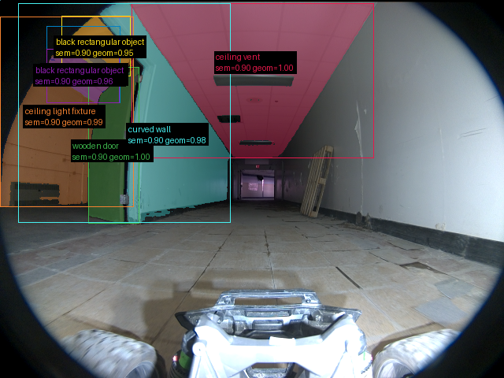

**scene_type:** indoor · **regiões canônicas:** 34 (7 publicadas, 27 contexto estrutural) · **relações:** 203 · **falhas de interpretação:** 0 · **audit:** ✅ pass (39 warnings)

## corridor-02-04282

**scene_type:** corridor · **regiões canônicas:** 37 (4 publicadas, 33 contexto estrutural) · **relações:** 198 · **falhas de interpretação:** 0 · **audit:** ✅ pass (41 warnings)

## corridor-02-04307

**scene_type:** corridor · **regiões canônicas:** 39 (0 publicadas, 39 contexto estrutural) · **relações:** 193 · **falhas de interpretação:** 0 · **audit:** ✅ pass (43 warnings)

## corridor-02-04331

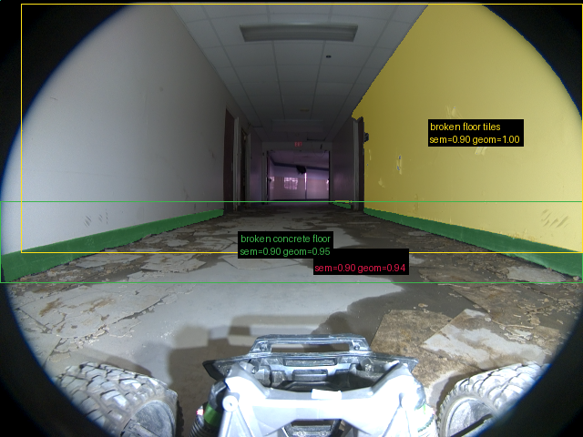

**scene_type:** corridor · **regiões canônicas:** 32 (3 publicadas, 29 contexto estrutural) · **relações:** 135 · **falhas de interpretação:** 0 · **audit:** ✅ pass (35 warnings)

## corridor-02-04354

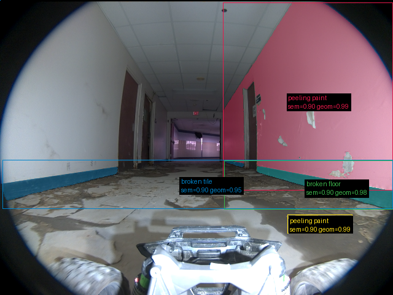

**scene_type:** corridor · **regiões canônicas:** 44 (4 publicadas, 40 contexto estrutural) · **relações:** 204 · **falhas de interpretação:** 0 · **audit:** ✅ pass (52 warnings)

## corridor-02-04379

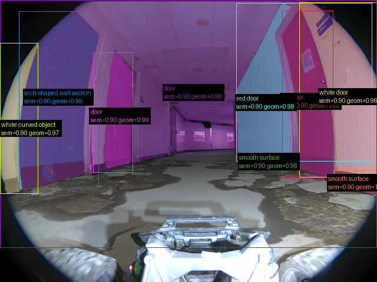

**scene_type:** corridor · **regiões canônicas:** 36 (9 publicadas, 27 contexto estrutural) · **relações:** 183 · **falhas de interpretação:** 0 · **audit:** ✅ pass (40 warnings)

## corridor-02-04402

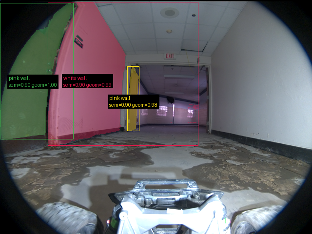

**scene_type:** indoor · **regiões canônicas:** 32 (3 publicadas, 29 contexto estrutural) · **relações:** 121 · **falhas de interpretação:** 0 · **audit:** ✅ pass (29 warnings)

## corridor-02-04426

**scene_type:** indoor · **regiões canônicas:** 39 (3 publicadas, 36 contexto estrutural) · **relações:** 193 · **falhas de interpretação:** 0 · **audit:** ✅ pass (48 warnings)

## corridor-02-04450

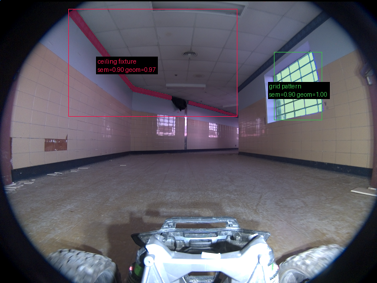

**scene_type:** indoor · **regiões canônicas:** 31 (2 publicadas, 29 contexto estrutural) · **relações:** 199 · **falhas de interpretação:** 0 · **audit:** ✅ pass (30 warnings)

## corridor-02-04475

**scene_type:** indoor · **regiões canônicas:** 29 (2 publicadas, 27 contexto estrutural) · **relações:** 175 · **falhas de interpretação:** 0 · **audit:** ✅ pass (34 warnings)

## corridor-02-04498

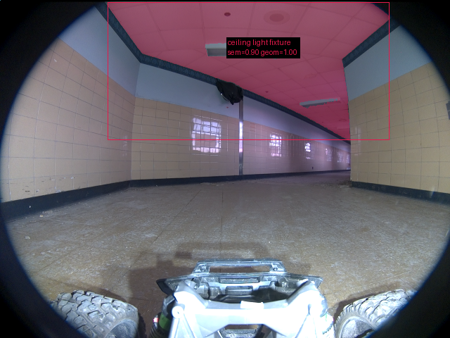

**scene_type:** corridor · **regiões canônicas:** 25 (1 publicadas, 24 contexto estrutural) · **relações:** 160 · **falhas de interpretação:** 0 · **audit:** ✅ pass (23 warnings)

## corridor-02-04523

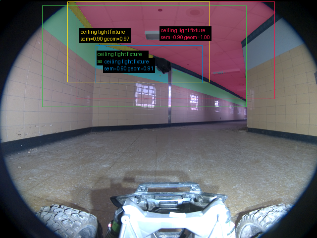

**scene_type:** indoor · **regiões canônicas:** 24 (4 publicadas, 20 contexto estrutural) · **relações:** 149 · **falhas de interpretação:** 0 · **audit:** ✅ pass (27 warnings)

## corridor-02-04546

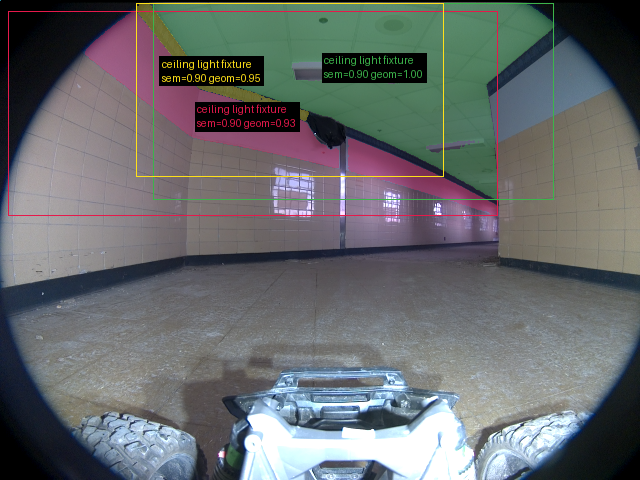

**scene_type:** corridor · **regiões canônicas:** 25 (3 publicadas, 22 contexto estrutural) · **relações:** 150 · **falhas de interpretação:** 0 · **audit:** ✅ pass (25 warnings)

## corridor-02-04570

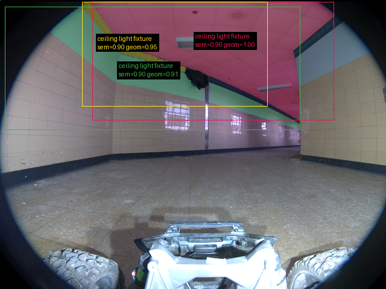

**scene_type:** indoor · **regiões canônicas:** 25 (3 publicadas, 22 contexto estrutural) · **relações:** 161 · **falhas de interpretação:** 0 · **audit:** ✅ pass (27 warnings)

## corridor-02-04595

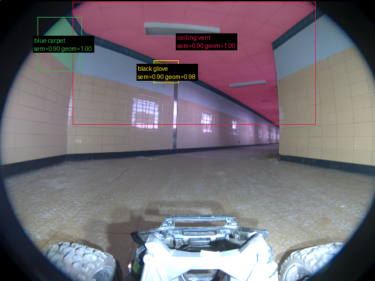

**scene_type:** indoor · **regiões canônicas:** 18 (3 publicadas, 15 contexto estrutural) · **relações:** 73 · **falhas de interpretação:** 0 · **audit:** ✅ pass (23 warnings)
