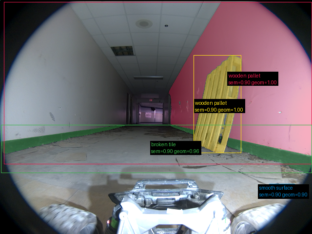
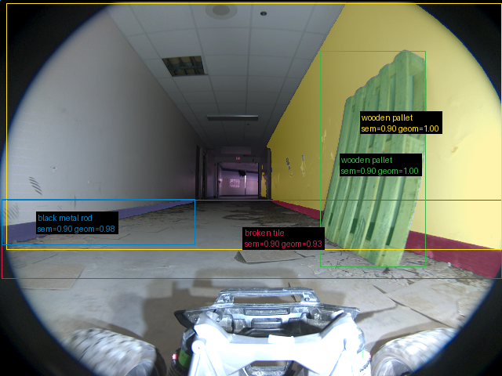
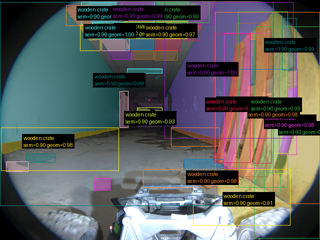
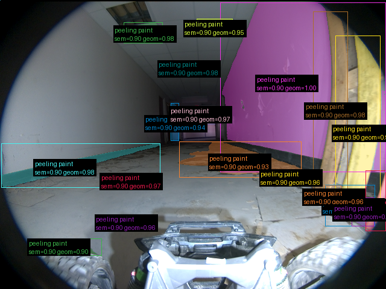

# Validação do pipeline real — 20260911T120857Z

Revisão: `9a2a421` · Frames: 4 · Pico de VRAM observado: 4.57 GB (budget: 8.0 GB)

Ver `manifest.json` para configuração completa e log de estágios.

## corridor-02-04282

**scene_type:** corridor · **regiões canônicas:** 37 (4 publicadas, 33 contexto estrutural) · **relações:** 199 · **falhas de interpretação:** 0 · **audit:** ✅ pass (49 warnings)

## corridor-02-04288

**scene_type:** indoor · **regiões canônicas:** 38 (4 publicadas, 34 contexto estrutural) · **relações:** 204 · **falhas de interpretação:** 0 · **audit:** ✅ pass (50 warnings)

## corridor-02-04294

**scene_type:** corridor · **regiões canônicas:** 45 (42 publicadas, 3 contexto estrutural) · **relações:** 283 · **falhas de interpretação:** 0 · **audit:** ✅ pass (6 warnings)

## corridor-02-04300

**scene_type:** corridor · **regiões canônicas:** 40 (18 publicadas, 22 contexto estrutural) · **relações:** 227 · **falhas de interpretação:** 0 · **audit:** ✅ pass (62 warnings)
