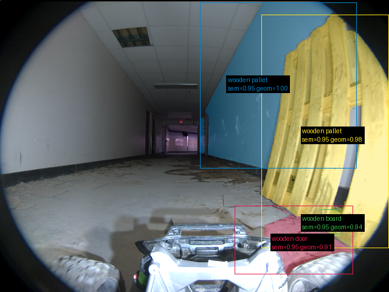

# Validação do pipeline real — 20260911T124447Z

Revisão: `3596e90` · Frames: 1 · Pico de VRAM observado: 4.57 GB (budget: 8.0 GB)

Ver `manifest.json` para configuração completa e log de estágios.

## corridor-02-04294

**scene_type:** corridor · **regiões canônicas:** 45 (4 publicadas, 41 contexto estrutural) · **relações:** 295 · **falhas de interpretação:** 0 · **audit:** ✅ pass (53 warnings)
