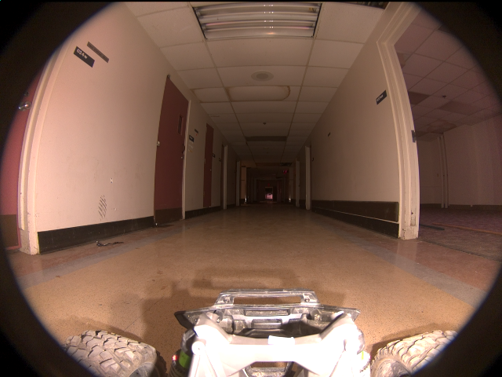

# Validação do pipeline real — 20260914T023102Z

Revisão: `d947b60` · Frames: 1 · Pico de VRAM: 4.97 GB (budget: 8.0 GB) · Pico de RSS do host: 9.00 GB

Ver `manifest.json` para configuração completa e log de estágios.

## corridor-02-000

**scene_type:** corridor · **regiões canônicas:** 0 (0 publicadas, 0 contexto estrutural) · **relações:** 0 · **falhas de interpretação:** 0 · **audit:** ✅ pass (0 warnings)
