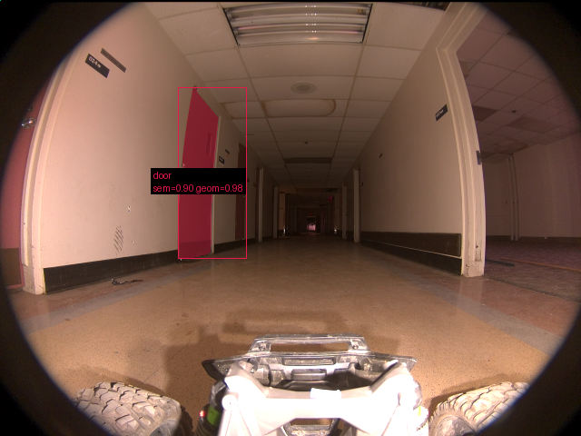
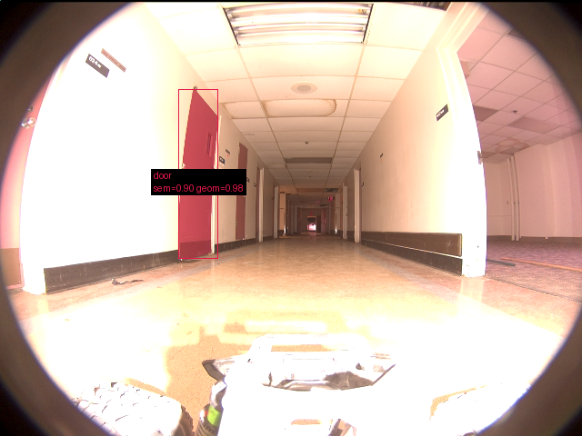
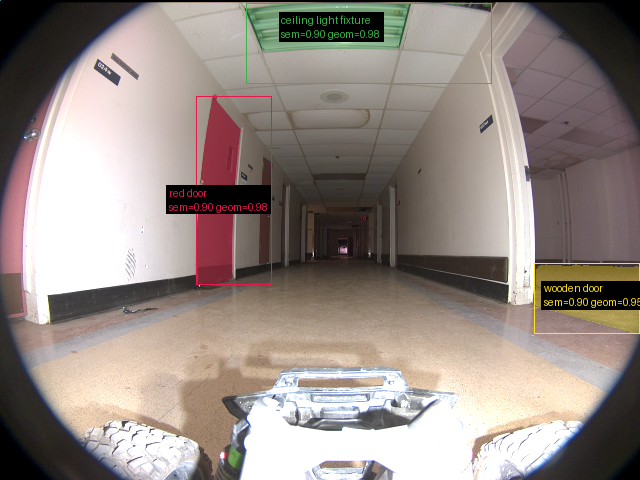

# Validação do pipeline real — 20260914T110823Z

Revisão: `69f05fb` · Frames: 3 · Pico de VRAM: 6.67 GB (budget: 8.0 GB) · Pico de RSS do host: 9.25 GB

Ver `manifest.json` para configuração completa e log de estágios.

## corridor-02-00000

**scene_type:** corridor · **regiões canônicas:** 27 (1 publicadas, 26 contexto estrutural) · **relações:** 75 · **falhas de interpretação:** 0 · **audit:** ✅ pass (28 warnings)

## corridor-02-00008

**scene_type:** corridor · **regiões canônicas:** 26 (1 publicadas, 25 contexto estrutural) · **relações:** 46 · **falhas de interpretação:** 0 · **audit:** ✅ pass (25 warnings)

## corridor-02-00017

**scene_type:** corridor · **regiões canônicas:** 25 (3 publicadas, 22 contexto estrutural) · **relações:** 62 · **falhas de interpretação:** 0 · **audit:** ✅ pass (25 warnings)
