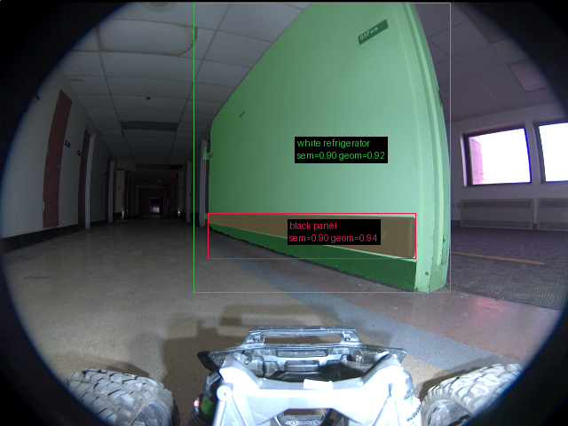
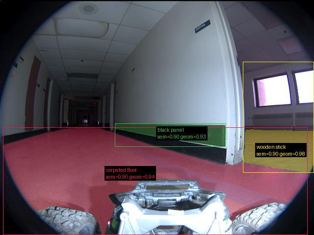

# Validação do pipeline real — 20260914T143143Z

Revisão: `7be8ec5` · Frames: 3 · Pico de VRAM: 6.89 GB (budget: 8.0 GB) · Pico de RSS do host: 10.34 GB

Ver `manifest.json` para configuração completa e log de estágios.

## corridor-02-02148

**scene_type:** corridor · **regiões canônicas:** 26 (2 publicadas, 24 contexto estrutural) · **relações:** 91 · **falhas de interpretação:** 0 · **audit:** ✅ pass (30 warnings)

## corridor-02-02156

**scene_type:** corridor · **regiões canônicas:** 27 (4 publicadas, 23 contexto estrutural) · **relações:** 87 · **falhas de interpretação:** 0 · **audit:** ✅ pass (31 warnings)

## corridor-02-02163

**scene_type:** corridor · **regiões canônicas:** 27 (3 publicadas, 24 contexto estrutural) · **relações:** 84 · **falhas de interpretação:** 0 · **audit:** ✅ pass (33 warnings)
