# Validação do pipeline real — 20260914T152032Z

Revisão: `7be8ec5` · Frames: 31 · Pico de VRAM: 6.89 GB (budget: 8.0 GB) · Pico de RSS do host: 10.88 GB

Ver `manifest.json` para configuração completa e log de estágios.

## corridor-02-02148

**scene_type:** corridor · **regiões canônicas:** 26 (2 publicadas, 24 contexto estrutural) · **relações:** 91 · **falhas de interpretação:** 0 · **audit:** ✅ pass (30 warnings)

## corridor-02-02156

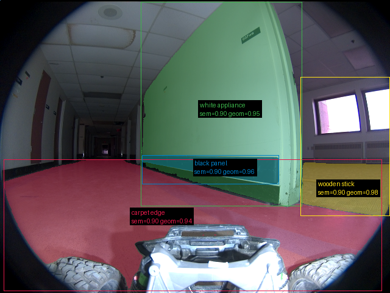

**scene_type:** corridor · **regiões canônicas:** 27 (4 publicadas, 23 contexto estrutural) · **relações:** 87 · **falhas de interpretação:** 0 · **audit:** ✅ pass (31 warnings)

## corridor-02-02163

**scene_type:** corridor · **regiões canônicas:** 27 (3 publicadas, 24 contexto estrutural) · **relações:** 84 · **falhas de interpretação:** 0 · **audit:** ✅ pass (33 warnings)

## corridor-02-02171

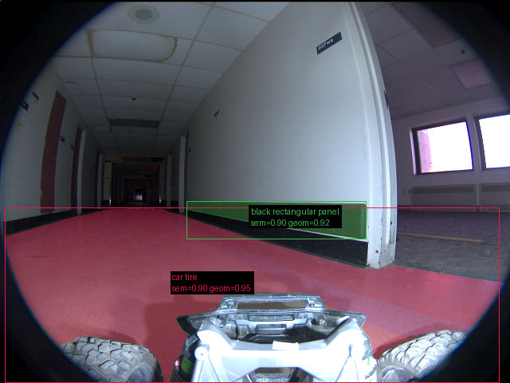

**scene_type:** corridor · **regiões canônicas:** 28 (2 publicadas, 26 contexto estrutural) · **relações:** 93 · **falhas de interpretação:** 0 · **audit:** ✅ pass (34 warnings)

## corridor-02-02179

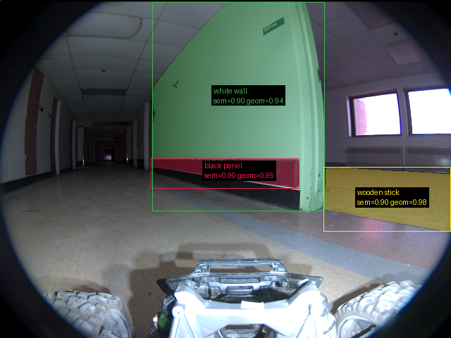

**scene_type:** corridor · **regiões canônicas:** 22 (3 publicadas, 19 contexto estrutural) · **relações:** 38 · **falhas de interpretação:** 0 · **audit:** ✅ pass (30 warnings)

## corridor-02-02188

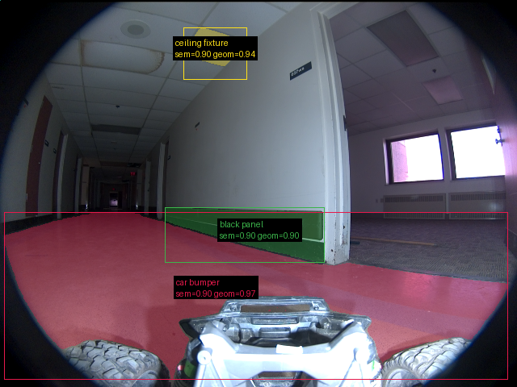

**scene_type:** corridor · **regiões canônicas:** 28 (3 publicadas, 25 contexto estrutural) · **relações:** 53 · **falhas de interpretação:** 0 · **audit:** ✅ pass (36 warnings)

## corridor-02-02196

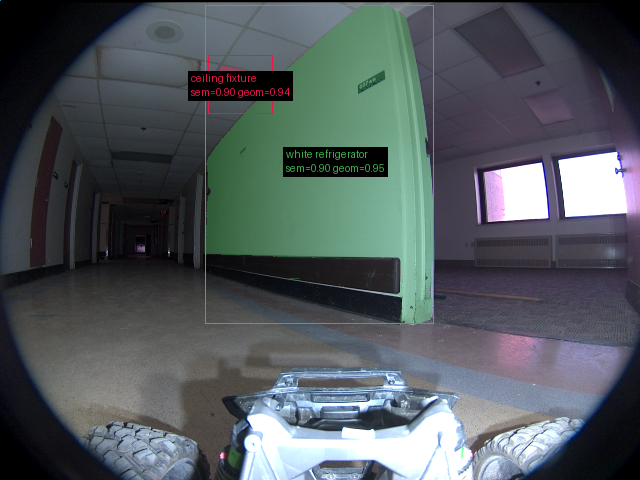

**scene_type:** corridor · **regiões canônicas:** 24 (2 publicadas, 22 contexto estrutural) · **relações:** 50 · **falhas de interpretação:** 0 · **audit:** ✅ pass (27 warnings)

## corridor-02-02203

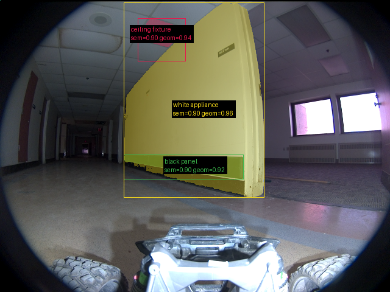

**scene_type:** corridor · **regiões canônicas:** 26 (3 publicadas, 23 contexto estrutural) · **relações:** 56 · **falhas de interpretação:** 0 · **audit:** ✅ pass (34 warnings)

## corridor-02-02211

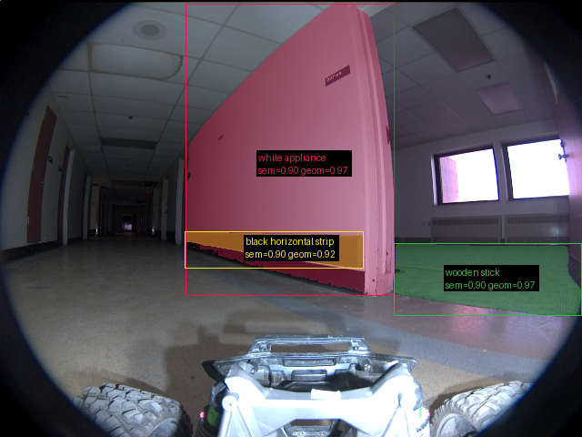

**scene_type:** corridor · **regiões canônicas:** 27 (3 publicadas, 24 contexto estrutural) · **relações:** 55 · **falhas de interpretação:** 0 · **audit:** ✅ pass (37 warnings)

## corridor-02-02219

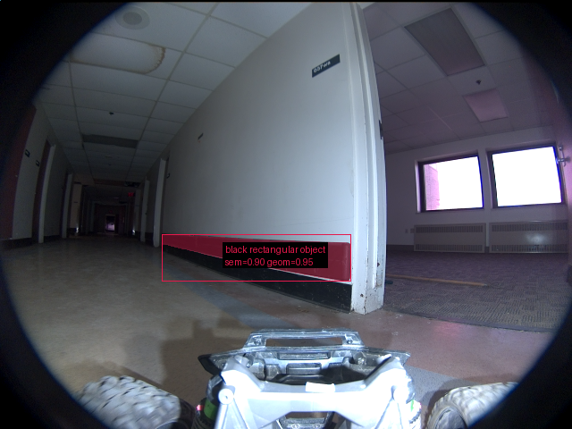

**scene_type:** corridor · **regiões canônicas:** 22 (1 publicadas, 21 contexto estrutural) · **relações:** 45 · **falhas de interpretação:** 0 · **audit:** ✅ pass (23 warnings)

## corridor-02-02228

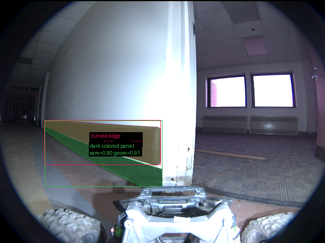

**scene_type:** corridor · **regiões canônicas:** 17 (2 publicadas, 15 contexto estrutural) · **relações:** 26 · **falhas de interpretação:** 0 · **audit:** ✅ pass (25 warnings)

## corridor-02-02236

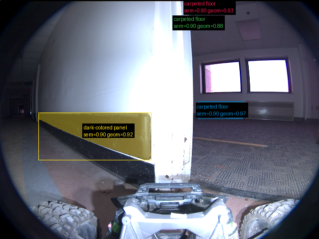

**scene_type:** office · **regiões canônicas:** 12 (4 publicadas, 8 contexto estrutural) · **relações:** 15 · **falhas de interpretação:** 0 · **audit:** ✅ pass (16 warnings)

## corridor-02-02244

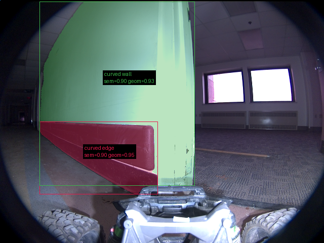

**scene_type:** corridor · **regiões canônicas:** 17 (2 publicadas, 15 contexto estrutural) · **relações:** 44 · **falhas de interpretação:** 0 · **audit:** ✅ pass (23 warnings)

## corridor-02-02251

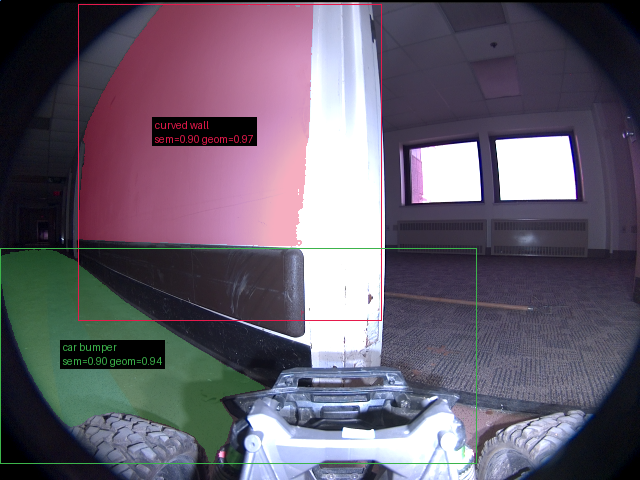

**scene_type:** airport · **regiões canônicas:** 16 (2 publicadas, 14 contexto estrutural) · **relações:** 27 · **falhas de interpretação:** 0 · **audit:** ✅ pass (22 warnings)

## corridor-02-02259

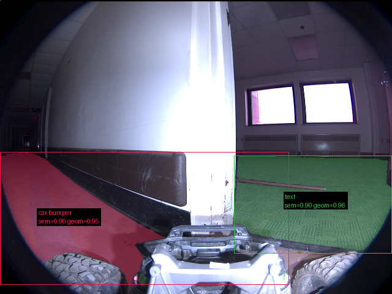

**scene_type:** corridor · **regiões canônicas:** 16 (2 publicadas, 14 contexto estrutural) · **relações:** 30 · **falhas de interpretação:** 0 · **audit:** ✅ pass (19 warnings)

## corridor-02-02267

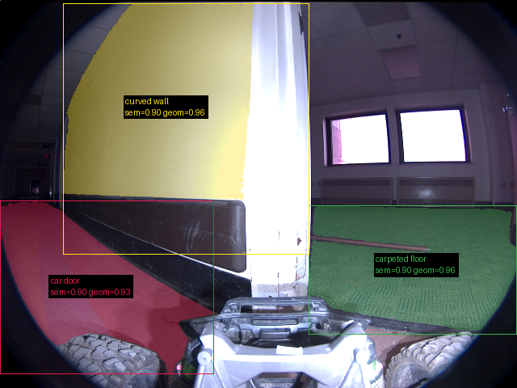

**scene_type:** corridor · **regiões canônicas:** 15 (3 publicadas, 12 contexto estrutural) · **relações:** 22 · **falhas de interpretação:** 0 · **audit:** ✅ pass (19 warnings)

## corridor-02-02276

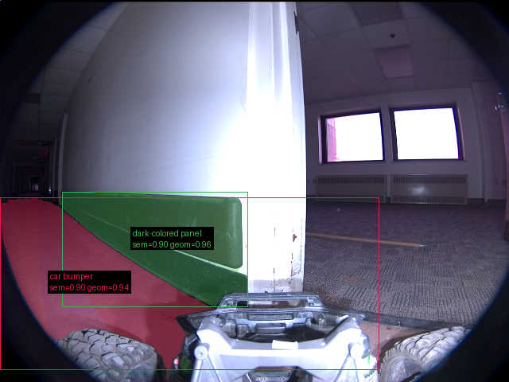

**scene_type:** corridor · **regiões canônicas:** 16 (2 publicadas, 14 contexto estrutural) · **relações:** 36 · **falhas de interpretação:** 0 · **audit:** ✅ pass (21 warnings)

## corridor-02-02284

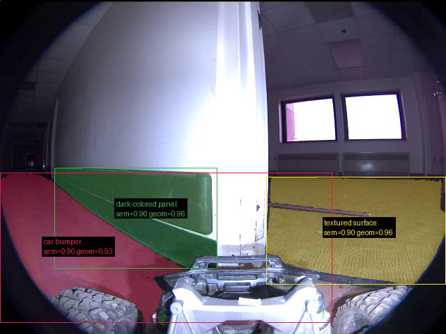

**scene_type:** corridor · **regiões canônicas:** 15 (3 publicadas, 12 contexto estrutural) · **relações:** 31 · **falhas de interpretação:** 0 · **audit:** ✅ pass (20 warnings)

## corridor-02-02291

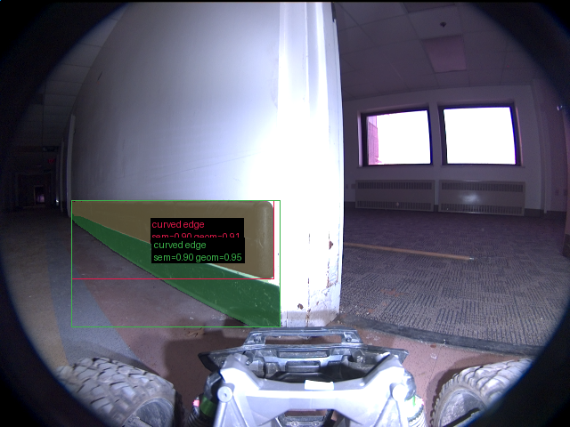

**scene_type:** corridor · **regiões canônicas:** 14 (2 publicadas, 12 contexto estrutural) · **relações:** 30 · **falhas de interpretação:** 0 · **audit:** ✅ pass (18 warnings)

## corridor-02-02299

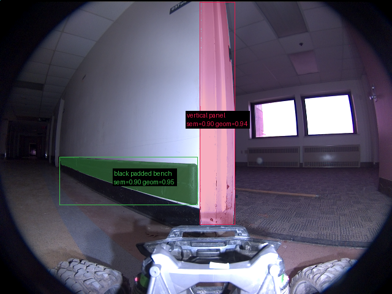

**scene_type:** corridor · **regiões canônicas:** 22 (2 publicadas, 20 contexto estrutural) · **relações:** 47 · **falhas de interpretação:** 0 · **audit:** ✅ pass (19 warnings)

## corridor-02-02307

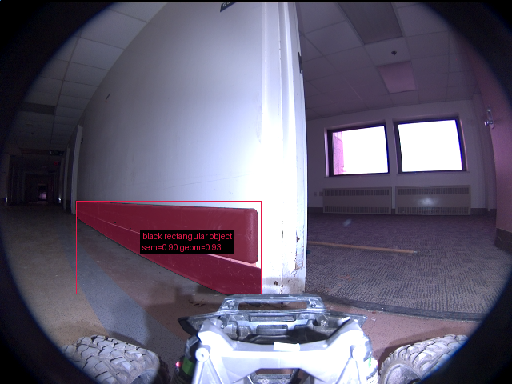

**scene_type:** corridor · **regiões canônicas:** 15 (1 publicadas, 14 contexto estrutural) · **relações:** 21 · **falhas de interpretação:** 0 · **audit:** ✅ pass (19 warnings)

## corridor-02-02316

**scene_type:** corridor · **regiões canônicas:** 19 (2 publicadas, 17 contexto estrutural) · **relações:** 31 · **falhas de interpretação:** 0 · **audit:** ✅ pass (23 warnings)

## corridor-02-02324

**scene_type:** corridor · **regiões canônicas:** 20 (1 publicadas, 19 contexto estrutural) · **relações:** 33 · **falhas de interpretação:** 0 · **audit:** ✅ pass (26 warnings)

## corridor-02-02332

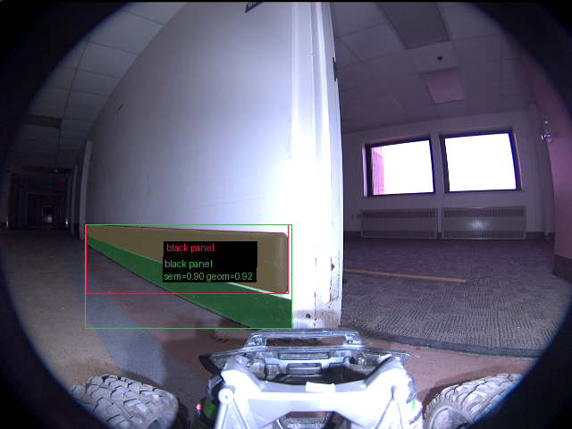

**scene_type:** corridor · **regiões canônicas:** 18 (2 publicadas, 16 contexto estrutural) · **relações:** 28 · **falhas de interpretação:** 0 · **audit:** ✅ pass (21 warnings)

## corridor-02-02339

**scene_type:** corridor · **regiões canônicas:** 19 (1 publicadas, 18 contexto estrutural) · **relações:** 30 · **falhas de interpretação:** 0 · **audit:** ✅ pass (23 warnings)

## corridor-02-02347

**scene_type:** corridor · **regiões canônicas:** 18 (1 publicadas, 17 contexto estrutural) · **relações:** 28 · **falhas de interpretação:** 0 · **audit:** ✅ pass (23 warnings)

## corridor-02-02355

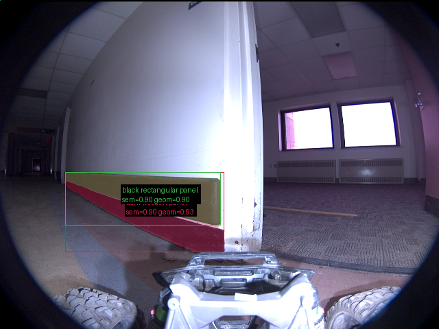

**scene_type:** corridor · **regiões canônicas:** 19 (2 publicadas, 17 contexto estrutural) · **relações:** 31 · **falhas de interpretação:** 0 · **audit:** ✅ pass (23 warnings)

## corridor-02-02364

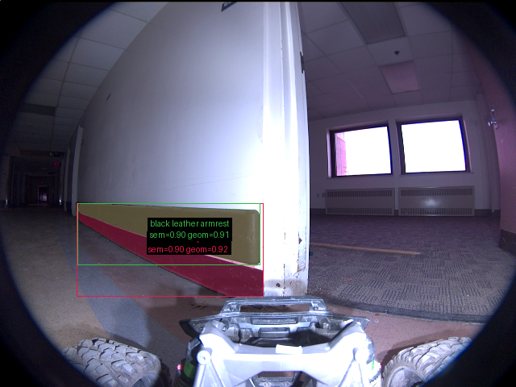

**scene_type:** corridor · **regiões canônicas:** 17 (2 publicadas, 15 contexto estrutural) · **relações:** 27 · **falhas de interpretação:** 0 · **audit:** ✅ pass (23 warnings)

## corridor-02-02371

**scene_type:** corridor · **regiões canônicas:** 17 (1 publicadas, 16 contexto estrutural) · **relações:** 26 · **falhas de interpretação:** 0 · **audit:** ✅ pass (25 warnings)

## corridor-02-02379

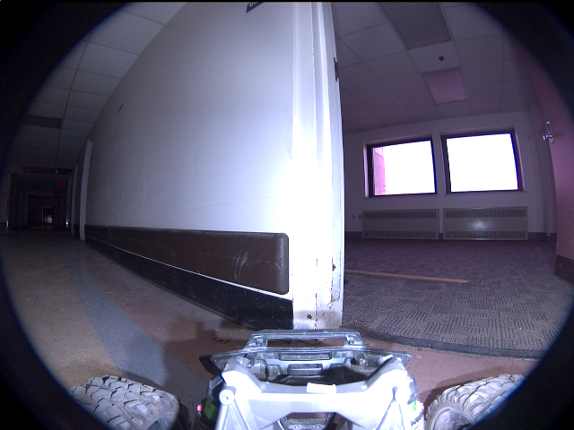

**scene_type:** corridor · **regiões canônicas:** 18 (0 publicadas, 18 contexto estrutural) · **relações:** 29 · **falhas de interpretação:** 0 · **audit:** ✅ pass (19 warnings)

## corridor-02-02387

**scene_type:** corridor · **regiões canônicas:** 19 (1 publicadas, 18 contexto estrutural) · **relações:** 32 · **falhas de interpretação:** 0 · **audit:** ✅ pass (22 warnings)
