# Validação do pipeline real — 20260914T165808Z

Revisão: `7be8ec5` · Frames: 31 · Pico de VRAM: 6.89 GB (budget: 8.0 GB) · Pico de RSS do host: 10.82 GB

Ver `manifest.json` para configuração completa e log de estágios.

## corridor-02-04292

**scene_type:** corridor · **regiões canônicas:** 22 (21 publicadas, 1 contexto estrutural) · **relações:** 82 · **falhas de interpretação:** 0 · **audit:** ✅ pass (20 warnings)

## corridor-02-04300

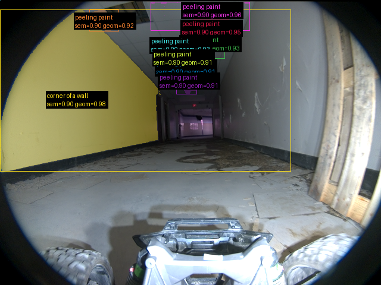

**scene_type:** corridor · **regiões canônicas:** 20 (9 publicadas, 11 contexto estrutural) · **relações:** 80 · **falhas de interpretação:** 0 · **audit:** ✅ pass (38 warnings)

## corridor-02-04308

**scene_type:** corridor · **regiões canônicas:** 26 (0 publicadas, 26 contexto estrutural) · **relações:** 103 · **falhas de interpretação:** 0 · **audit:** ✅ pass (42 warnings)

## corridor-02-04315

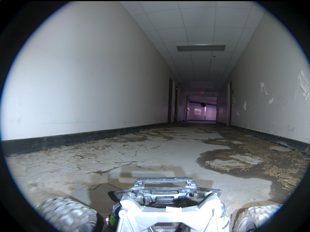

**scene_type:** corridor · **regiões canônicas:** 19 (0 publicadas, 19 contexto estrutural) · **relações:** 59 · **falhas de interpretação:** 0 · **audit:** ✅ pass (24 warnings)

## corridor-02-04324

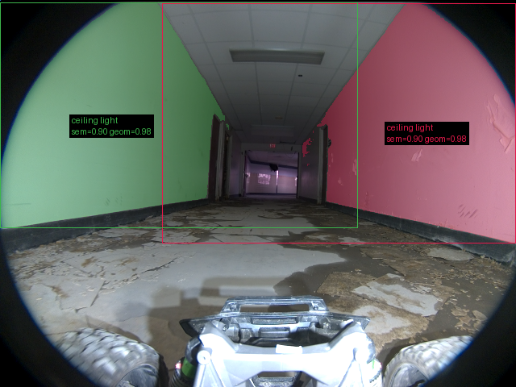

**scene_type:** corridor · **regiões canônicas:** 21 (2 publicadas, 19 contexto estrutural) · **relações:** 67 · **falhas de interpretação:** 0 · **audit:** ✅ pass (24 warnings)

## corridor-02-04332

**scene_type:** corridor · **regiões canônicas:** 20 (0 publicadas, 20 contexto estrutural) · **relações:** 54 · **falhas de interpretação:** 0 · **audit:** ✅ pass (23 warnings)

## corridor-02-04340

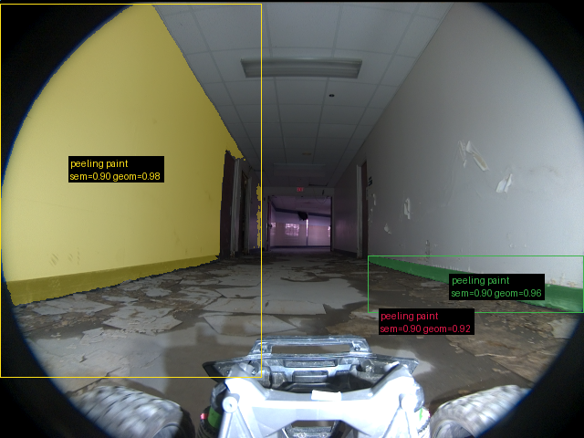

**scene_type:** corridor · **regiões canônicas:** 24 (3 publicadas, 21 contexto estrutural) · **relações:** 70 · **falhas de interpretação:** 0 · **audit:** ✅ pass (28 warnings)

## corridor-02-04348

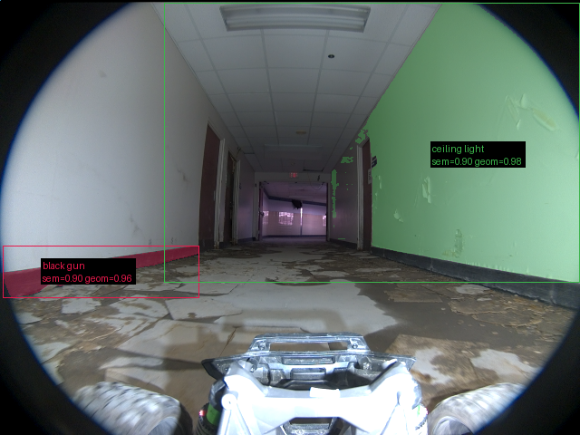

**scene_type:** corridor · **regiões canônicas:** 19 (2 publicadas, 17 contexto estrutural) · **relações:** 59 · **falhas de interpretação:** 0 · **audit:** ✅ pass (18 warnings)

## corridor-02-04355

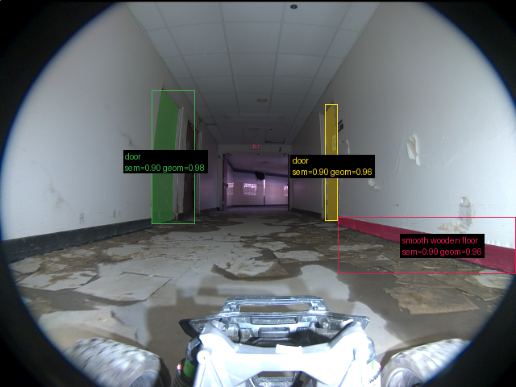

**scene_type:** corridor · **regiões canônicas:** 28 (3 publicadas, 25 contexto estrutural) · **relações:** 131 · **falhas de interpretação:** 0 · **audit:** ✅ pass (35 warnings)

## corridor-02-04363

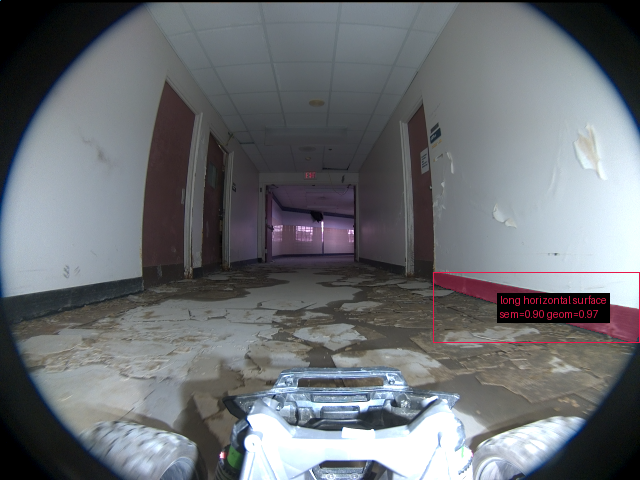

**scene_type:** corridor · **regiões canônicas:** 29 (1 publicadas, 28 contexto estrutural) · **relações:** 112 · **falhas de interpretação:** 0 · **audit:** ✅ pass (35 warnings)

## corridor-02-04372

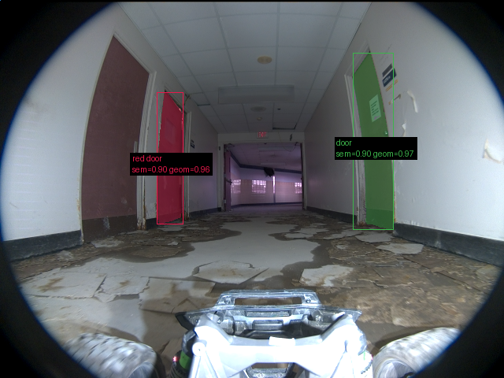

**scene_type:** corridor · **regiões canônicas:** 29 (2 publicadas, 27 contexto estrutural) · **relações:** 61 · **falhas de interpretação:** 0 · **audit:** ✅ pass (28 warnings)

## corridor-02-04380

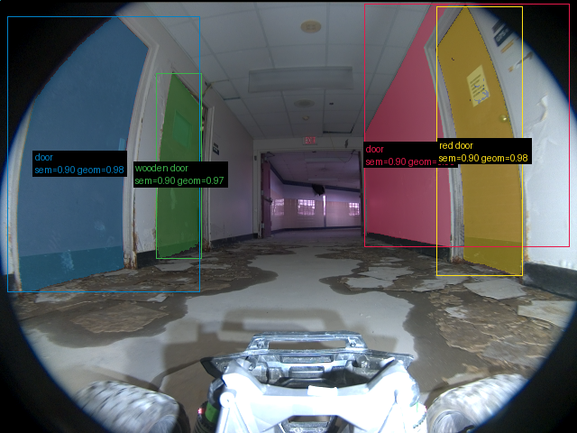

**scene_type:** corridor · **regiões canônicas:** 26 (4 publicadas, 22 contexto estrutural) · **relações:** 76 · **falhas de interpretação:** 0 · **audit:** ✅ pass (27 warnings)

## corridor-02-04388

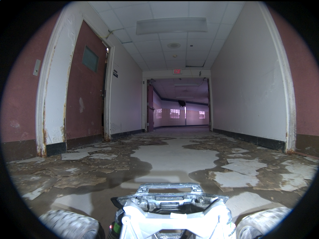

**scene_type:** corridor · **regiões canônicas:** 24 (0 publicadas, 24 contexto estrutural) · **relações:** 47 · **falhas de interpretação:** 0 · **audit:** ✅ pass (25 warnings)

## corridor-02-04395

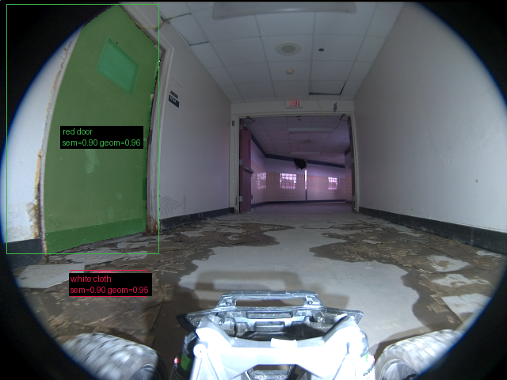

**scene_type:** indoor · **regiões canônicas:** 24 (2 publicadas, 22 contexto estrutural) · **relações:** 64 · **falhas de interpretação:** 0 · **audit:** ✅ pass (27 warnings)

## corridor-02-04403

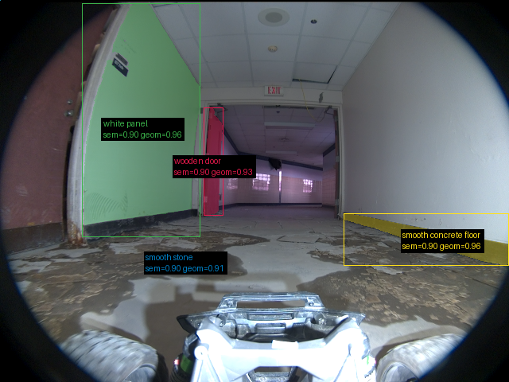

**scene_type:** indoor · **regiões canônicas:** 19 (4 publicadas, 15 contexto estrutural) · **relações:** 53 · **falhas de interpretação:** 0 · **audit:** ✅ pass (25 warnings)

## corridor-02-04412

**scene_type:** indoor · **regiões canônicas:** 16 (0 publicadas, 16 contexto estrutural) · **relações:** 41 · **falhas de interpretação:** 0 · **audit:** ✅ pass (19 warnings)

## corridor-02-04420

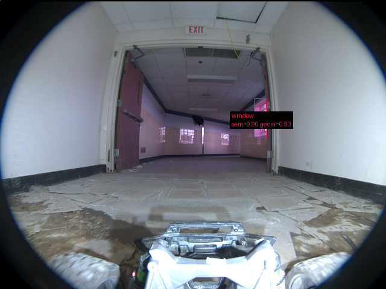

**scene_type:** indoor · **regiões canônicas:** 15 (1 publicadas, 14 contexto estrutural) · **relações:** 28 · **falhas de interpretação:** 0 · **audit:** ✅ pass (18 warnings)

## corridor-02-04427

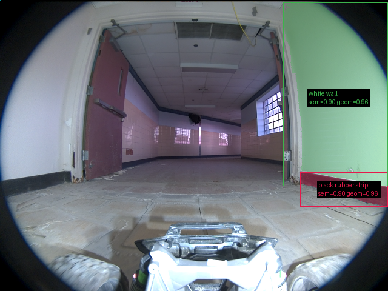

**scene_type:** indoor · **regiões canônicas:** 15 (2 publicadas, 13 contexto estrutural) · **relações:** 23 · **falhas de interpretação:** 0 · **audit:** ✅ pass (21 warnings)

## corridor-02-04435

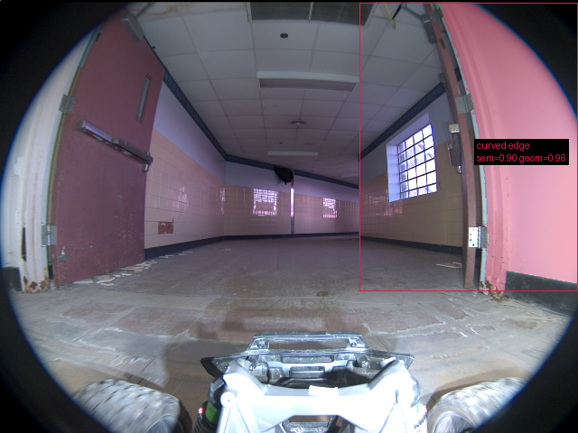

**scene_type:** indoor · **regiões canônicas:** 17 (1 publicadas, 16 contexto estrutural) · **relações:** 32 · **falhas de interpretação:** 0 · **audit:** ✅ pass (25 warnings)

## corridor-02-04443

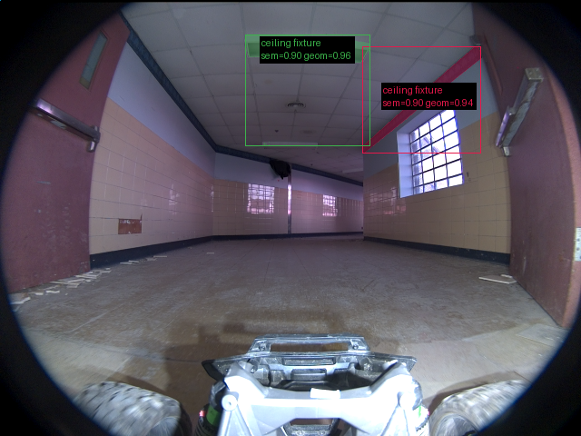

**scene_type:** indoor · **regiões canônicas:** 19 (2 publicadas, 17 contexto estrutural) · **relações:** 43 · **falhas de interpretação:** 0 · **audit:** ✅ pass (23 warnings)

## corridor-02-04451

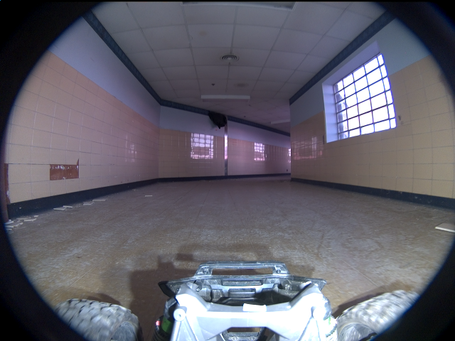

**scene_type:** indoor · **regiões canônicas:** 21 (0 publicadas, 21 contexto estrutural) · **relações:** 45 · **falhas de interpretação:** 0 · **audit:** ✅ pass (24 warnings)

## corridor-02-04460

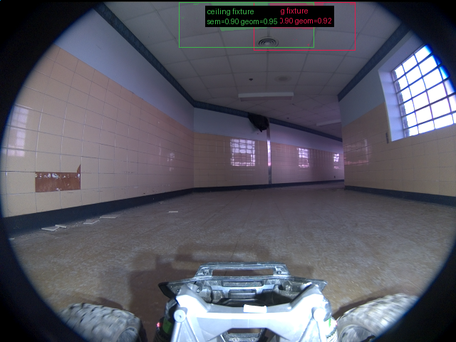

**scene_type:** indoor · **regiões canônicas:** 23 (2 publicadas, 21 contexto estrutural) · **relações:** 56 · **falhas de interpretação:** 0 · **audit:** ✅ pass (22 warnings)

## corridor-02-04468

**scene_type:** indoor · **regiões canônicas:** 28 (0 publicadas, 28 contexto estrutural) · **relações:** 64 · **falhas de interpretação:** 0 · **audit:** ✅ pass (38 warnings)

## corridor-02-04476

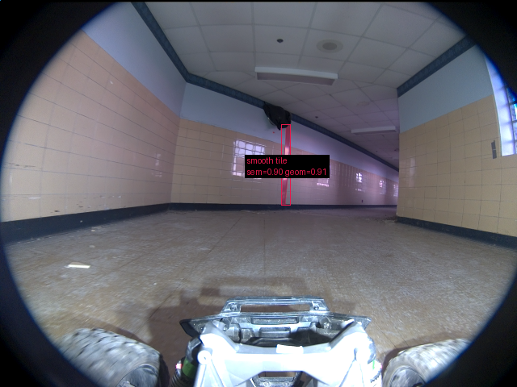

**scene_type:** indoor · **regiões canônicas:** 23 (1 publicadas, 22 contexto estrutural) · **relações:** 53 · **falhas de interpretação:** 0 · **audit:** ✅ pass (19 warnings)

## corridor-02-04483

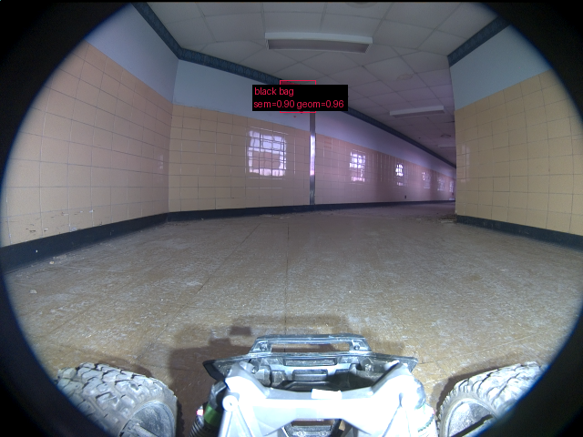

**scene_type:** indoor · **regiões canônicas:** 13 (1 publicadas, 12 contexto estrutural) · **relações:** 22 · **falhas de interpretação:** 0 · **audit:** ✅ pass (17 warnings)

## corridor-02-04491

**scene_type:** indoor · **regiões canônicas:** 20 (0 publicadas, 20 contexto estrutural) · **relações:** 45 · **falhas de interpretação:** 0 · **audit:** ✅ pass (22 warnings)

## corridor-02-04500

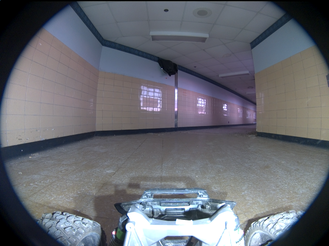

**scene_type:** indoor · **regiões canônicas:** 24 (0 publicadas, 24 contexto estrutural) · **relações:** 62 · **falhas de interpretação:** 0 · **audit:** ✅ pass (27 warnings)

## corridor-02-04508

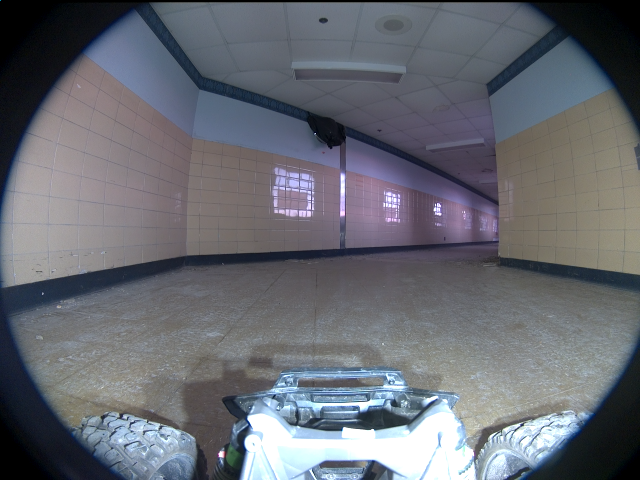

**scene_type:** indoor · **regiões canônicas:** 22 (0 publicadas, 22 contexto estrutural) · **relações:** 54 · **falhas de interpretação:** 0 · **audit:** ✅ pass (27 warnings)

## corridor-02-04516

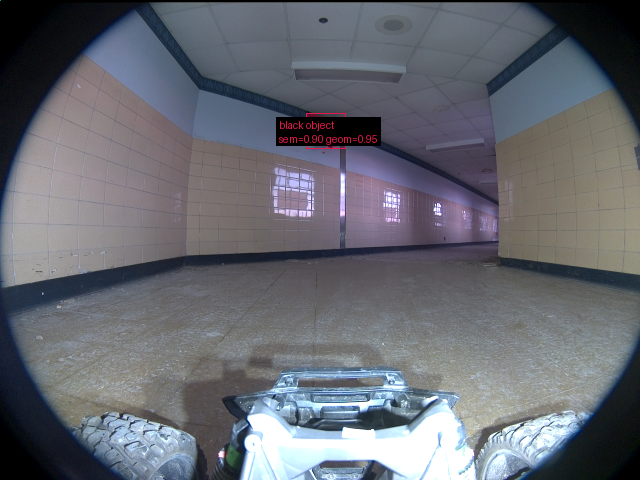

**scene_type:** indoor · **regiões canônicas:** 23 (1 publicadas, 22 contexto estrutural) · **relações:** 60 · **falhas de interpretação:** 0 · **audit:** ✅ pass (25 warnings)

## corridor-02-04524

**scene_type:** indoor · **regiões canônicas:** 21 (0 publicadas, 21 contexto estrutural) · **relações:** 52 · **falhas de interpretação:** 0 · **audit:** ✅ pass (21 warnings)

## corridor-02-04531

**scene_type:** indoor · **regiões canônicas:** 24 (0 publicadas, 24 contexto estrutural) · **relações:** 61 · **falhas de interpretação:** 0 · **audit:** ✅ pass (27 warnings)
