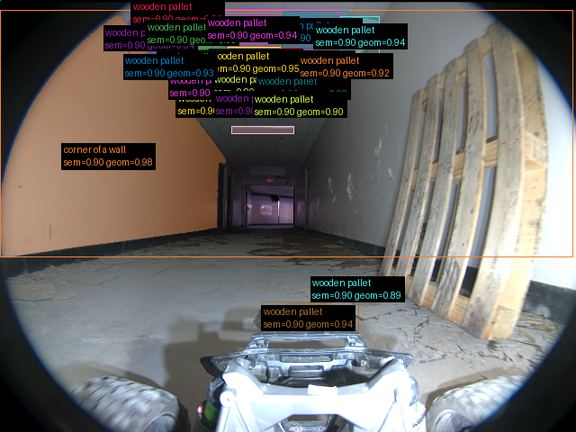

# Validação do pipeline real — 20260914T194013Z

Revisão: `da487c3` · Frames: 1 · Pico de VRAM: 5.43 GB (budget: 8.0 GB) · Pico de RSS do host: 9.38 GB

Ver `manifest.json` para configuração completa e log de estágios.

## corridor-02-04292

**scene_type:** corridor · **regiões canônicas:** 22 (21 publicadas, 1 contexto estrutural) · **relações:** 82 · **falhas de interpretação:** 0 · **audit:** ✅ pass (20 warnings)
