# Validação do pipeline real — 20260914T200834Z

Revisão: `177e763` · Frames: 31 · Pico de VRAM: 6.89 GB (budget: 8.0 GB) · Pico de RSS do host: 10.89 GB

Ver `manifest.json` para configuração completa e log de estágios.

## corridor-02-08580

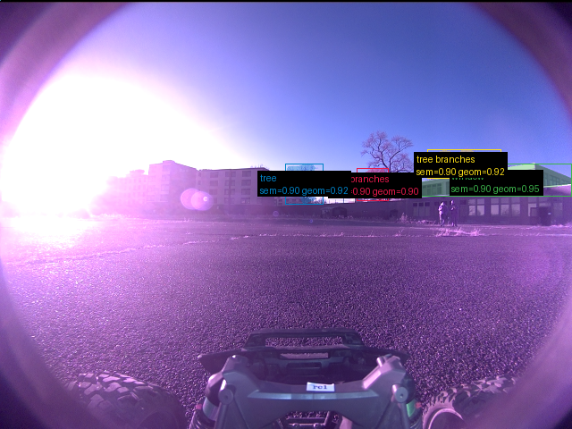

**scene_type:** urban · **regiões canônicas:** 5 (4 publicadas, 1 contexto estrutural) · **relações:** 1 · **falhas de interpretação:** 0 · **audit:** ✅ pass (4 warnings)

## corridor-02-08588

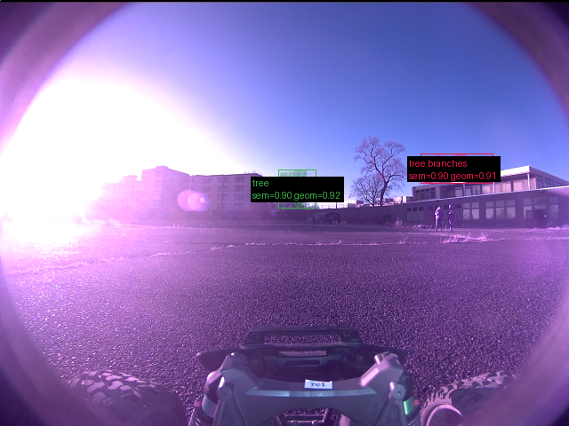

**scene_type:** urban · **regiões canônicas:** 3 (2 publicadas, 1 contexto estrutural) · **relações:** 1 · **falhas de interpretação:** 0 · **audit:** ✅ pass (1 warnings)

## corridor-02-08596

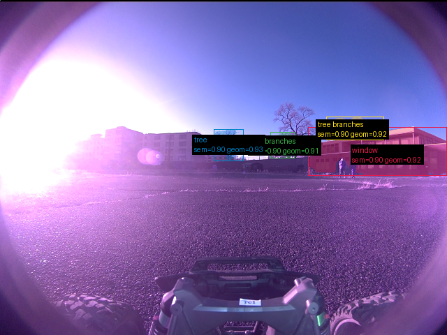

**scene_type:** urban · **regiões canônicas:** 5 (4 publicadas, 1 contexto estrutural) · **relações:** 1 · **falhas de interpretação:** 0 · **audit:** ✅ pass (1 warnings)

## corridor-02-08604

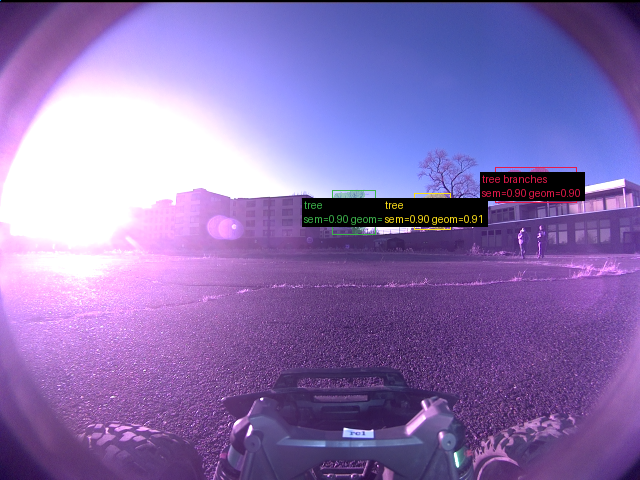

**scene_type:** urban · **regiões canônicas:** 3 (3 publicadas, 0 contexto estrutural) · **relações:** 0 · **falhas de interpretação:** 0 · **audit:** ✅ pass (0 warnings)

## corridor-02-08612

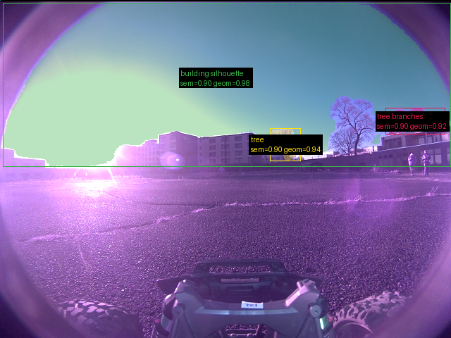

**scene_type:** urban · **regiões canônicas:** 5 (3 publicadas, 2 contexto estrutural) · **relações:** 4 · **falhas de interpretação:** 0 · **audit:** ✅ pass (1 warnings)

## corridor-02-08620

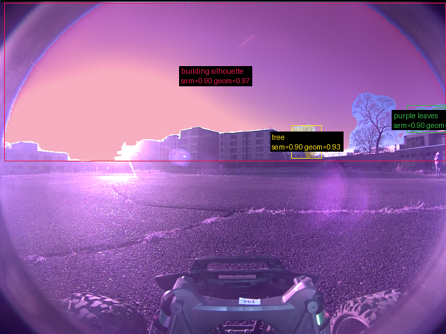

**scene_type:** urban · **regiões canônicas:** 6 (3 publicadas, 3 contexto estrutural) · **relações:** 6 · **falhas de interpretação:** 0 · **audit:** ✅ pass (3 warnings)

## corridor-02-08628

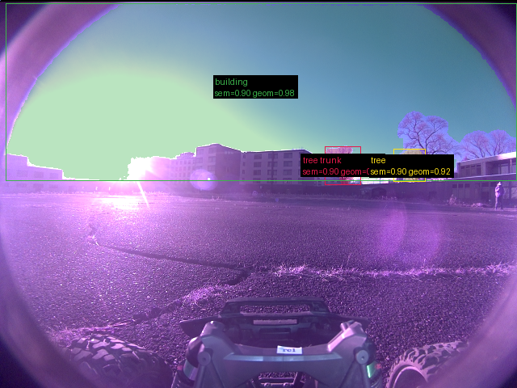

**scene_type:** open field · **regiões canônicas:** 4 (3 publicadas, 1 contexto estrutural) · **relações:** 4 · **falhas de interpretação:** 0 · **audit:** ✅ pass (2 warnings)

## corridor-02-08636

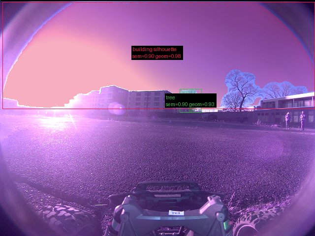

**scene_type:** urban · **regiões canônicas:** 3 (2 publicadas, 1 contexto estrutural) · **relações:** 2 · **falhas de interpretação:** 0 · **audit:** ✅ pass (1 warnings)

## corridor-02-08644

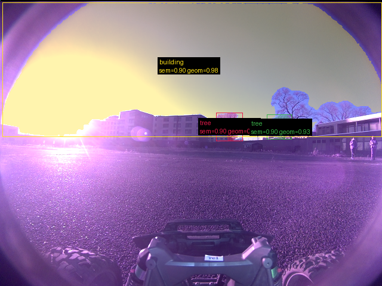

**scene_type:** park · **regiões canônicas:** 4 (3 publicadas, 1 contexto estrutural) · **relações:** 3 · **falhas de interpretação:** 0 · **audit:** ✅ pass (2 warnings)

## corridor-02-08652

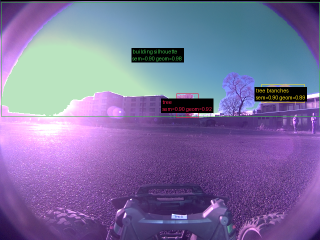

**scene_type:** urban · **regiões canônicas:** 5 (3 publicadas, 2 contexto estrutural) · **relações:** 6 · **falhas de interpretação:** 0 · **audit:** ✅ pass (1 warnings)

## corridor-02-08660

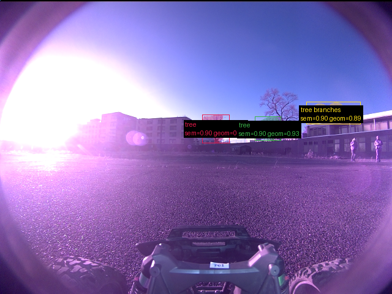

**scene_type:** urban · **regiões canônicas:** 3 (3 publicadas, 0 contexto estrutural) · **relações:** 0 · **falhas de interpretação:** 0 · **audit:** ✅ pass (0 warnings)

## corridor-02-08668

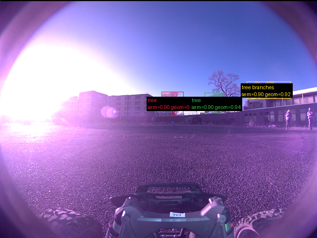

**scene_type:** urban · **regiões canônicas:** 3 (3 publicadas, 0 contexto estrutural) · **relações:** 0 · **falhas de interpretação:** 0 · **audit:** ✅ pass (0 warnings)

## corridor-02-08676

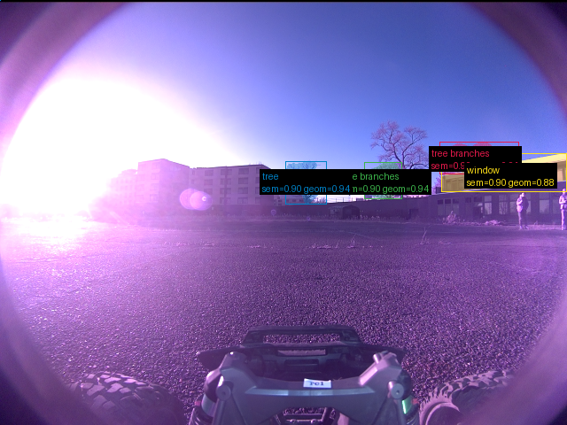

**scene_type:** urban · **regiões canônicas:** 5 (4 publicadas, 1 contexto estrutural) · **relações:** 1 · **falhas de interpretação:** 0 · **audit:** ✅ pass (3 warnings)

## corridor-02-08684

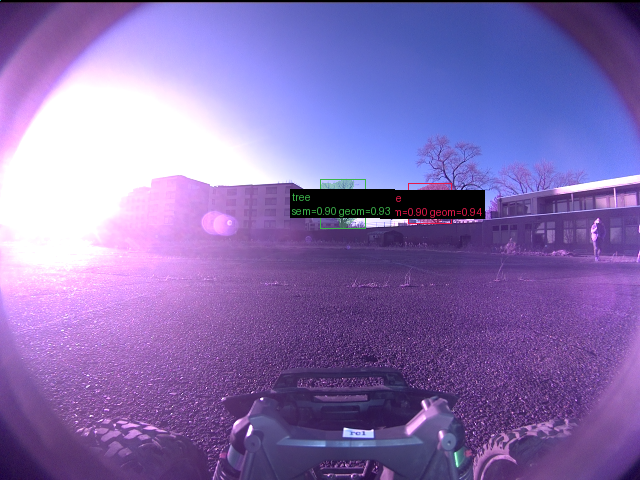

**scene_type:** urban · **regiões canônicas:** 2 (2 publicadas, 0 contexto estrutural) · **relações:** 0 · **falhas de interpretação:** 0 · **audit:** ✅ pass (0 warnings)

## corridor-02-08693

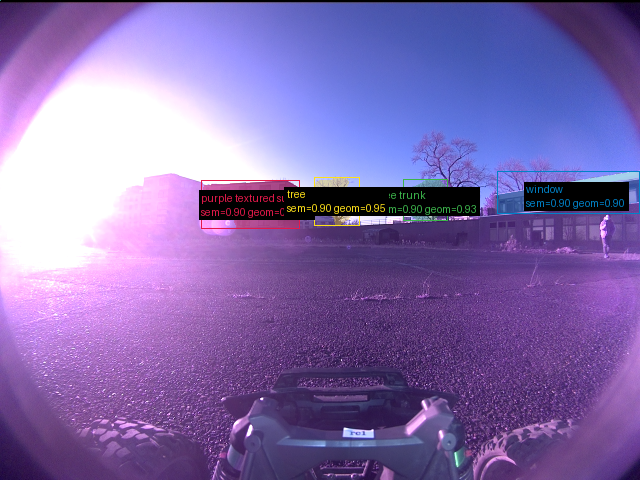

**scene_type:** urban · **regiões canônicas:** 4 (4 publicadas, 0 contexto estrutural) · **relações:** 0 · **falhas de interpretação:** 0 · **audit:** ✅ pass (2 warnings)

## corridor-02-08700

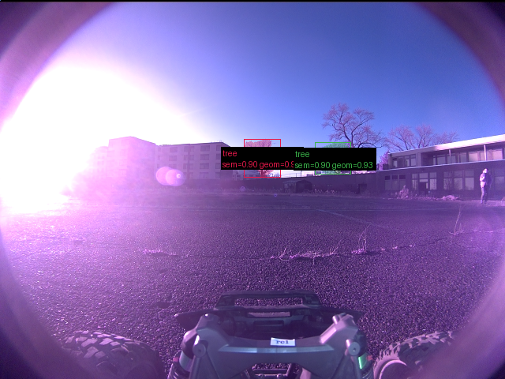

**scene_type:** urban · **regiões canônicas:** 4 (2 publicadas, 2 contexto estrutural) · **relações:** 0 · **falhas de interpretação:** 0 · **audit:** ✅ pass (3 warnings)

## corridor-02-08708

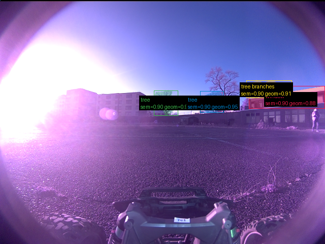

**scene_type:** urban · **regiões canônicas:** 4 (4 publicadas, 0 contexto estrutural) · **relações:** 1 · **falhas de interpretação:** 0 · **audit:** ✅ pass (0 warnings)

## corridor-02-08716

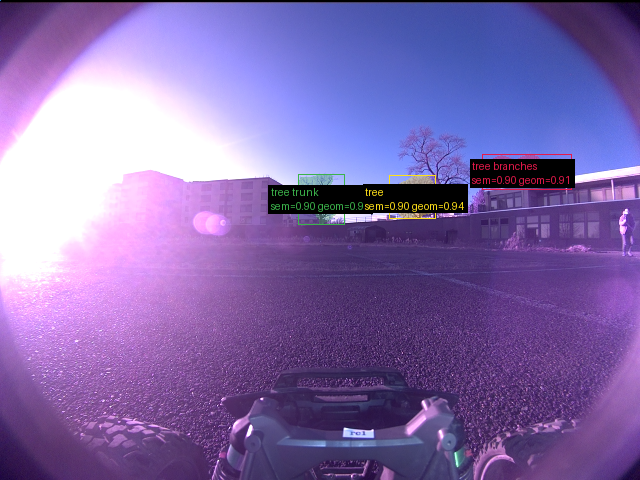

**scene_type:** park · **regiões canônicas:** 3 (3 publicadas, 0 contexto estrutural) · **relações:** 0 · **falhas de interpretação:** 0 · **audit:** ✅ pass (1 warnings)

## corridor-02-08724

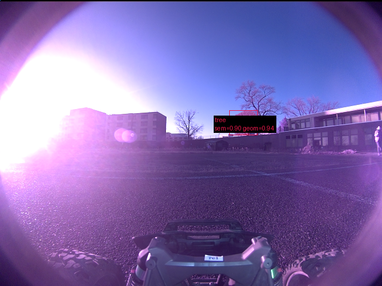

**scene_type:** urban · **regiões canônicas:** 1 (1 publicadas, 0 contexto estrutural) · **relações:** 0 · **falhas de interpretação:** 0 · **audit:** ✅ pass (0 warnings)

## corridor-02-08732

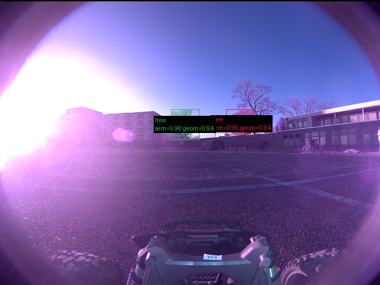

**scene_type:** urban · **regiões canônicas:** 2 (2 publicadas, 0 contexto estrutural) · **relações:** 0 · **falhas de interpretação:** 0 · **audit:** ✅ pass (0 warnings)

## corridor-02-08740

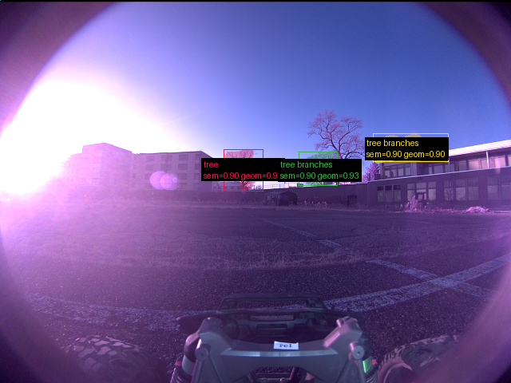

**scene_type:** urban · **regiões canônicas:** 4 (3 publicadas, 1 contexto estrutural) · **relações:** 1 · **falhas de interpretação:** 0 · **audit:** ✅ pass (1 warnings)

## corridor-02-08748

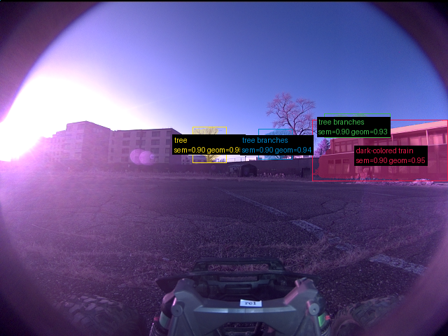

**scene_type:** urban · **regiões canônicas:** 4 (4 publicadas, 0 contexto estrutural) · **relações:** 1 · **falhas de interpretação:** 0 · **audit:** ✅ pass (2 warnings)

## corridor-02-08756

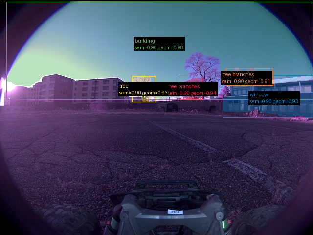

**scene_type:** urban · **regiões canônicas:** 9 (5 publicadas, 4 contexto estrutural) · **relações:** 14 · **falhas de interpretação:** 0 · **audit:** ✅ pass (3 warnings)

## corridor-02-08764

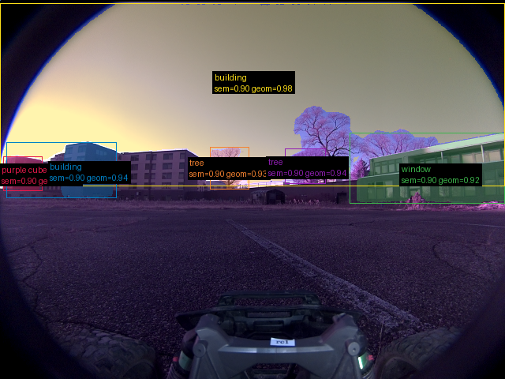

**scene_type:** urban · **regiões canônicas:** 7 (6 publicadas, 1 contexto estrutural) · **relações:** 10 · **falhas de interpretação:** 0 · **audit:** ✅ pass (4 warnings)

## corridor-02-08772

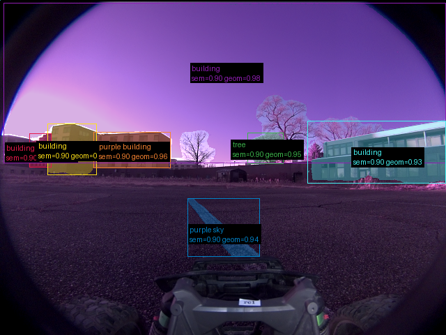

**scene_type:** urban · **regiões canônicas:** 9 (7 publicadas, 2 contexto estrutural) · **relações:** 11 · **falhas de interpretação:** 0 · **audit:** ✅ pass (7 warnings)

## corridor-02-08781

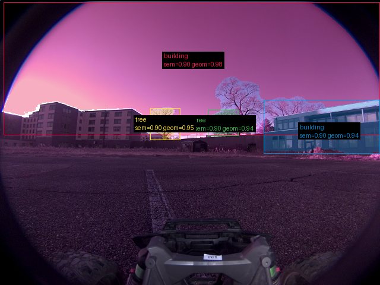

**scene_type:** urban · **regiões canônicas:** 9 (4 publicadas, 5 contexto estrutural) · **relações:** 9 · **falhas de interpretação:** 0 · **audit:** ✅ pass (5 warnings)

## corridor-02-08788

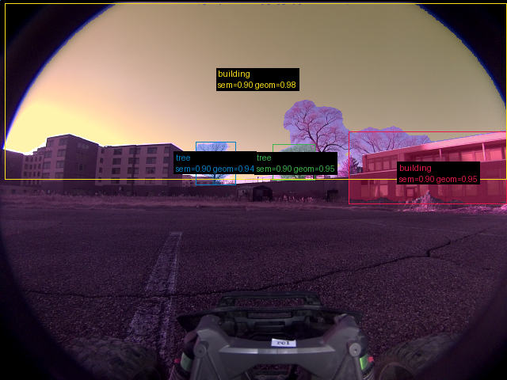

**scene_type:** urban · **regiões canônicas:** 7 (4 publicadas, 3 contexto estrutural) · **relações:** 8 · **falhas de interpretação:** 0 · **audit:** ✅ pass (2 warnings)

## corridor-02-08796

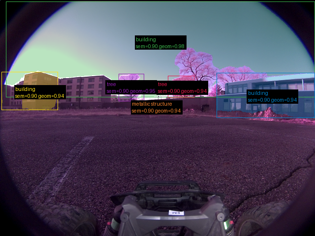

**scene_type:** urban · **regiões canônicas:** 9 (6 publicadas, 3 contexto estrutural) · **relações:** 14 · **falhas de interpretação:** 0 · **audit:** ✅ pass (7 warnings)

## corridor-02-08804

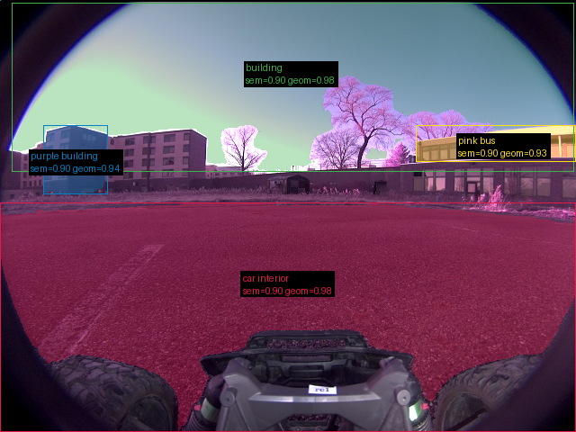

**scene_type:** urban · **regiões canônicas:** 6 (4 publicadas, 2 contexto estrutural) · **relações:** 4 · **falhas de interpretação:** 0 · **audit:** ✅ pass (6 warnings)

## corridor-02-08812

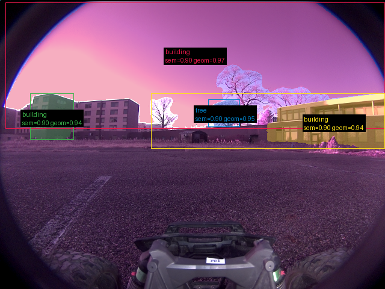

**scene_type:** urban · **regiões canônicas:** 7 (4 publicadas, 3 contexto estrutural) · **relações:** 8 · **falhas de interpretação:** 0 · **audit:** ✅ pass (5 warnings)

## corridor-02-08820

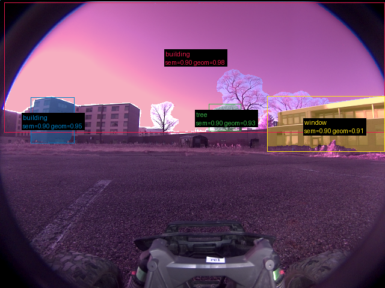

**scene_type:** urban · **regiões canônicas:** 6 (4 publicadas, 2 contexto estrutural) · **relações:** 5 · **falhas de interpretação:** 0 · **audit:** ✅ pass (5 warnings)
