# Validação do pipeline real — 20260914T210300Z

Revisão: `177e763` · Frames: 34 · Pico de VRAM: 6.84 GB (budget: 8.0 GB) · Pico de RSS do host: 10.68 GB

Ver `manifest.json` para configuração completa e log de estágios.

## corridor-02-12868

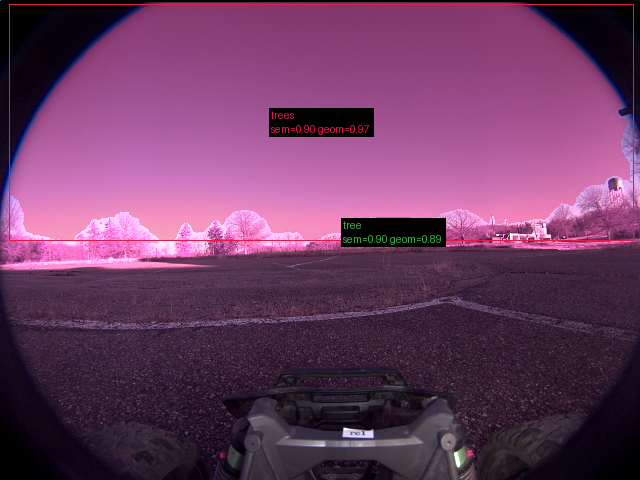

**scene_type:** rural · **regiões canônicas:** 2 (2 publicadas, 0 contexto estrutural) · **relações:** 1 · **falhas de interpretação:** 0 · **audit:** ✅ pass (0 warnings)

## corridor-02-12876

**FALHOU:** `BackendExecutionError("Out of memory while running 'multimodal_reasoning:Qwen/Qwen2.5-VL-3B-Instruct:cuda:True'.")`

## corridor-02-12884

**FALHOU:** `BackendExecutionError("Out of memory while running 'multimodal_reasoning:Qwen/Qwen2.5-VL-3B-Instruct:cuda:True'.")`

## corridor-02-12893

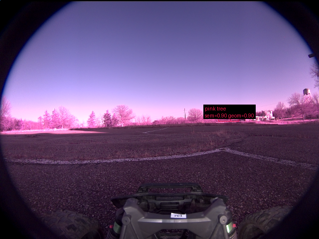

**scene_type:** rural · **regiões canônicas:** 2 (1 publicadas, 1 contexto estrutural) · **relações:** 1 · **falhas de interpretação:** 0 · **audit:** ✅ pass (0 warnings)

## corridor-02-12901

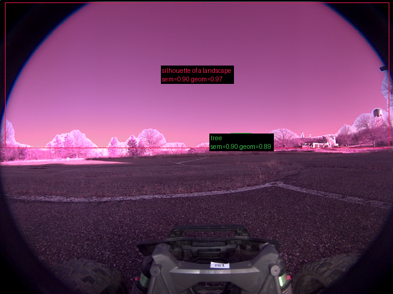

**scene_type:** rural · **regiões canônicas:** 2 (2 publicadas, 0 contexto estrutural) · **relações:** 2 · **falhas de interpretação:** 0 · **audit:** ✅ pass (2 warnings)

## corridor-02-12908

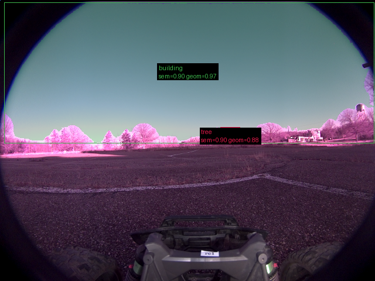

**scene_type:** rural · **regiões canônicas:** 2 (2 publicadas, 0 contexto estrutural) · **relações:** 1 · **falhas de interpretação:** 0 · **audit:** ✅ pass (1 warnings)

## corridor-02-12916

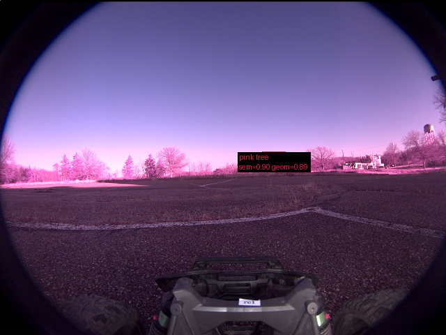

**scene_type:** rural · **regiões canônicas:** 2 (1 publicadas, 1 contexto estrutural) · **relações:** 1 · **falhas de interpretação:** 0 · **audit:** ✅ pass (0 warnings)

## corridor-02-12924

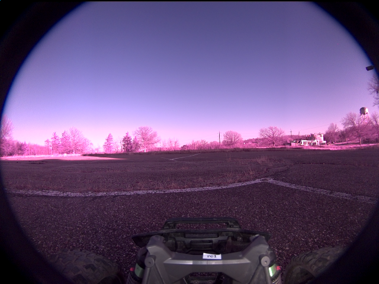

**scene_type:** rural · **regiões canônicas:** 1 (0 publicadas, 1 contexto estrutural) · **relações:** 0 · **falhas de interpretação:** 0 · **audit:** ✅ pass (0 warnings)

## corridor-02-12933

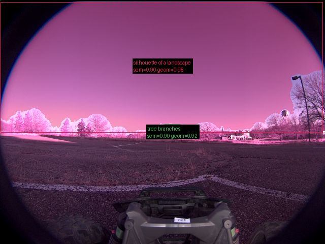

**scene_type:** rural · **regiões canônicas:** 2 (2 publicadas, 0 contexto estrutural) · **relações:** 1 · **falhas de interpretação:** 0 · **audit:** ✅ pass (3 warnings)

## corridor-02-12941

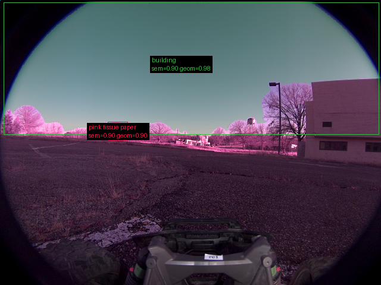

**scene_type:** urban · **regiões canônicas:** 4 (2 publicadas, 2 contexto estrutural) · **relações:** 5 · **falhas de interpretação:** 0 · **audit:** ✅ pass (3 warnings)

## corridor-02-12948

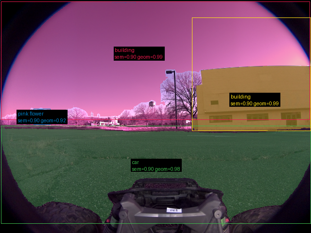

**scene_type:** rural · **regiões canônicas:** 6 (4 publicadas, 2 contexto estrutural) · **relações:** 14 · **falhas de interpretação:** 0 · **audit:** ✅ pass (3 warnings)

## corridor-02-12956

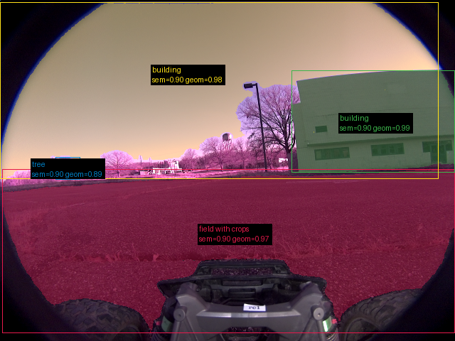

**scene_type:** rural · **regiões canônicas:** 6 (4 publicadas, 2 contexto estrutural) · **relações:** 14 · **falhas de interpretação:** 0 · **audit:** ✅ pass (3 warnings)

## corridor-02-12964

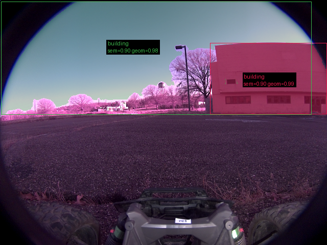

**scene_type:** industrial · **regiões canônicas:** 4 (2 publicadas, 2 contexto estrutural) · **relações:** 9 · **falhas de interpretação:** 0 · **audit:** ✅ pass (1 warnings)

## corridor-02-12972

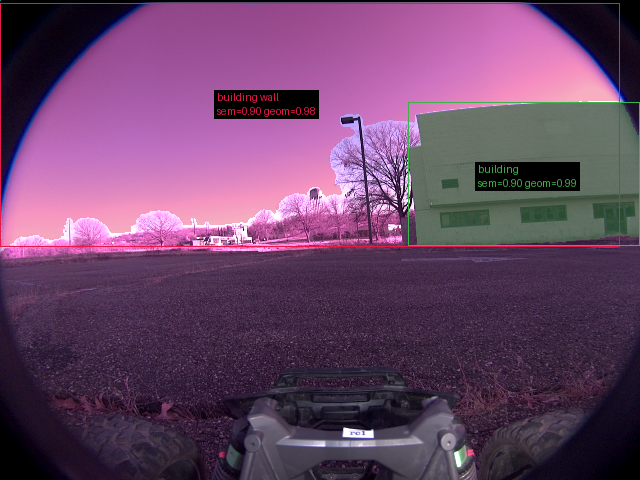

**scene_type:** industrial · **regiões canônicas:** 5 (2 publicadas, 3 contexto estrutural) · **relações:** 9 · **falhas de interpretação:** 0 · **audit:** ✅ pass (1 warnings)

## corridor-02-12981

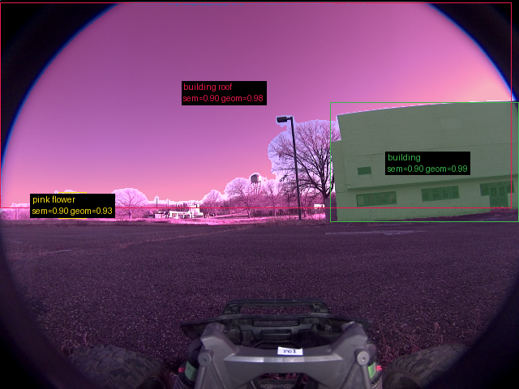

**scene_type:** industrial · **regiões canônicas:** 5 (3 publicadas, 2 contexto estrutural) · **relações:** 9 · **falhas de interpretação:** 0 · **audit:** ✅ pass (1 warnings)

## corridor-02-12988

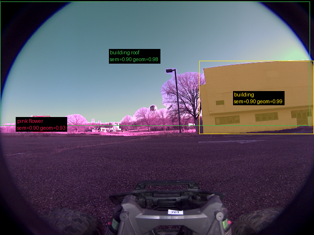

**scene_type:** industrial · **regiões canônicas:** 6 (3 publicadas, 3 contexto estrutural) · **relações:** 9 · **falhas de interpretação:** 0 · **audit:** ✅ pass (3 warnings)

## corridor-02-12996

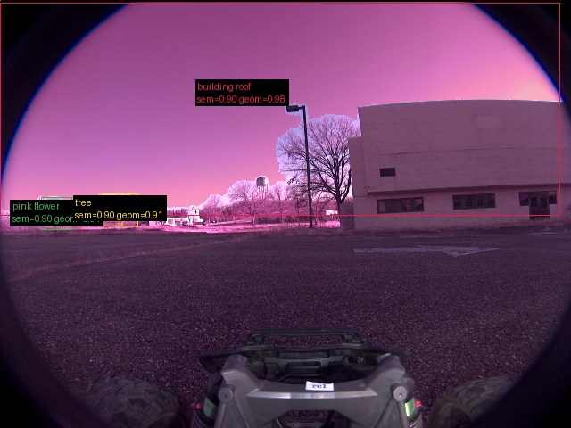

**scene_type:** industrial · **regiões canônicas:** 8 (3 publicadas, 5 contexto estrutural) · **relações:** 17 · **falhas de interpretação:** 0 · **audit:** ✅ pass (6 warnings)

## corridor-02-13004

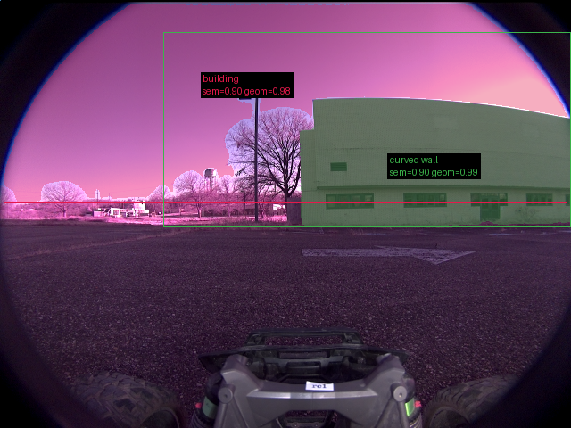

**scene_type:** industrial · **regiões canônicas:** 5 (2 publicadas, 3 contexto estrutural) · **relações:** 10 · **falhas de interpretação:** 0 · **audit:** ✅ pass (3 warnings)

## corridor-02-13012

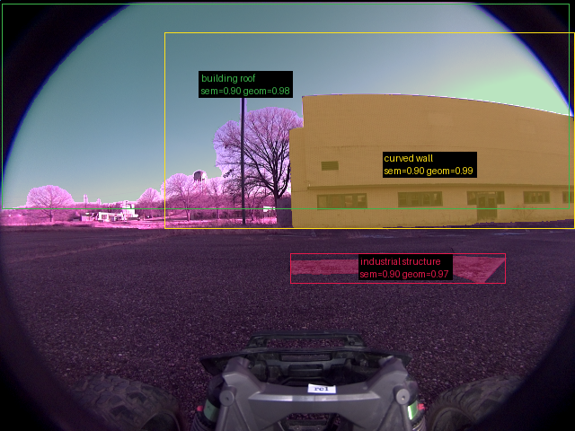

**scene_type:** industrial · **regiões canônicas:** 5 (3 publicadas, 2 contexto estrutural) · **relações:** 10 · **falhas de interpretação:** 0 · **audit:** ✅ pass (9 warnings)

## corridor-02-13021

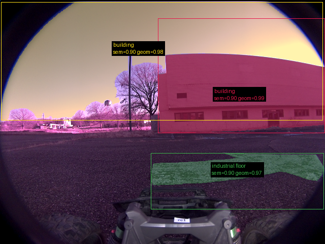

**scene_type:** industrial · **regiões canônicas:** 5 (3 publicadas, 2 contexto estrutural) · **relações:** 10 · **falhas de interpretação:** 0 · **audit:** ✅ pass (6 warnings)

## corridor-02-13029

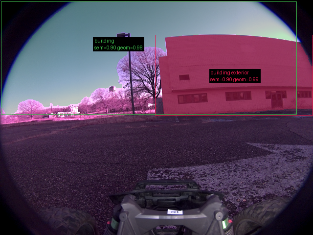

**scene_type:** industrial · **regiões canônicas:** 8 (2 publicadas, 6 contexto estrutural) · **relações:** 17 · **falhas de interpretação:** 0 · **audit:** ✅ pass (1 warnings)

## corridor-02-13036

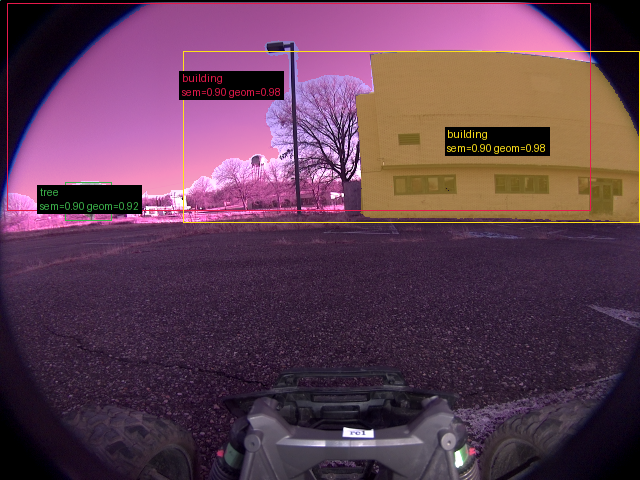

**scene_type:** industrial · **regiões canônicas:** 5 (3 publicadas, 2 contexto estrutural) · **relações:** 8 · **falhas de interpretação:** 0 · **audit:** ✅ pass (2 warnings)

## corridor-02-13044

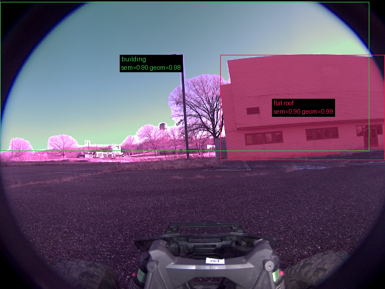

**scene_type:** industrial · **regiões canônicas:** 5 (2 publicadas, 3 contexto estrutural) · **relações:** 11 · **falhas de interpretação:** 0 · **audit:** ✅ pass (4 warnings)

## corridor-02-13052

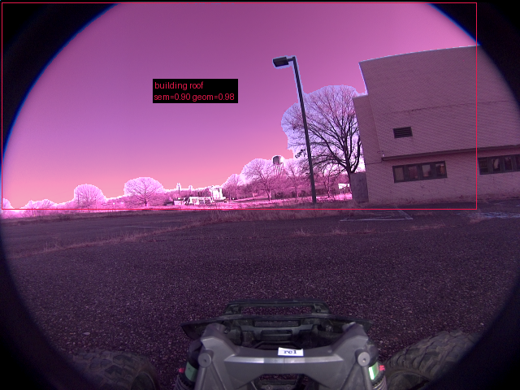

**scene_type:** rural · **regiões canônicas:** 6 (1 publicadas, 5 contexto estrutural) · **relações:** 13 · **falhas de interpretação:** 0 · **audit:** ✅ pass (5 warnings)

## corridor-02-13060

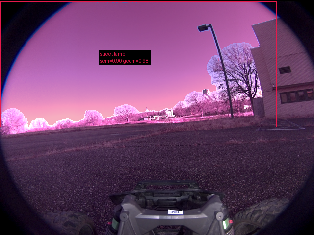

**scene_type:** parking lot · **regiões canônicas:** 4 (1 publicadas, 3 contexto estrutural) · **relações:** 5 · **falhas de interpretação:** 0 · **audit:** ✅ pass (4 warnings)

## corridor-02-13069

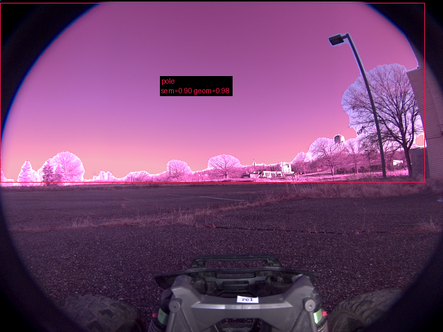

**scene_type:** rural · **regiões canônicas:** 3 (1 publicadas, 2 contexto estrutural) · **relações:** 3 · **falhas de interpretação:** 0 · **audit:** ✅ pass (2 warnings)

## corridor-02-13077

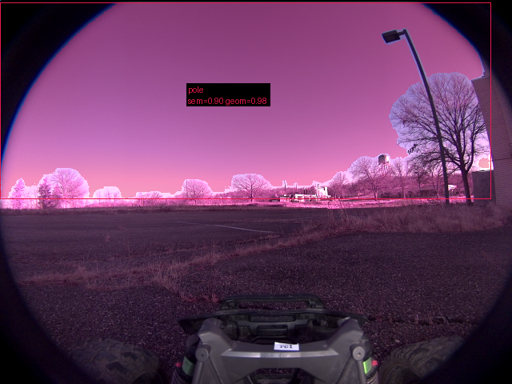

**scene_type:** rural · **regiões canônicas:** 3 (1 publicadas, 2 contexto estrutural) · **relações:** 3 · **falhas de interpretação:** 0 · **audit:** ✅ pass (1 warnings)

## corridor-02-13084

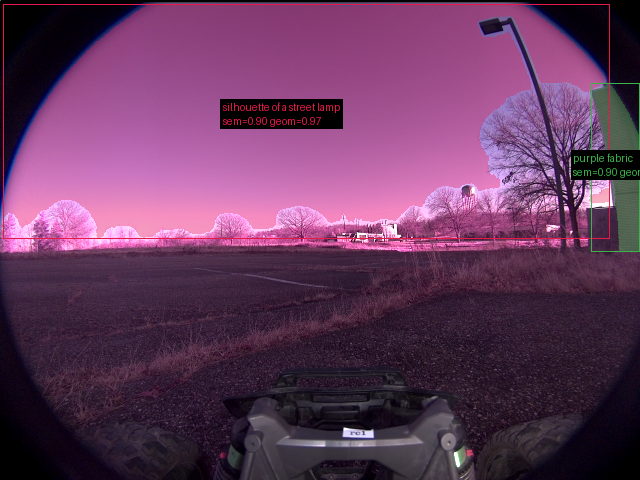

**scene_type:** rural · **regiões canônicas:** 3 (2 publicadas, 1 contexto estrutural) · **relações:** 3 · **falhas de interpretação:** 0 · **audit:** ✅ pass (4 warnings)

## corridor-02-13092

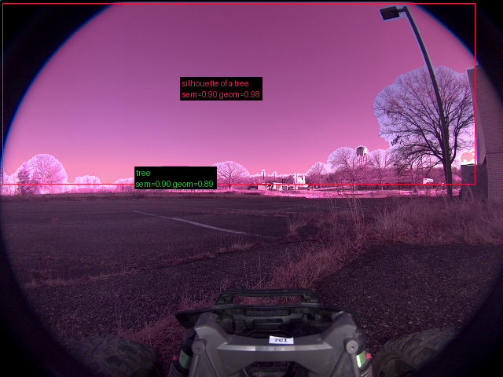

**scene_type:** rural · **regiões canônicas:** 4 (2 publicadas, 2 contexto estrutural) · **relações:** 3 · **falhas de interpretação:** 0 · **audit:** ✅ pass (4 warnings)

## corridor-02-13100

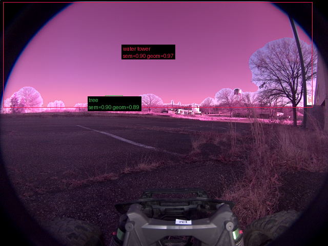

**scene_type:** parking lot · **regiões canônicas:** 3 (2 publicadas, 1 contexto estrutural) · **relações:** 2 · **falhas de interpretação:** 0 · **audit:** ✅ pass (0 warnings)

## corridor-02-13109

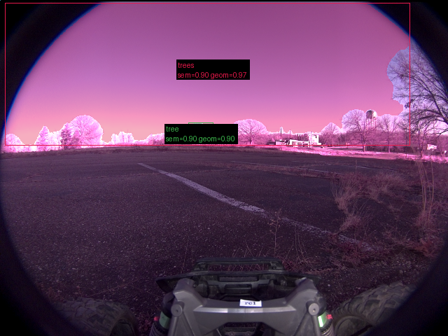

**scene_type:** open field · **regiões canônicas:** 2 (2 publicadas, 0 contexto estrutural) · **relações:** 1 · **falhas de interpretação:** 0 · **audit:** ✅ pass (0 warnings)

## corridor-02-13117

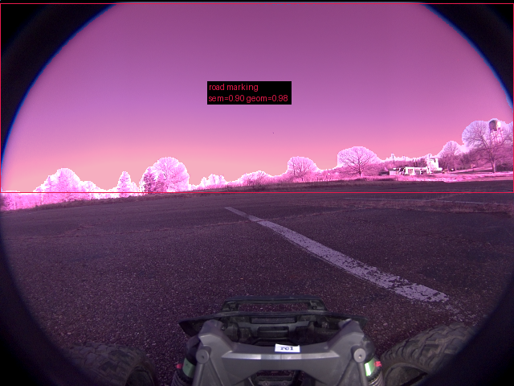

**scene_type:** open field · **regiões canônicas:** 1 (1 publicadas, 0 contexto estrutural) · **relações:** 0 · **falhas de interpretação:** 0 · **audit:** ✅ pass (2 warnings)

## corridor-02-13124

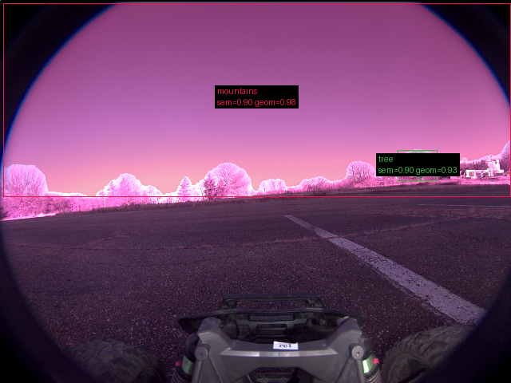

**scene_type:** open field · **regiões canônicas:** 4 (2 publicadas, 2 contexto estrutural) · **relações:** 2 · **falhas de interpretação:** 0 · **audit:** ✅ pass (2 warnings)

## corridor-02-13132

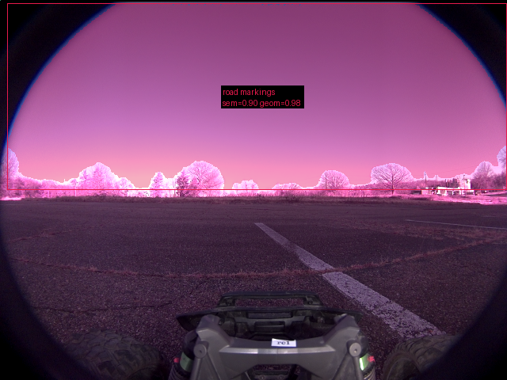

**scene_type:** rural · **regiões canônicas:** 1 (1 publicadas, 0 contexto estrutural) · **relações:** 0 · **falhas de interpretação:** 0 · **audit:** ✅ pass (2 warnings)
