# Validação do pipeline real — 20260914T214403Z

Revisão: `adde096` · Frames: 34 · Pico de VRAM: 6.84 GB (budget: 8.0 GB) · Pico de RSS do host: 10.91 GB

Ver `manifest.json` para configuração completa e log de estágios.

## corridor-02-15012

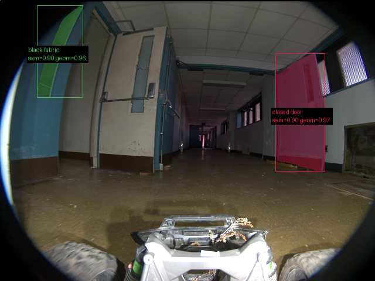

**scene_type:** corridor · **regiões canônicas:** 29 (2 publicadas, 27 contexto estrutural) · **relações:** 64 · **falhas de interpretação:** 0 · **audit:** ✅ pass (39 warnings)

## corridor-02-15020

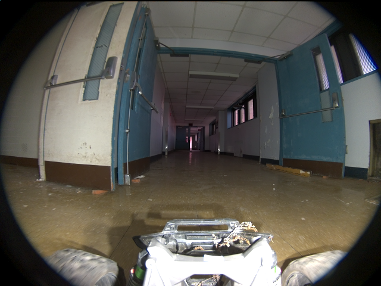

**scene_type:** indoor · **regiões canônicas:** 22 (0 publicadas, 22 contexto estrutural) · **relações:** 41 · **falhas de interpretação:** 0 · **audit:** ✅ pass (31 warnings)

## corridor-02-15028

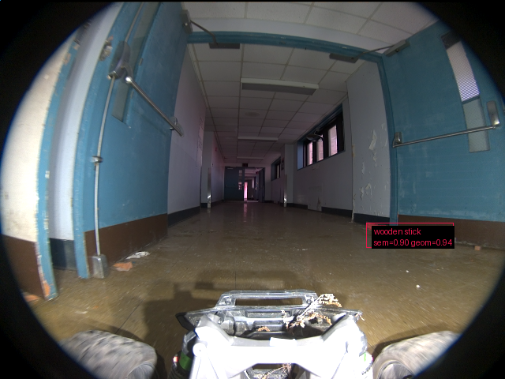

**scene_type:** corridor · **regiões canônicas:** 16 (1 publicadas, 15 contexto estrutural) · **relações:** 21 · **falhas de interpretação:** 0 · **audit:** ✅ pass (19 warnings)

## corridor-02-15037

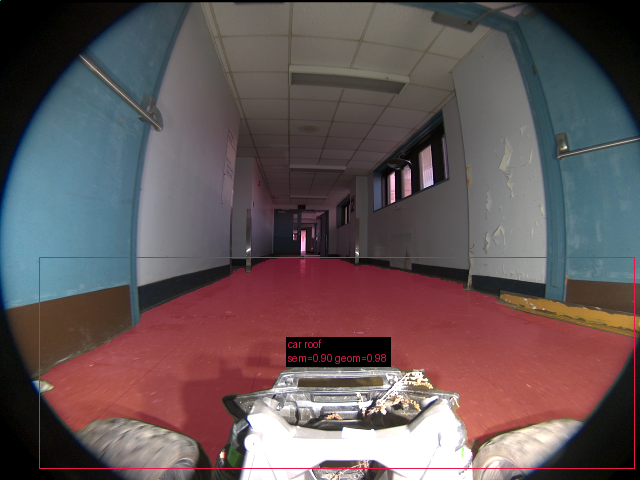

**scene_type:** corridor · **regiões canônicas:** 29 (1 publicadas, 28 contexto estrutural) · **relações:** 73 · **falhas de interpretação:** 0 · **audit:** ✅ pass (36 warnings)

## corridor-02-15045

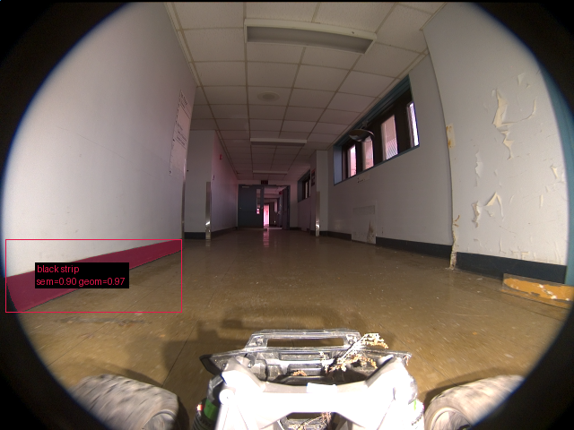

**scene_type:** corridor · **regiões canônicas:** 24 (1 publicadas, 23 contexto estrutural) · **relações:** 57 · **falhas de interpretação:** 0 · **audit:** ✅ pass (33 warnings)

## corridor-02-15052

**scene_type:** corridor · **regiões canônicas:** 25 (0 publicadas, 25 contexto estrutural) · **relações:** 61 · **falhas de interpretação:** 0 · **audit:** ✅ pass (29 warnings)

## corridor-02-15060

**scene_type:** corridor · **regiões canônicas:** 31 (0 publicadas, 31 contexto estrutural) · **relações:** 87 · **falhas de interpretação:** 0 · **audit:** ✅ pass (37 warnings)

## corridor-02-15068

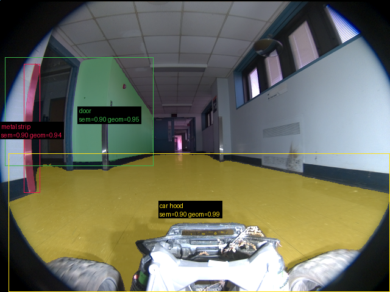

**scene_type:** corridor · **regiões canônicas:** 35 (3 publicadas, 32 contexto estrutural) · **relações:** 108 · **falhas de interpretação:** 0 · **audit:** ✅ pass (44 warnings)

## corridor-02-15076

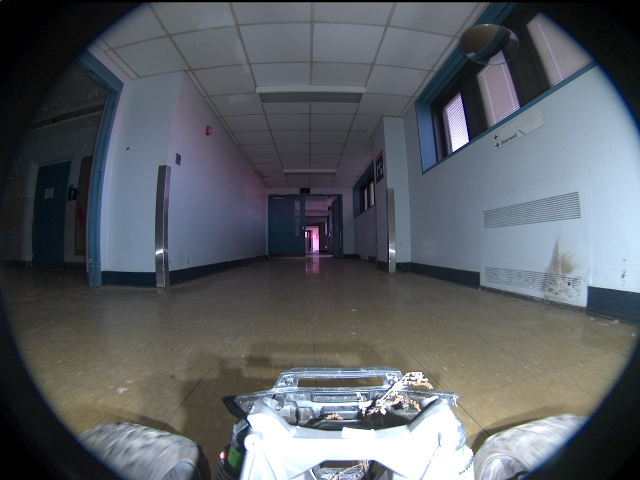

**scene_type:** corridor · **regiões canônicas:** 35 (0 publicadas, 35 contexto estrutural) · **relações:** 95 · **falhas de interpretação:** 0 · **audit:** ✅ pass (40 warnings)

## corridor-02-15085

**scene_type:** corridor · **regiões canônicas:** 39 (0 publicadas, 39 contexto estrutural) · **relações:** 119 · **falhas de interpretação:** 0 · **audit:** ✅ pass (40 warnings)

## corridor-02-15093

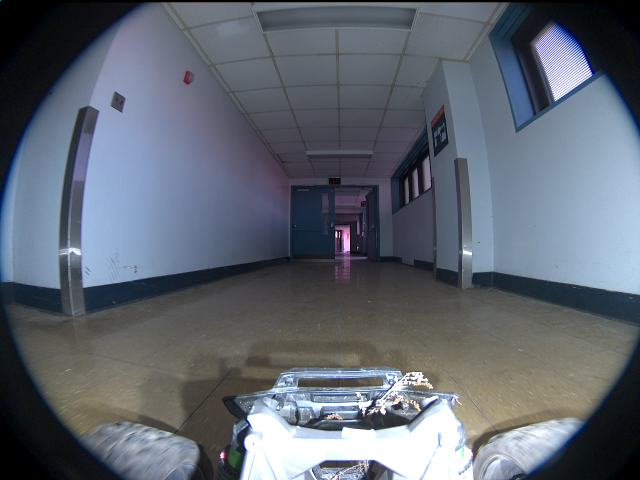

**scene_type:** corridor · **regiões canônicas:** 25 (0 publicadas, 25 contexto estrutural) · **relações:** 68 · **falhas de interpretação:** 0 · **audit:** ✅ pass (32 warnings)

## corridor-02-15100

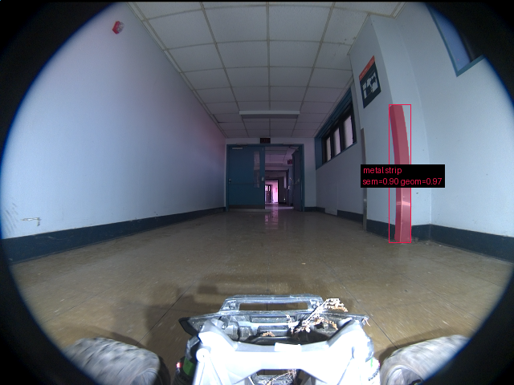

**scene_type:** corridor · **regiões canônicas:** 24 (1 publicadas, 23 contexto estrutural) · **relações:** 67 · **falhas de interpretação:** 0 · **audit:** ✅ pass (36 warnings)

## corridor-02-15108

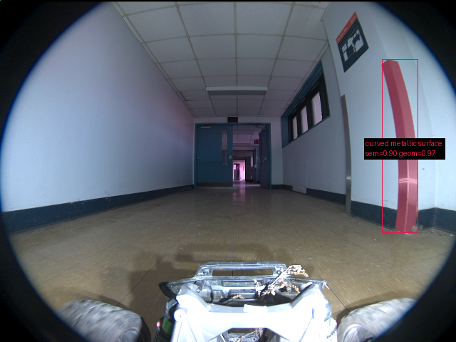

**scene_type:** corridor · **regiões canônicas:** 24 (1 publicadas, 23 contexto estrutural) · **relações:** 69 · **falhas de interpretação:** 0 · **audit:** ✅ pass (35 warnings)

## corridor-02-15116

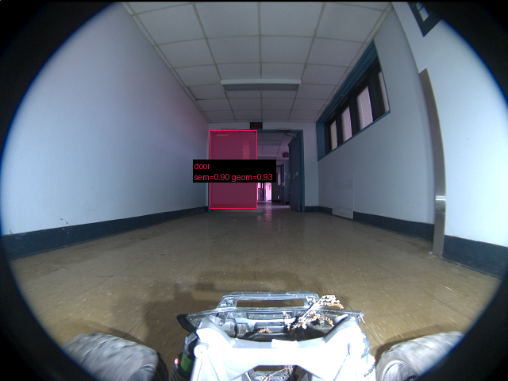

**scene_type:** corridor · **regiões canônicas:** 25 (1 publicadas, 24 contexto estrutural) · **relações:** 76 · **falhas de interpretação:** 0 · **audit:** ✅ pass (28 warnings)

## corridor-02-15125

**scene_type:** corridor · **regiões canônicas:** 26 (0 publicadas, 26 contexto estrutural) · **relações:** 78 · **falhas de interpretação:** 0 · **audit:** ✅ pass (33 warnings)

## corridor-02-15133

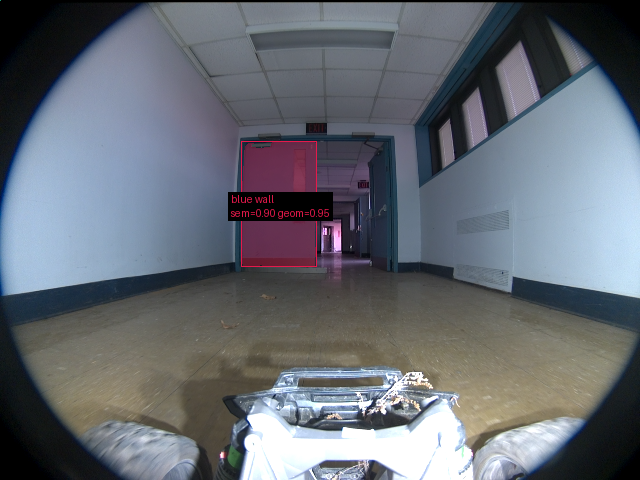

**scene_type:** corridor · **regiões canônicas:** 28 (1 publicadas, 27 contexto estrutural) · **relações:** 103 · **falhas de interpretação:** 0 · **audit:** ✅ pass (32 warnings)

## corridor-02-15140

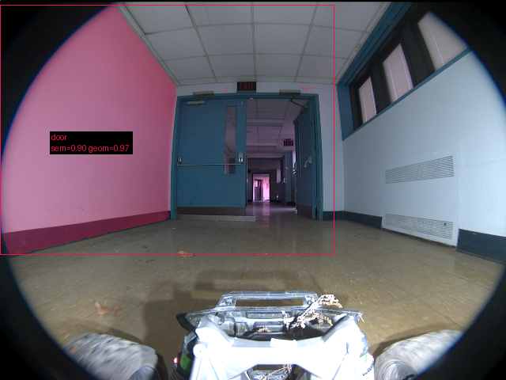

**scene_type:** corridor · **regiões canônicas:** 23 (1 publicadas, 22 contexto estrutural) · **relações:** 71 · **falhas de interpretação:** 0 · **audit:** ✅ pass (24 warnings)

## corridor-02-15148

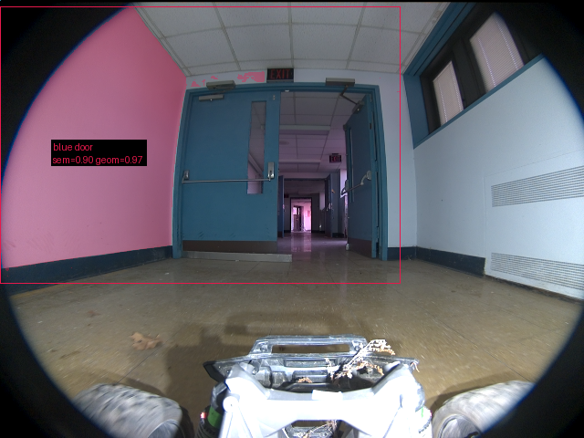

**scene_type:** corridor · **regiões canônicas:** 21 (1 publicadas, 20 contexto estrutural) · **relações:** 66 · **falhas de interpretação:** 0 · **audit:** ✅ pass (27 warnings)

## corridor-02-15156

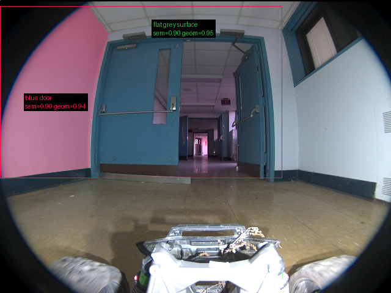

**scene_type:** corridor · **regiões canônicas:** 21 (2 publicadas, 19 contexto estrutural) · **relações:** 50 · **falhas de interpretação:** 0 · **audit:** ✅ pass (29 warnings)

## corridor-02-15164

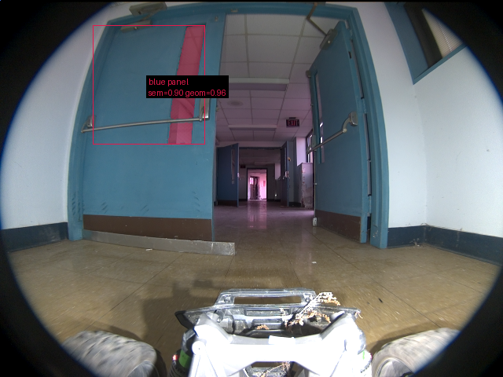

**scene_type:** indoor · **regiões canônicas:** 18 (1 publicadas, 17 contexto estrutural) · **relações:** 40 · **falhas de interpretação:** 0 · **audit:** ✅ pass (21 warnings)

## corridor-02-15173

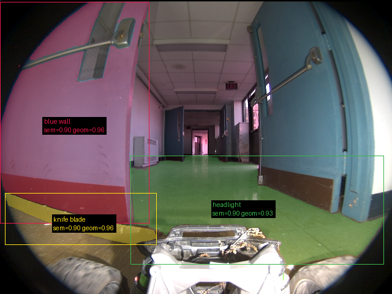

**scene_type:** corridor · **regiões canônicas:** 24 (3 publicadas, 21 contexto estrutural) · **relações:** 44 · **falhas de interpretação:** 0 · **audit:** ✅ pass (33 warnings)

## corridor-02-15181

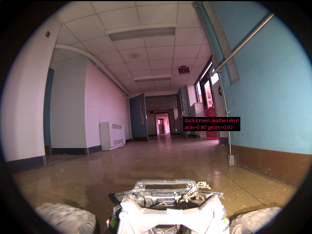

**scene_type:** corridor · **regiões canônicas:** 31 (1 publicadas, 30 contexto estrutural) · **relações:** 71 · **falhas de interpretação:** 0 · **audit:** ✅ pass (36 warnings)

## corridor-02-15188

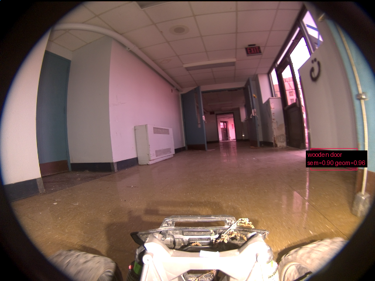

**scene_type:** indoor · **regiões canônicas:** 34 (1 publicadas, 33 contexto estrutural) · **relações:** 86 · **falhas de interpretação:** 0 · **audit:** ✅ pass (38 warnings)

## corridor-02-15196

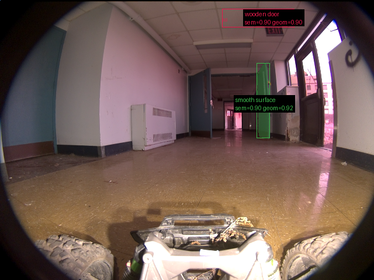

**scene_type:** indoor · **regiões canônicas:** 25 (2 publicadas, 23 contexto estrutural) · **relações:** 58 · **falhas de interpretação:** 0 · **audit:** ✅ pass (33 warnings)

## corridor-02-15204

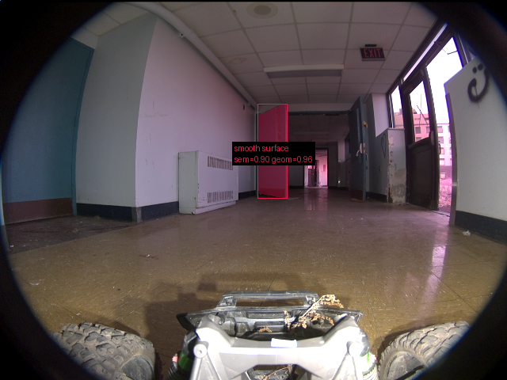

**scene_type:** indoor · **regiões canônicas:** 26 (1 publicadas, 25 contexto estrutural) · **relações:** 58 · **falhas de interpretação:** 0 · **audit:** ✅ pass (31 warnings)

## corridor-02-15213

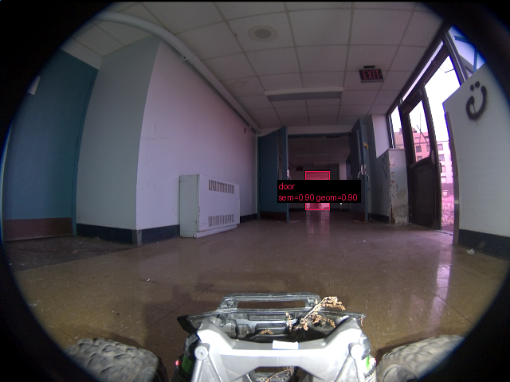

**scene_type:** indoor · **regiões canônicas:** 32 (1 publicadas, 31 contexto estrutural) · **relações:** 74 · **falhas de interpretação:** 0 · **audit:** ✅ pass (39 warnings)

## corridor-02-15221

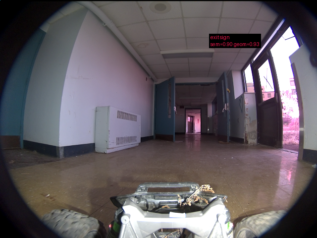

**scene_type:** corridor · **regiões canônicas:** 36 (1 publicadas, 35 contexto estrutural) · **relações:** 98 · **falhas de interpretação:** 0 · **audit:** ✅ pass (38 warnings)

## corridor-02-15229

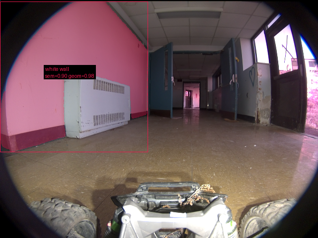

**scene_type:** indoor · **regiões canônicas:** 23 (1 publicadas, 22 contexto estrutural) · **relações:** 59 · **falhas de interpretação:** 0 · **audit:** ✅ pass (28 warnings)

## corridor-02-15236

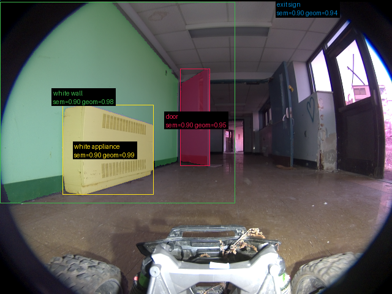

**scene_type:** indoor · **regiões canônicas:** 31 (4 publicadas, 27 contexto estrutural) · **relações:** 92 · **falhas de interpretação:** 0 · **audit:** ✅ pass (34 warnings)

## corridor-02-15244

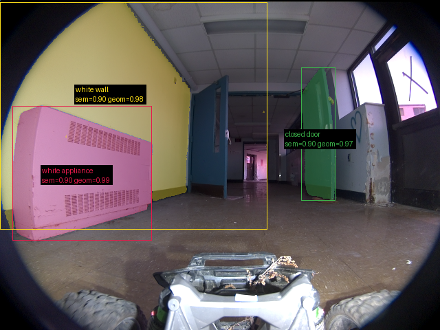

**scene_type:** indoor · **regiões canônicas:** 28 (3 publicadas, 25 contexto estrutural) · **relações:** 84 · **falhas de interpretação:** 0 · **audit:** ✅ pass (37 warnings)

## corridor-02-15253

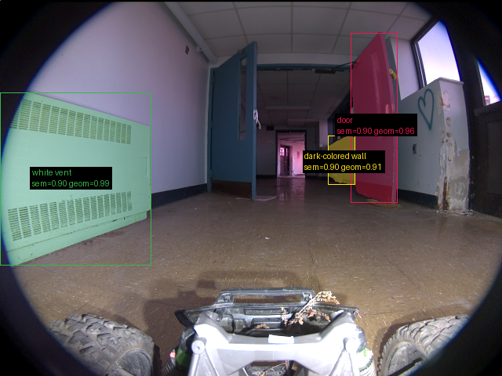

**scene_type:** indoor · **regiões canônicas:** 23 (3 publicadas, 20 contexto estrutural) · **relações:** 64 · **falhas de interpretação:** 0 · **audit:** ✅ pass (26 warnings)

## corridor-02-15261

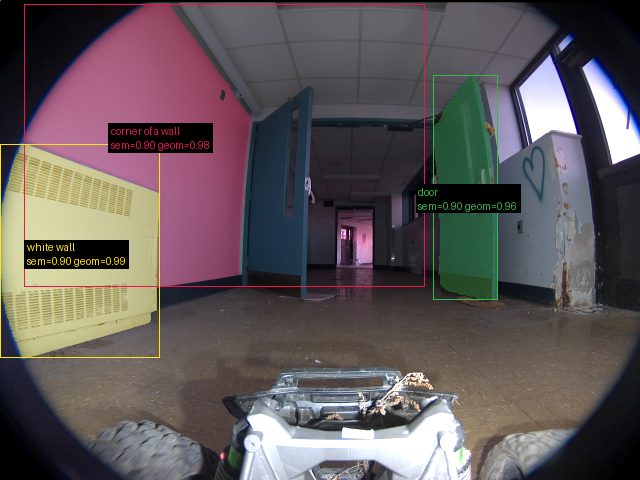

**scene_type:** abandoned building · **regiões canônicas:** 35 (3 publicadas, 32 contexto estrutural) · **relações:** 133 · **falhas de interpretação:** 0 · **audit:** ✅ pass (45 warnings)

## corridor-02-15269

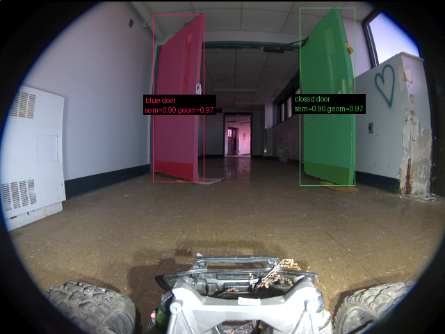

**scene_type:** indoor · **regiões canônicas:** 19 (2 publicadas, 17 contexto estrutural) · **relações:** 46 · **falhas de interpretação:** 0 · **audit:** ✅ pass (22 warnings)

## corridor-02-15276

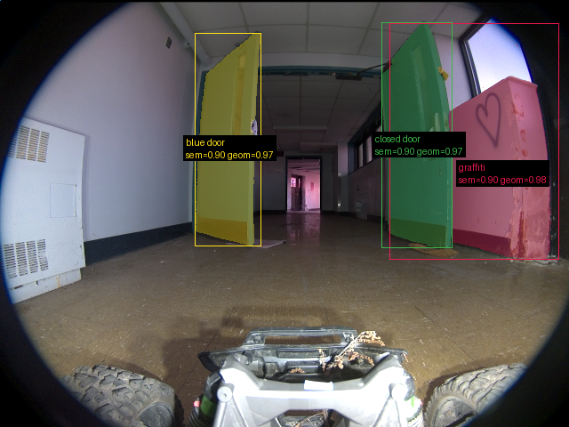

**scene_type:** indoor · **regiões canônicas:** 25 (3 publicadas, 22 contexto estrutural) · **relações:** 82 · **falhas de interpretação:** 0 · **audit:** ✅ pass (24 warnings)
